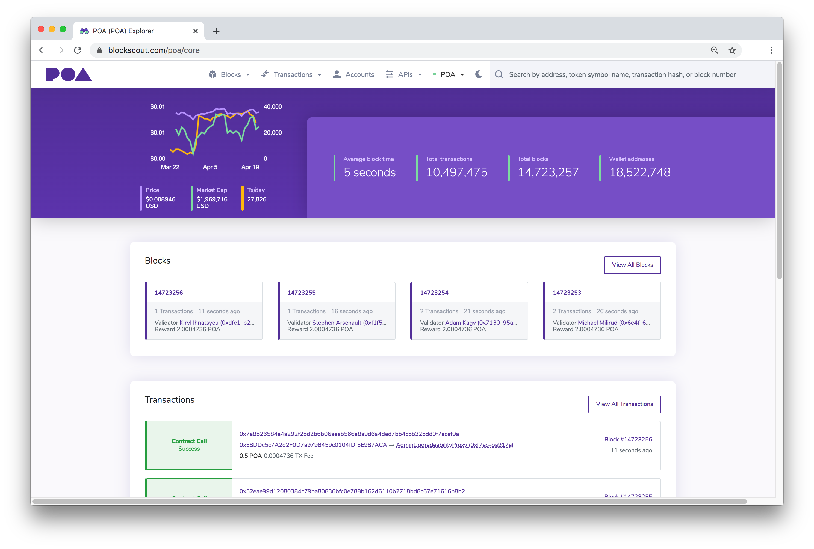

# Welcome to POA


**POA Network Merger Announcement**

POA Network is entering a new phase as a valuable part of the xDai ecosystem! Over the next 6 months, POA users will have the opportunity to swap their POA for STAKE on xDai.

[Learn more about this opportunity and what it means for the future of POA and xDai](for-users/about-poa-token/poa-merger-and-stake-swap.md).


POA Core is an autonomous network secured by a group of trusted validators. All validators on the network are United States notaries, and their information is publicly available.  This distributed group of known validators allows the network to provide fast and inexpensive transactions.

POA organization also develops products and tools to improve interoperability, infrastructure and transparency throughout the ecosystem. These include [BlockScout](https://docs.blockscout.com), an open-source explorer, [TokenBridge](https://docs.tokenbridge.net), a multi-chain asset-transfer solution.

Engaging with POA Core will help you experience and create a first-class application on our platform. Welcome to POA Core!

## About our Logo

All POA Projects utilize [Identicon](http://identicon.net) to generate unique logos. A hash of the project name along with the project color scheme is used to create the visual identity for each project. This creates consistency while highlighting the uniqueness of each project.

