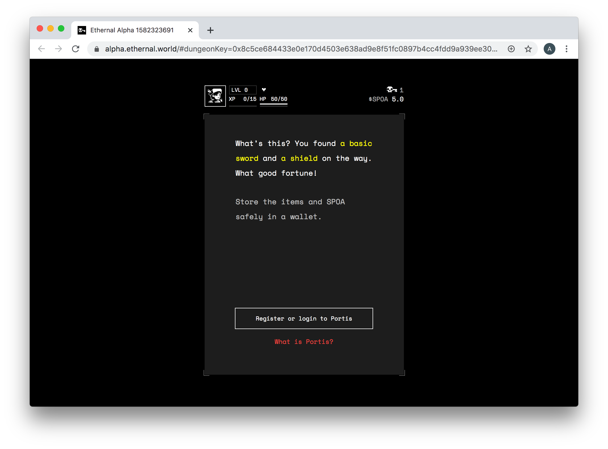
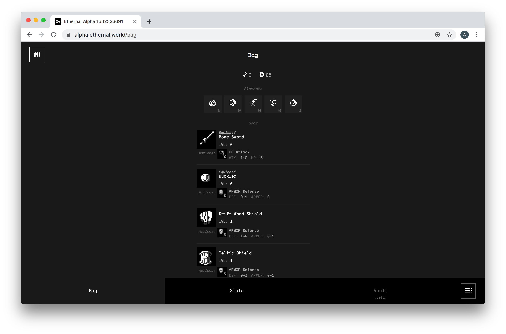
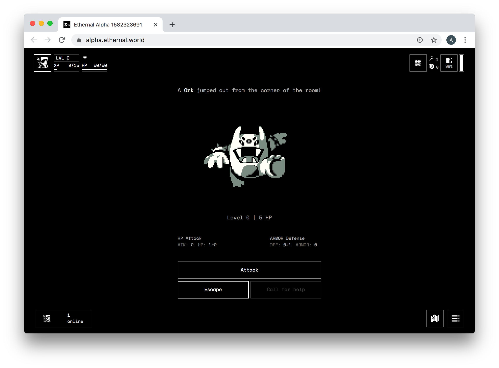
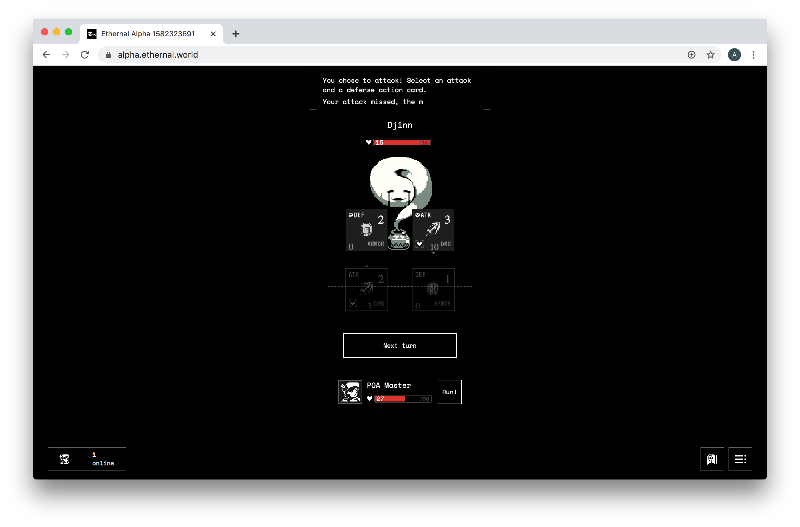

# Ethernal.World


Ethernal.World was tested on the Sokol Testnet. The beta version is released on the Matic network.


Text and grid-based MUD \(multi-user dungeon\) games have a long and storied history. The next chapter is unfolding on the blockchain! [Etherenal.World](https://ethernal.world/) is currently running on the Sokol testnet in Alpha mode. New rooms are generated on-chain as players explore the dungeon. Each space is created through smart contract-based procedures which use randomness to generate and populate a room.

Players can collect weapons, battle monsters, and even collaborate or compete with other players.  It's a lot of fun, brings back sweet memories for some of us seasoned players👴and its all on-chain!

The Sokol chain runs quickly enough so that monster battles feel interactive. Each action \(attack / defense\) requires a transaction -  it's important that they are processed quickly. Onboarding with the [Portis ](https://portis.io/)wallet is also extremely easy as users don't need a wallet or crypto to start playing \(although crypto vets can use MetaMask or another web3wallet\). Transaction fees are consolidated into a single fee paid at the beginning of the game which can be recharged as needed. This helps keep gameplay moving quickly.

Collected items can be kept, sold/traded with other players, or potentially used in other dungeons and games. Rare collected items remain rare due to the protocol rules, and generated rooms are immutable.

It's a lot of fun, and we've been fortunate to participate in early Alpha testing. Here are a few screenshots and comments from our dungeon exploration testing Ethernal.World.


For more info & screenshots from Ethernal.World, check out these posts:

* Alpha Update: [https://medium.com/@EthernalWorld/ethernal-alpha-1-0-update-a2b7dcade4e3](https://medium.com/@EthernalWorld/ethernal-alpha-1-0-update-a2b7dcade4e3)
* Dungeon Crawler: [https://medium.com/@EthernalWorld/dungeon-crawler-32f693732a24](https://medium.com/@EthernalWorld/dungeon-crawler-32f693732a24)


## Getting Started

## Gameplay

Rooms are explored by choosing a direction \(North, South, East, West\) to proceed to the next space. You can also teleport, but it costs a few tokens depending on how far you are going. Once you reach the outer limits of the existing map, you can proceed into the darkness to create a new room, which is generated programatically.

Items are collected by defeating monsters or discovered in rooms. These items can be saved to a wallet for later trading or bridging to the mainnet \(these features are not yet active, but will be introduced in subsequent versions\). However, if you die with unstored items,  these items are left in the room for other players to scavenge. 

## Monsters

When encountering monsters, you can choose to Attack or Run. Attack and defense against an attack is based on your existing abilities, which are leveled up by defeating enemies or through room discovery. Each attack counts as transaction, which takes only a few seconds to process.

## Conclusion

We can't wait to try this again, after dying it wasn't possible to restart in the Alpha version, and some mistakes \(attacking without enough firepower and not selecting better weapons from our bag\) led to an early death. The gameplay felt relaxed and also exciting when encountering new rooms and monsters. When we tested there were no other players at the same time, so we didn't get to see other on-chain users or interact with other players in real-time. We died wanting more, and look forward to playing again soon!

It's exciting to see a new MUD coming to the blockchain, echoing how early games began in the PC environment. Scaling will happen much faster, and games like Ethernal.world are following a familiar track to create something new. The in-game economy, a leaderboard and other upcoming features will make make the game even more exciting in future iterations.

