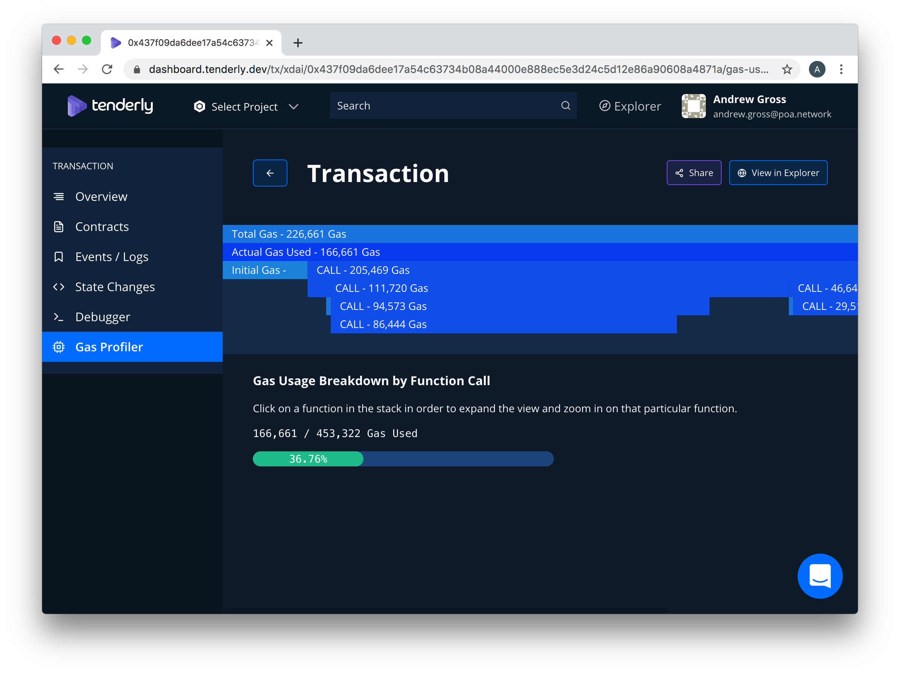

# Developer Resources

## General Information 



| Block Size | Block Speed | Gas price | Patchset | Native token | Network ID |
| :--- | :--- | :--- | :--- | :--- | :--- |
| ~10,000,000 Gas | 5 sec | 1 -10 GWei | Istanbul | POA | 99 |


To mitigate an ongoing denial-of-service attack, validators decided to increase the gas price to a range between 1-10 Gwei. Each validator can determine their own value within this range.




| Block Size | Block Speed | Gas price | Patchset | Native token | Network ID |
| :--- | :--- | :--- | :--- | :--- | :--- |
| ~10,000,000 Gas | 5 sec | 1 GWei | Istanbul | SPOA | 77 |



### **Sokol Faucets**

* Sokol Testnet Faucet: [https://faucet.poa.network](https://faucet.poa.network/) Get free 100 SPOA tokens for testing on the _Sokol_ testnet 
* [ERC20 Test Token Faucet](getting-tokens-for-tests/erc20-test-token-faucet.md) Can be used on Sokol or POA Core. 

## Blockchain Explorers

1\) **BlockScout** is the official blockchain explorer for the POA Network. With this full-featured, open-source explorer you can view transactions, accounts & balances, access data via the API and read and verify smart contracts.

* POA Core Network: [https://blockscout.com/poa/core](https://blockscout.com/poa/core)
* Sokol Testnet: [https://blockscout.com/poa/sokol](https://blockscout.com/poa/sokol)

2\) **AnyBlock Analytics Explorer** is convenient for exploring recent transactions and blocks and locating basic information extremely quickly**.**

* Poa Core Network: [https://explorer.anyblock.tools/ethereum/poa/core/](https://explorer.anyblock.tools/ethereum/poa/core/)
* Sokol Testnet: [https://explorer.anyblock.tools/ethereum/poa/sokol/](https://explorer.anyblock.tools/ethereum/poa/sokol/)

## JSON RPC endpoints 

There are endpoints provided by POA. They are used to connect to the network. Use these endpoints to connect with DApps or when connecting to the POA Network with MetaMask or other web3 wallets.

### POA Core  

| ​POA Core Network | ​ |
| :--- | :--- |
| **Main RPC \(HTTP2\)** | [​](https://core.poanetwork.dev/)[https://core.poanetwork.dev/](https://core.poanetwork.dev/)  |
| Main RPC \(HTTP\) | [http://core.poanetwork.dev:8545](http://core.poanetwork.dev:8545) |
| RPC Alias \(HTTPS/Cloudflare\) | [https://core.poa.network/](https://core.poa.network/) |
| WebSockets | [ws://core.poanetwork.dev:8546](ws://core.poanetwork.dev:8546) |
| Archive node \(last 100k blocks\) | [https://core-archive.blockscout.com/](https://core-archive.blockscout.com/) |
| Network ID | 99 |

### Sokol Testnet

| **POA Sokol Testnet** |  |
| :--- | :--- |
| Main RPC \(HTTPS\) | [https://sokol.poa.network](https://sokol.poa.network) |
| Main RPC \(HTTP\) | [http://sokol.poa.network:8545](http://sokol.poa.network:8545) |
| WebSockets | [ws://sokol.poa.network:8546](ws://sokol.poa.network:8546) |
| Archive node \(last 100k blocks\) | [http://sokol-archive.blockscout.com/](http://sokol-archive.blockscout.com/) |
| Network ID | 77 |

### Kovan Testnet

| Kovan Testnet |  |
| :--- | :--- |
| Main RPC \(HTTPS\) | [https://kovan.poa.network/](https://kovan.poa.network/) |
| Main RPC \(HTTP\) | [http://kovan.poa.network:8545](http://kovan.poa.network:8545) |
| WebSockets | [ws://kovan.poa.network:8546](ws://kovan.poa.network:8546) |
| Network ID | 42 |

## TokenBridge UI

TokenBridge UI at [https://bridge.poa.net/](https://bridge.poa.net/)

## DApp Management & Developer Tools

* [Terminal ](https://terminal.co)provides management, monitoring and analytics tools for DApp developers. 
* [Pocket](https://www.pokt.network/) provides a decentralized API layer for DApp developers \(IOS, Android & Web SDKs available\) and blockchain users.
* [TheGraph](https://thegraph.com) supports xDai data indexing, querying and display. 
* [AnyBlock Analytics](https://www.anyblockanalytics.com/) provides[ ElasticSearch & SQL access](api-and-sql-access.md)  
* [Tenderly ](https://tenderly.dev/)dashboard supports POA transaction inspection - smart contracts can also be pushed to the dashboard for real-time monitoring.

## **Additional Resources** 

### **POA Mainnet**

* Chain spec files and known bootnodes of the POA network [https://github.com/poanetwork/poa-chain-spec/tree/core](https://github.com/poanetwork/poa-chain-spec/tree/core)
* Netstats, an overview of POA Chain nodes [https://core-netstat.poa.network](https://core-netstat.poa.network)
* DApps Deployed to POA: Partial list of deployed DApps along with statistics and links [https://www.stateofthedapps.com/rankings/platform/poa](https://www.stateofthedapps.com/rankings/platform/poa)

### POA Sokol Testnet

* Chain [spec](https://github.com/poanetwork/poa-chain-spec/blob/sokol/spec.json) files and known [bootnodes ](https://github.com/poanetwork/poa-chain-spec/blob/sokol/bootnodes.txt)of the _Sokol_ network
* [Ethereum Networks Stats ](https://github.com/cubedro/eth-netstats)\(Netstats\) with a list of nodes on Sokol network. Nodes should have netstats agent installed to be listed in the netstats. [https://sokol-netstat.poa.network](https://sokol-netstat.poa.network/)
* Governance DApps: To use governance dapps please switch to Sokol network in your Nifty Wallet
  * Validators DApp: [https://validators.poa.network/ ](https://validators.poa.network/) In the DApp anyone can get information about validators of the _Sokol_ network and their keys
  * Voting DApp: [https://voting.poa.network/ ](https://voting.poa.network/) In the DApp anyone can get information about governance decisions on the _Sokol_ network.

