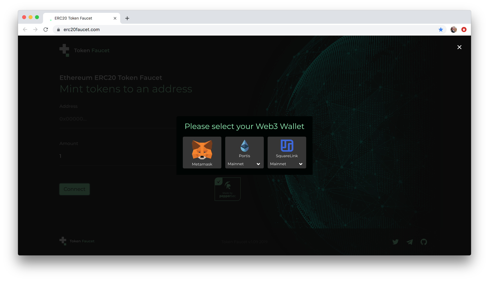
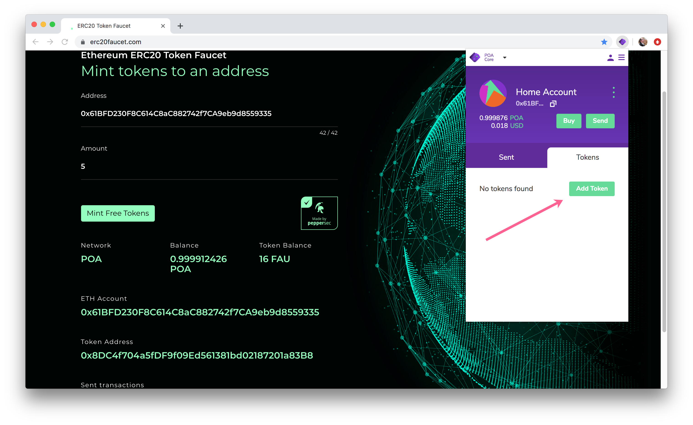
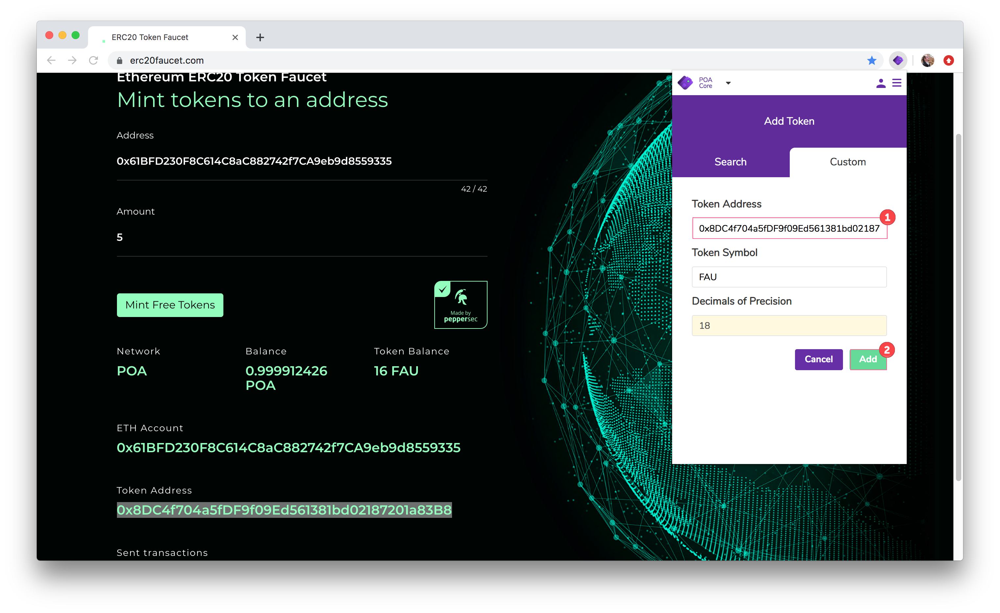
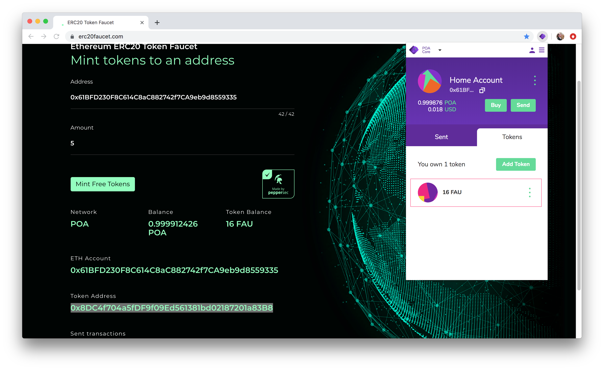

# ERC20 Test Token Faucet

The [ERC20 Token Faucet](https://erc20faucet.com/) by [peppersec](https://peppersec.com/) provides a sleek and easy interface for ERC20 test token creation. 

The faucet can quickly generate any number of FAU \(FAUCET\) tokens directly from a web interface. These tokens are then available for developers to test smart contract applications and any other token transfer functionality.

### Prerequisites

* Network wallet address loaded with enough native currency \(POA\) to cover the transaction.
* Web3 wallet interface such as MetaMask or [NiftyWallet](../for-users/wallets/nifty-wallet/). In this tutorial we use [NiftyWallet](https://forum.poa.network/t/nifty-wallet-is-back-on-the-chrome-store/2408).


ERC20 Token Faucet can also be used with [Portis](https://www.portis.io/) or [Squarelink](https://squarelink.com/).


### Steps

1\) Go to [https://erc20faucet.com/](https://erc20faucet.com/)**.** Check that your web3 wallet \(ie NiftyWallet\) is connected to the POA network. If you change this after step 3, you will need to reconnect.

**2**\)  Click **Connect**.

3\) Select **Metamask.**

4\) Once selected, the web interface will populate with your Address, Network and Balance information.

* 1\) Select the **Amount of tokens** you would like to create.
* 2\) Click the **Mint Free Tokens** button.

4\) Your web3 wallet interface should open. Check the transaction and click **Submit** to confirm. You will see a Success message if the transaction is successful.

5\) The tokens have been minted on your address! To view them, you will need to add the Token Address to your wallet.

* A\) Copy the Token Address, open your NiftyWallet, and click Add Token in the Tokens tab.

* B\) Select the Custom tab, and paste in the Token Address from the website. The Token Symbol and Decimals should populate automatically. Click **Add**.

* C\) You should see your new FAU balance in the wallet. _\(Note there are 16 FAU tokens due to a previous balance of 11, and 5 were added through this transaction.\)_


To mint FAU tokens on another network, such as the xDai Chain, simply switch the network you are connected to in your web3 wallet, and follow the process above.


### Quick Video

This video shows the steps above using the POA network as a demo and a previous version of the ERC20 Token Faucet. 




Instruction originally appeared on the POA forum [https://forum.poa.network/t/erc20-token-faucet-tutorial/2457](https://forum.poa.network/t/erc20-token-faucet-tutorial/2457)


