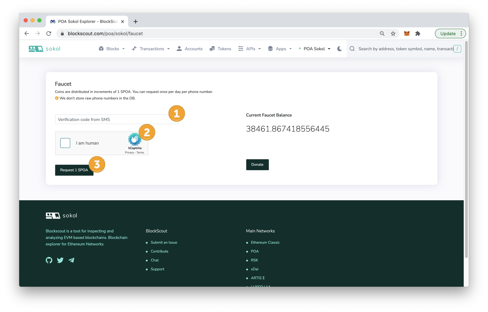
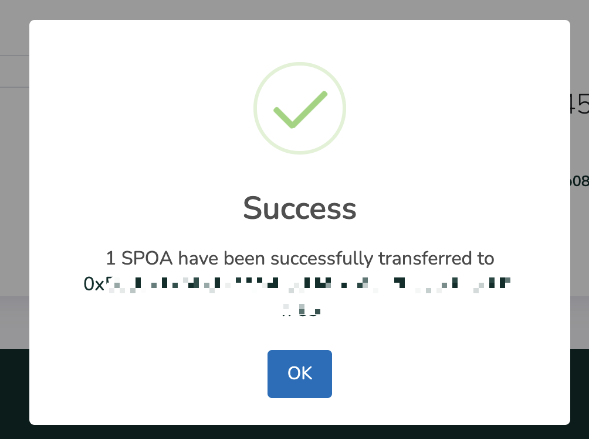

# Sokol Testnet Faucet

The Sokol Testnet provides an application testing environment as well as a test network for POA validator candidates. [More information about Sokol.](../developer-resourses.md#poa-sokol-testnet)

DApp testing requires SPOA, the native token for Sokol. SPOA is available through the Sokol faucet. If you require a large amount of SPOA for testing, please [contact us](../../social-media/contact-us.md).

## SPOA Faucet

SPOA is distributed in increments of 1 SPOA. Due to [reports of unscrupulous users](https://alphawallet.com/faq/sokol-poa-tokens-have-no-value-beware-of-scammers/) \(users selling SPOA which is a test token with no actual value\) we have added measures to make obtaining large amounts of SPOA difficult. 

Users are now limited to requesting 1 SPOA per day and are required to add a phone number for SMS verification.

The faucet is integrated with BlockScout Explorer. To start go to [https://blockscout.com/poa/sokol/faucet](https://blockscout.com/poa/sokol/faucet)

### Get SPOA

1. Enter an `0x...` address where you want to receive the SPOA.
2. Enter a valid phone number where you can receive a SMS text message. Be sure to select the correct country with the flag icon.
3. Complete the Captcha process.
4. Click **Send SMS.**

**You will be forwarded to the next screen and should receive a text message with a 6 digit code.**

1. Enter the verification code.
2. Complete the Captcha.
3. Click **Request 1 SPOA**.

You should see a success message and receive 1 SPOA to your account.

## Interacting with SPOA

| **POA Sokol Testnet** |  |
| :--- | :--- |
| RPC  | https://sokol.poa.network |
| Network ID | 77 |

## Using Web3 Wallets with Sokol 

### **Nifty Wallet**

Nifty Wallet ships with Sokol. Go to the network dropdown and select Sokol. Once connected, you ou should see your SPOA \(displayed as POA\) token balance.

### Saturn Wallet

Saturn Wallet includes the Sokol Testnet in Developers Mode. To access:

1. Click on icon at far right \(will change from bars to an X\) 
2. Select Settings
3. Click **Enable** to enable developer mode

Sokol will now appear in the network dropdown list. Select to Connect.

### MetaMask

You will add the Sokol Custom RPC to MetaMask to interact with Sokol.

1. Click on the Network Dropdown
2. Select Custom RPC

Fill in the Sokol Network Details and click **Save**. Sokol will now be available in the dropdown list.

* **Network Name:** Sokol Testnet
* **New RPC URL:** https://sokol.poa.network
* **ChainID:** 77
* **Symbol:** SPOA
* **Block Explorer URL:** https://blockscout.com/poa/sokol

