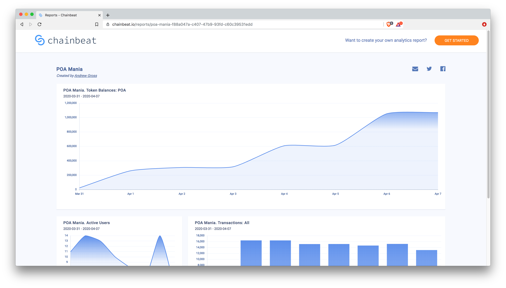
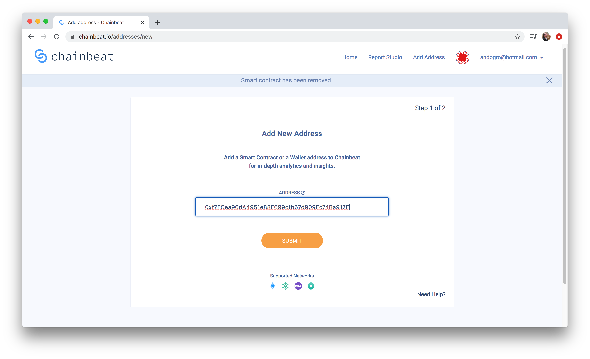
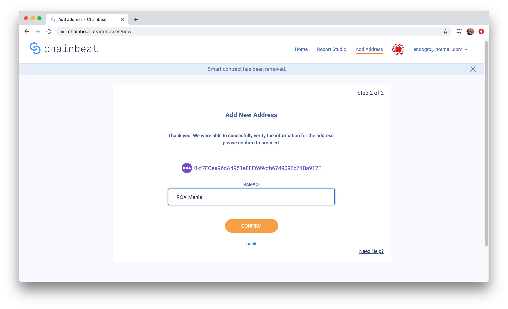
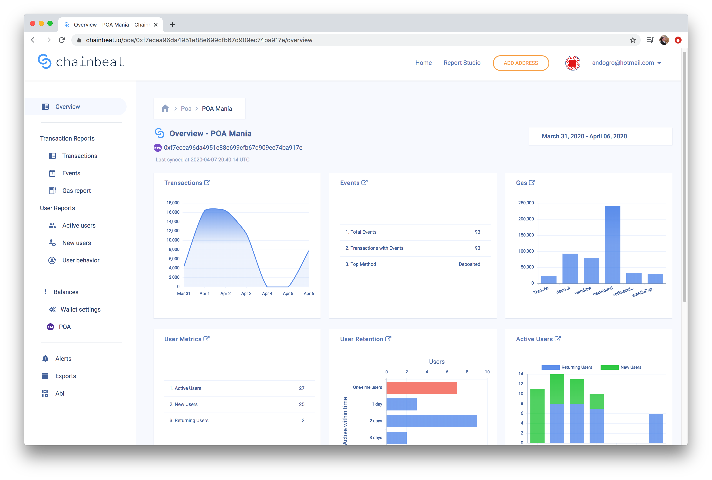
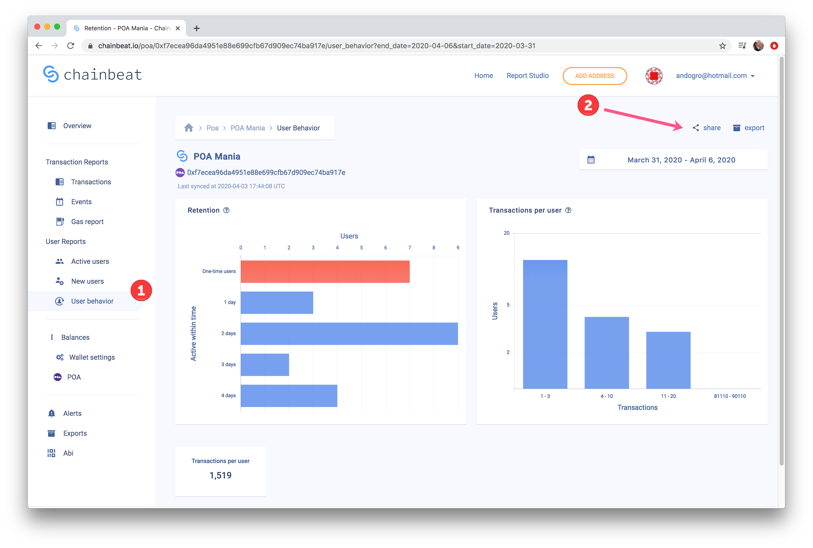

# Smart Contract Dashboard

## Chainbeat Dashboard on POA

Blockchains are designed for constant data streams. Without the right tools, data quickly becomes overwhelming and almost impossible to analyze. Dashboards have become an essential blockchain feature, and the POA [ChainBeat](https://chainbeat.io) integration makes it easy to gain valuable insights around token usage and smart contract interaction.

The ChainBeat interface is very easy to use. Simply sign up, plugin a smart contract address, and then explore and monitor the resulting insights. The dashboard allows you to analyze many different metrics including transaction & token volume, events, & user insights like active and new users.  You can drill down into each of these subtopics to get granular info, setup alerts, and export data in a csv format.

## **POA example**

POA Mania is an no-loss savings lottery running on POA. Users commit funds to a smart contract for an opportunity to win a portion of the emission rewards.   The ChainBlock dashboard shows basic token usage over the past week, including the number of transactions, new users, total POA in the contract and more. View a sample public report here: [POA Mania basic report](https://chainbeat.io/reports/poa-mania-f88a047a-c407-47b9-93fd-c60c39531edd).

## **Creating a dashboard**

1\) With the starter plan, you can create two dashboards for free. Once you’ve signed up, click Add Address, enter the Smart Contract address and Click **Submit**. Here we enter the Upgradeable Proxy Contract Address ([0xf7ECea96dA4951e88E699cfb67d909Ec74Ba917E](https://blockscout.com/poa/core/address/0xf7ECea96dA4951e88E699cfb67d909Ec74Ba917E/contracts)) rather than the POA Mania base contract.&#x20;

2\) Next, if the contract is deployed to multiple chains, select the network you would like to receive insights from and click **Confirm**. In this case, POA Mania is only deployed to the POA Network, so there is no choice of networks to select.

3\) Your private dashboard will begin to populate. With POA, it only takes a few minutes.

4\) You can drill down using the left menu, and select any of these more granular views to share. Here we look at User Behavior - click on the share icon to get a public, shareable link. [https://chainbeat.io/shared\_reports/e0d48b05-fcbb-4075-9854-1ab0190efb22](https://chainbeat.io/shared\_reports/e0d48b05-fcbb-4075-9854-1ab0190efb22)

## **Creating a public report**

Go to the Report Studio to create a custom report. Here you can create different **** widgets to display with different types of data. The Chainbeat Report Studio tutorial walks you through the process here:  [https://chainbeat.io/reports/help](https://chainbeat.io/reports/help)\
\
Chainbeat makes it easy to monitor smart contracts and get useful information about usage. For more on this integration, see this Chainbeat Medium post: [https://medium.com/chainbeat/poa-xdai-integrated-into-chainbeat-5e26412c3c72](https://medium.com/chainbeat/poa-xdai-integrated-into-chainbeat-5e26412c3c72)
