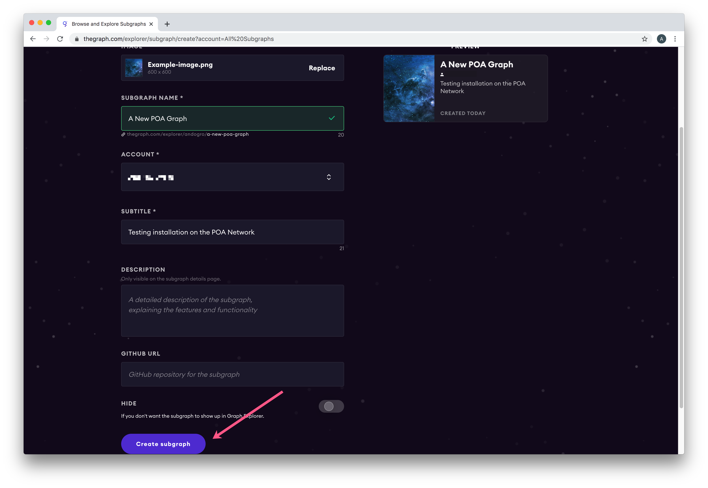

# TheGraph Data Indexing

POA Network is supported by [TheGraph](https://thegraph.com/), a decentralized protocol for indexing and querying chain data. With TheGraph, data defined through subgraphs is easy to query and explore. Subgraphs can be created locally, or use a free hosted explorer for indexing and data display. 

## Setting up a hosted project with TheGraph & POA Network


See [https://thegraph.com/docs/quick-start](https://thegraph.com/docs/quick-start#hosted-service) for more details, local installation and more. The docs include an example for learning how subgraphs work.  [This video also provides a good introduction.](https://thegraph.com/hackathons/2019/12)


1\) Go to Graph Explorer \([https://thegraph.com/explorer/](https://thegraph.com/explorer/)\) and setup an account. You will need a GitHub account for authentication. 

2\) Go to your dashboard and click **Add Subgraph**. Define the subgraph Name, Account, and Subtitle and update the image and other info \(you can update later\) if desired.  




3\) Install Graph CLI on your machine \(using either npm or yarn\)

```text
$ npm install -g @graphprotocol/graph-cli
$ yarn global add @graphprotocol/graph-cli

```

4\) Make a directory \(or choose an existing one\) and scaffold the project:

```text
graph init
```

5\) Enter your subgraph details at the prompts:

* **Subgraph name**: &lt;github\_username&gt;/&lt;graph-name&gt;  _Chose the subgraph name created in step 2 as lowercase-hypenated_ 
* **Directory to create**: Choose a directory name
* **Ethereum Network**: Select **poa-core**
* **Contract address**: Address of the contract you want to use. If [verified in BlockScout](https://docs.blockscout.com/for-users/smart-contract-interaction/verifying-a-smart-contract), the graph will grab the ABI, otherwise you will need manually add the ABI
*  **ABI file \(path\):** path-to-abi.json _You can save the abi from BlockScout or by running `truffle compile` or `solc` on a public project._ [_More info available here_](https://thegraph.com/docs/define-a-subgraph#the-subgraph-manifest)_._

6\)  Authenticate with the hosted service

```text
graph auth https://api.thegraph.com/deploy/ <your-access-token>
```

7\) Cd to the directory you created and start defining the subgraph. Information on creating a subgraph is available in the Graph Docs.



8\) When you are ready, deploy your subgraph. You can always test and redeploy as needed. 

```text
yarn deploy
```


Your subgraph will be deployed, and you can try sample queries. If you are ready to make it public, select the subgraph and turn off the Hide slider.


