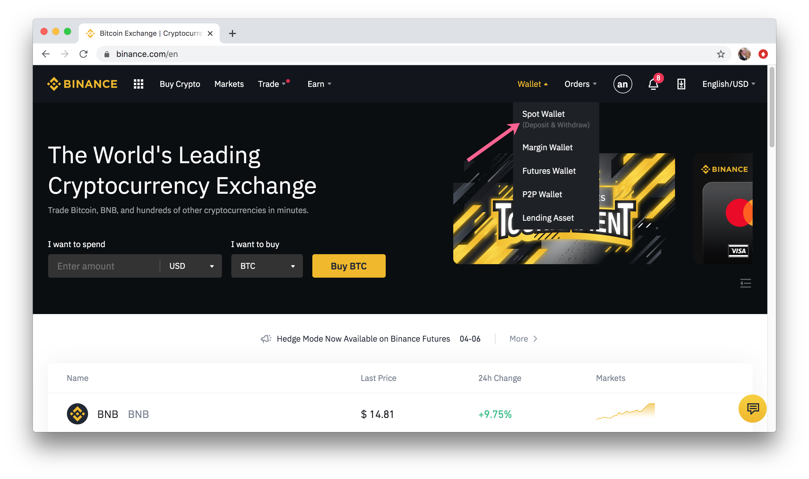
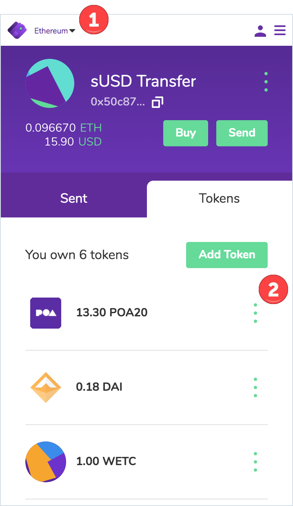
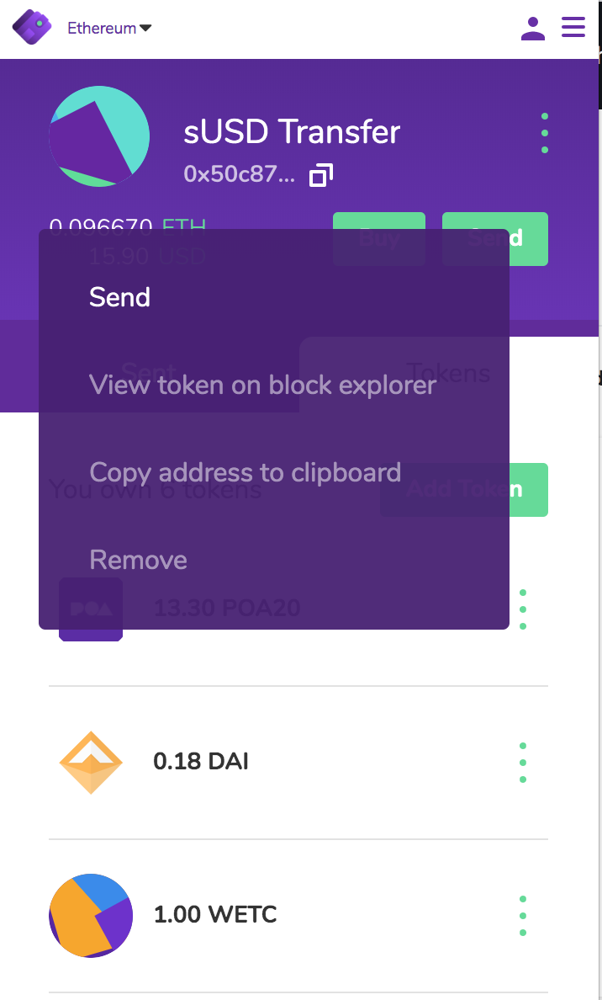
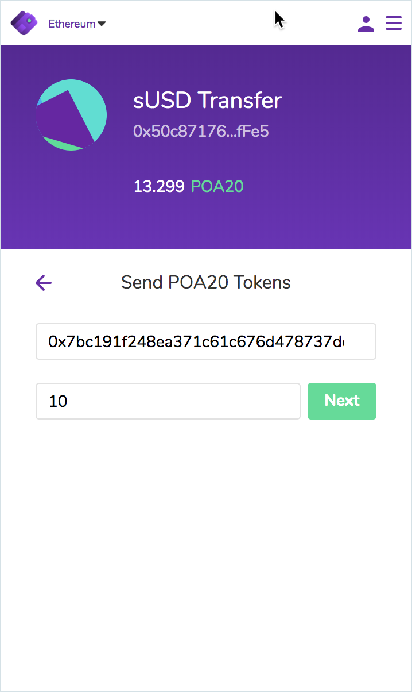
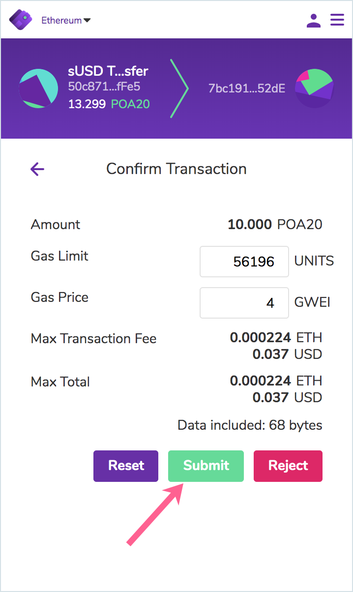
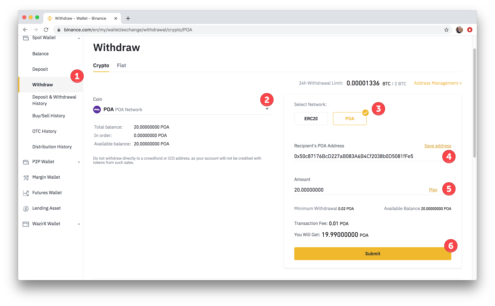
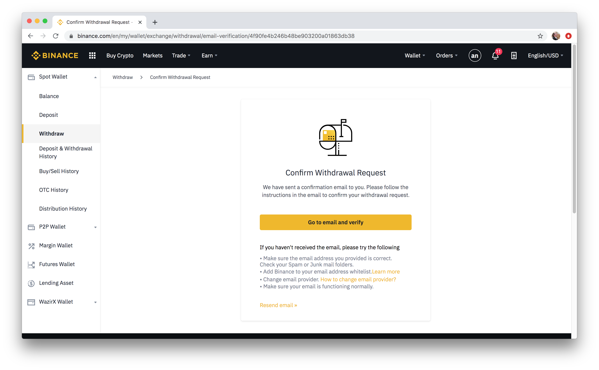
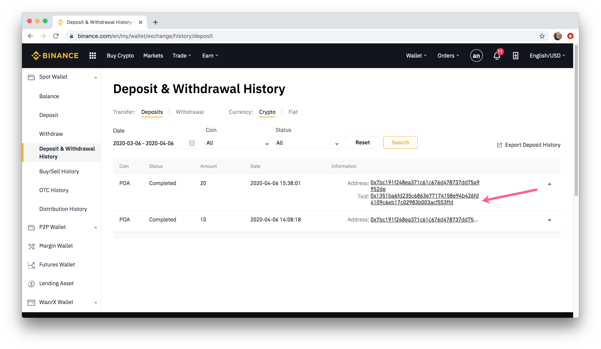
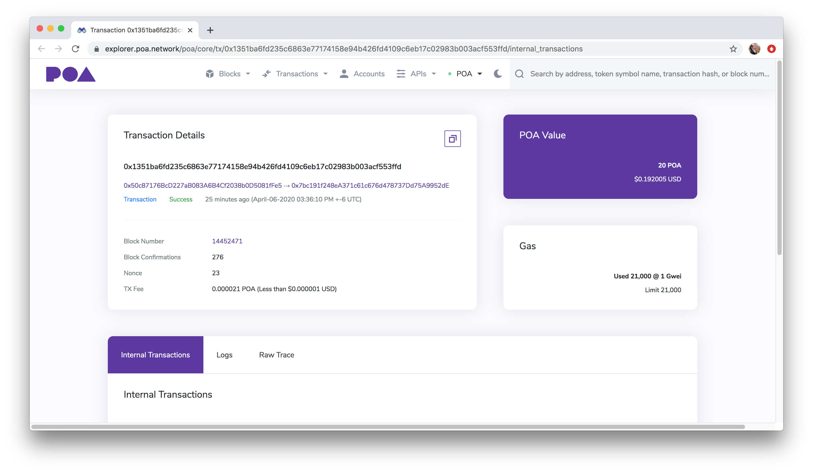

# POA & POA20 on Binance

A large majority of POA trading volume is currently carried out on Binance \(www.binance.com - not accessible from a US i.p. address\). A Binance wallet can be funded with either POA or POA20 to start trading with POA.

1\)  In Binance, go to **Wallet** -&gt; **Spot Wallet** in the top menu.

2\) Select the **Deposit** menu, select POA from the Coin dropdown, and copy the **POA Address** that funds must be sent to. This address does not change whether you select ERC20 or POA.

3\) In your wallet of choice, send the funds to the specified address. To **deposit POA**, make sure your wallet is connected to the **POA network** when completing the transaction. To **deposit POA20**, connect to the **Ethereum Mainnet** and select to send POA20 to the same address.

## Nifty Wallet Example: Sending POA20

1\) With the **Ethereum** network selected, go to the **Token tab** and **click on the dots** next to POA20.

2\) Select **Send**.

3\) Enter **Address** and **Amount** and click **Next.**

4\) Confirm details and click **Submit** to send the transaction. It will take a bit of time to arrive in Binance as POA. 

## Withdraw POA

Only POA may be withdrawn from Binance. Any POA20 deposited will be converted to a POA balance and may be withdrawn as POA. To withdraw:

1. Select withdraw from the side menu.
2. Select POA from the coin dropdown.
3. Select the POA network \(ERC20 network will not work\).
4. Enter the address to withdraw to.
5. Enter the amount to withdraw.
6. Click Submit

It will take a short amount of time to process the transaction and withdraw the POA from Binance to the selected address.

2\) Confirm the withdrawal request in your email \(if required\).

3\) Check transaction in the Deposit and Withdrawal history once processing is complete.

4\) Click on TX to view details on BlockScout. [0x1351ba6fd235c6863e77174158e94b426fd4109c6eb17c02983b003acf553ffd](https://explorer.poa.network/poa/core/tx/0x1351ba6fd235c6863e77174158e94b426fd4109c6eb17c02983b003acf553ffd)

