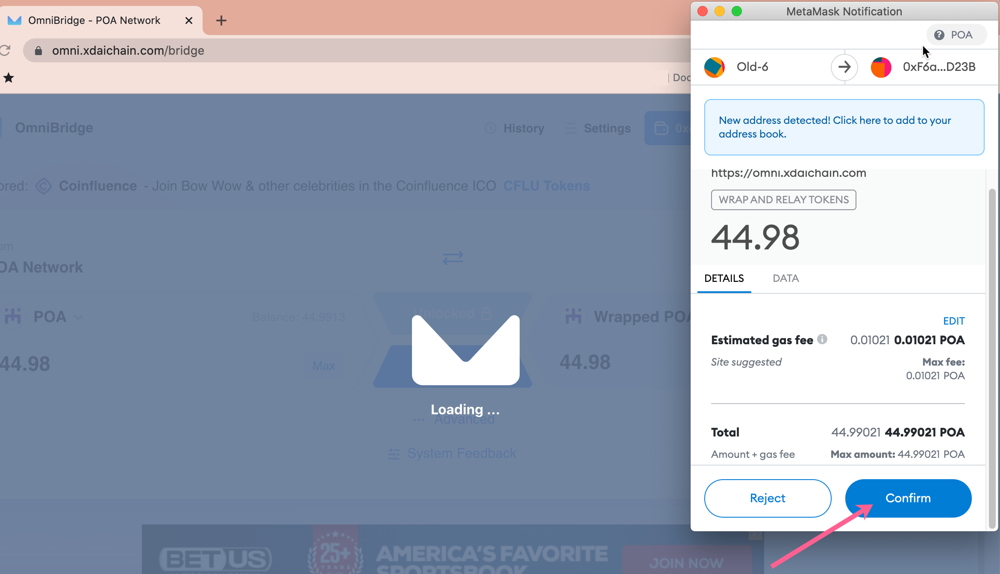

# POA Merger & STAKE Swap


**POA Network Merger Announcement**

POA Network is entering a new phase as a valuable part of the xDai ecosystem! Over the next 6 months, POA users will have the opportunity to swap their POA for STAKE on xDai. &#x20;

Learn more about this opportunity and what it means for the future of POA and xDai below.


## Overview & Token Details

xDai provides a full-featured ecosystem with many tools POA users know (BlockScout, bridges) along with additional applications, DEXs, lending, games, and much more. The xDai community welcomes the expertise and experience of POA users and developers to the xDai chain.&#x20;

STAKE (as the name implies) is the staking token on xDai. With POSDAO staking, stakers can delegate stake to validators and earn rewards for helping protect the chain. STAKE is also used for voting on proposals. The community is active in proposal creation, discussion, and voting.&#x20;

STAKE is a popular token used throughout the xDai ecosystem including various [DeFi platforms](https://www.xdaichain.com/about-xdai/project-spotlights#defi), and can be bridged to and from Ethereum Mainnet as well as other chains easily with the OmniBridge application. On Ethereum, STAKE has additional applications, including the ability for users to stake and earn rewards through the [EasyStaking](https://easy-staking.xdaichain.com) application.

**-> **[Learn more about STAKE here](https://www.xdaichain.com/for-stakers/stake-token).

\-> Questions about the merger? Ask in the [xDai discord poa-sokol channel.](https://discord.gg/mPJ9zkq)

## Swap Details

Swaps are available at a set price of **466.6163443 POA per 1 STAKE**. This price was derived using a TWAP (Time-weighted Average Price) for the 2 tokens between October 21, 2021 and November 3, 2021.&#x20;

The swap contract will launch with the ability for users to exchange 20% of POA tokens in circulation (58,672,514). Demand will be evaluated at regular intervals and additional STAKE added in batched amounts as required to cover POA to STAKE swaps.&#x20;

The swap program will be active with the same terms for 6 months, **starting on November 4, 2021 and ending on May 5, 2022**. POA holders will have the opportunity to swap at any time during this period without changes to the set price. Swaps are 1 way, there is no ability to swap STAKE back to WPOA through the application.&#x20;

During the 6 month swapping window, POA users may continue to earn rewards on POA Mania on the POA Network. However,** on May 5, 2022, POA rewards will cease for POA Mania players and swapping will no longer be available. **

Following emission & swapping cessation, POA network will continue to function in an important stress-testing capacity for users and developers. Client upgrades, testing, and experimentation will be conducted on POA prior to deployment on xDai or other chains using the POA network.

## How to Swap

Swapping from POA on POA Network to STAKE on xDai is a 2 step process.&#x20;

1. POA is bridged from the POA Network to xDai using the OmniBridge. During bridging, POA is converted to WPOA (wrapped POA) on the xDai chain.
2. WPOA on xDai is swapped for STAKE on xDai using a swap application.

### 1. Bridge POA to WPOA on xDai

1\) **Connect and Initiate Bridge Transaction**

1. Go to [omni.xdaichain.com/bridge](http://omni.xdaichain.com/bridge)
2. Connect your web3 wallet (MetaMask) to the **POA Network**. Select the POA-XDAI Bridge in the bridge selector dropdown.
3. Enter the **amount of POA** you want to bridge to WPOA. Note you need to reserve a very small amount to pay for gas.
4. Shows how much wrapped POA you will receive on xDai. 3 and 4 should match.

Click **Transfer** to start. (_note: this will transfer to your same wallet address on the xDai chain. If you want to send to a different address on the xDai chain, you can use the Advanced feature. Be sure to **triple check if you choose this option**, as funds sent to the wrong address may not be recoverable_).

2\) **Continue Transfer**

3\) **Confirm in MetaMask**

4\) **Wait for Confirmation**

You can view progress on the ALM monitor. The transfer should only take a few minutes to process between POA Network and the xDai Chain.

5\) **Add Balance to xDai Wallet (optional)**

The following processes detail adding WPOA to your wallet. You can also confirm the transfer in Blockscout by pasting your address in the search bar and checking your tokens balance.  If you don't want to add WPOA to view in your wallet, skip to [section 2 swap WPOA to STAKE](poa-merger-and-stake-swap.md#1.-bridge-poa-to-wpoa-on-xdai-1).

Here we use Metamask as an example.

1. Switch to the xDai Network ([How to add xDai network to your MetaMask](https://www.xdaichain.com/for-users/wallets/metamask/metamask-setup))
2. Go to Assets
3. Press Import Tokens

1.  Add the WPOA Token Contract Address `0x9fe3864F9Ae7cfb5668Dae90C0e20c4C3D437664`

    The remaining info should autopopulate.&#x20;
2. Press **Add Custom Token**.

&#x20;

You should now see WPOA along with your balance.&#x20;

1. Press **Import Tokens** to finalize&#x20;
2. You will now see the amount of WPOA in your balance

### 2. Swap WPOA to STAKE on the xDai Network

1\) **Go to swap application at **[**https://poa-to-stake.poa.network/**](https://poa-to-stake.poa.network)**. **

Press **Connect wallet**.

2\) **Select your wallet application of choice. **

In this example we use MetaMask connected to the xDai Chain.

3\) **Enter the amount you want to swap, or Convert All to swap all. **

_Note you will need a small amount of xDai to process the transaction. You can get some at the community faucet at _[_https://xdai-app.herokuapp.com/faucet_](https://xdai-app.herokuapp.com/faucet)__

4\)_** **_**Confirm the Transaction in MetaMask**

5\)** Transaction is initiated and should be completed shortly. **

From this final screen you can:

1. **View progress in BlockScout**: Click Check the status here to see swap progress.
2. **Add STAKE to MetaMask**: Click to add the STAKE token to your MetaMask wallet.

## Additional Details from BlockScout


WPOA to STAKE Swap Contract on xDai: [https://blockscout.com/xdai/mainnet/address/0x2A8475c74b7A9E08DB6dfdcb5f58AC53B598B319/transactions](https://blockscout.com/xdai/mainnet/address/0x2A8475c74b7A9E08DB6dfdcb5f58AC53B598B319/transactions)

\
WPOA Address on xDai: [https://blockscout.com/xdai/mainnet/token/0x9fe3864F9Ae7cfb5668Dae90C0e20c4C3D437664/token-transfers](https://blockscout.com/xdai/mainnet/token/0x9fe3864F9Ae7cfb5668Dae90C0e20c4C3D437664/token-transfers)

\
STAKE Address on xDai: [https://blockscout.com/xdai/mainnet/token/0xb7D311E2Eb55F2f68a9440da38e7989210b9A05e/token-transfers](https://blockscout.com/xdai/mainnet/token/0xb7D311E2Eb55F2f68a9440da38e7989210b9A05e/token-transfers)

\
BlockScout Tx of example WPOA to STAKE swap: [https://blockscout.com/xdai/mainnet/tx/0x36c282174dc10c002c3d38f657c5d951279ce3fd6b905e95402485649f7656f3](https://blockscout.com/xdai/mainnet/tx/0x36c282174dc10c002c3d38f657c5d951279ce3fd6b905e95402485649f7656f3)


