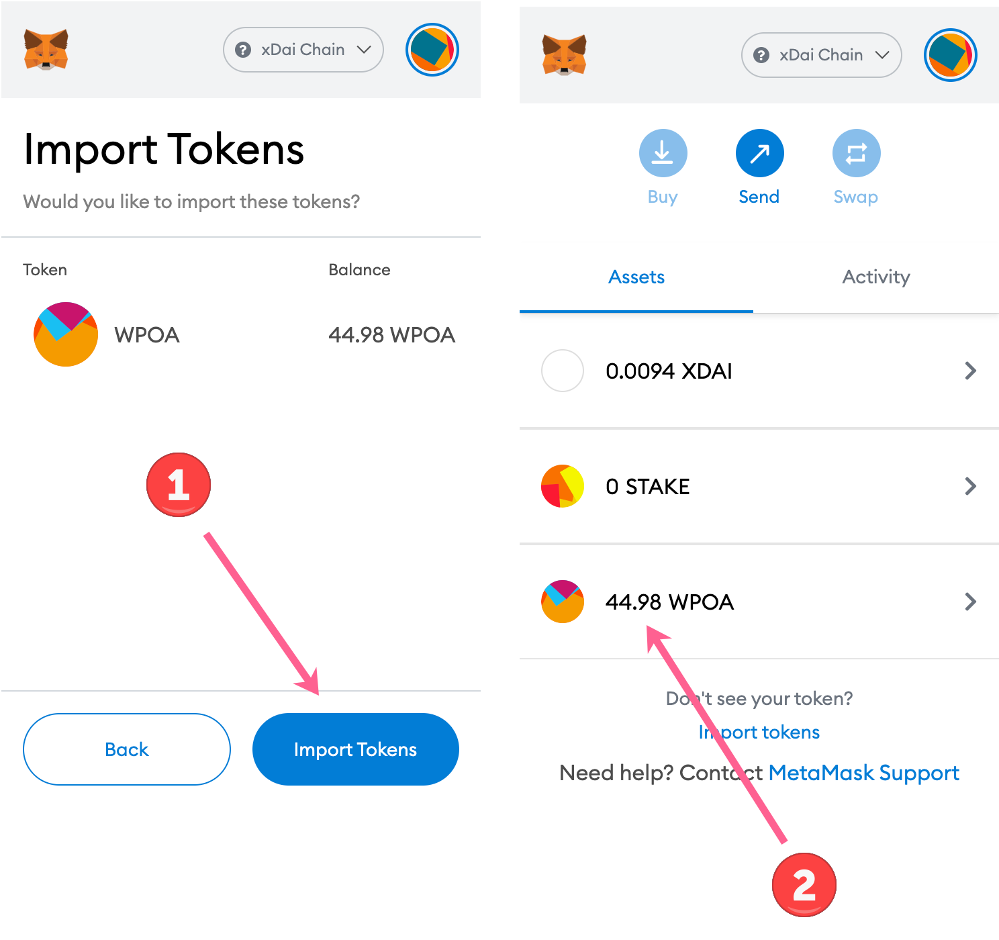

# POA - STAKE FAQs

We will continue to add questions/answers here as they arise. If you have an immediate concern, contact us in[ the discord poa channel.](https://discord.gg/mPJ9zkq)&#x20;


Instructions for how to [swap for POA on POA Network to STAKE on xDai are available here](poa-merger-and-stake-swap.md#how-to-swap).


## I can't see my POA in my wallet

Likely you are not connected to the POA network.&#x20;

Ethereum and POA Network externally owned addresses **** can co-exist on multiple chains. Switch the network to Mainnet to see tokens on Ethereum, and switch to POA Network to see tokens on POA (or xDai to see your balances on the xDai chain).&#x20;

To switch networks in MetaMask, click on the Network dropdown to select. **Note that POA and xDai are not native to MetaMask, so you will need to add them as custom networks. Instructions are below.**

********

## How do I add POA Network to MetaMask?

* You can add easily at [https://chainlist.org/](https://chainlist.org/,)&#x20;
* We have [instructions here](../wallets/metamask.md#metamask-setup) on adding a custom network.

## How do I add xDai Network to MetaMask

Same as above, you can add at [https://chainlist.org/](https://chainlist.org/,) or follow the instructions on [xdaichain.com](https://www.xdaichain.com/for-users/wallets/metamask/metamask-setup)

## I'm having trouble moving POA out of Binance

You can withdraw POA from Binance and send it to an external address that you control on the POA Network (an 0x wallet address that you have access to).&#x20;

Once it is on POA, follow the [swap process outlined here](poa-merger-and-stake-swap.md).

#### **Withdraw from Binance**

1\) Download and install [MetaMask](https://metamask.io).

2\) Add the POA Network. You can visit [https://chainlist.org/](https://chainlist.org/,) to add.

3\) Login to Binance and click Withdraw, withdraw crypto.

1. Select the POA Network Coin
2. Copy your wallet address from MetaMask&#x20;
3. Paste into Address field
4. Select POA Network \<see 2nd screenshot>

4\) Continue by adding amount of POA and press **Withdraw**. Press **Continue** to proceed.

5\) Verify security and **Submit.**

6\) Once confirmed, you will see the new amount of POA transferred to your address. Make sure your MetaMask is set to the POA Network to view. You can now [proceed with the swap](poa-merger-and-stake-swap.md).


**Additional resources**

* [Binance Withdrawal Guide and other Binance tutorials](https://academy.binance.com/en/articles/how-to-withdraw)
* [POA community created telegram group offering assistance.](https://t.me/POAHELP)


## What is the current POA price?

Valuations in your wallet may differ from what you receive when swapping. The rate for the swap is **466.6163443 POA per 1 STAKE,**  so the actual valuation is based on this rate.

Binance was responsible for nearly 100% of the trading volume for POA. Since it has been delisted, there is very little liquidity or trading options for the POA token.&#x20;

Tracking varies between tracking services and is not likely accurate.  Volume is very low and valuation may not reflect actual trade value or ability to trade.&#x20;

Primary price aggregators are here for reference.

* [Coin Market Cap](https://www.coingecko.com/en/coins/poa-network)
* [Coin Gecko](https://www.coingecko.com/en/coins/poa-network)

## What is POA20 on Ethereum?

POA20 is an ERC20 equivalent of POA that is on Ethereum rather than POA Network. Learn More Here

To swap POA20, it should first be bridged back to the POA Network. Here are some instructions (note gas fees to bridge from POA20 to POA can be expensive, and must be paid with ETH)



## What is the POA contract address?

POA does not have a contract address, it is the native token on the POA network (like ETH is the native token on Ethereum). To send, you need to be on the POA network.  If you [swap to xDai](poa-merger-and-stake-swap.md), it will be wrapped POA (WPOA) on the xDai chain. The address for **WPOA on xDai** is [0x9fe3864F9Ae7cfb5668Dae90C0e20c4C3D437664 ](https://blockscout.com/xdai/mainnet/token/0x9fe3864F9Ae7cfb5668Dae90C0e20c4C3D437664/token-transfers)

## How do I add WPOA to my wallet view on xDai?

Here we use Metamask as an example.

1. Switch to the xDai Network ([How to add xDai network to your MetaMask](https://www.xdaichain.com/for-users/wallets/metamask/metamask-setup))
2. Go to Assets
3. Press Import Tokens

1.  Add the WPOA Token Contract Address `0x9fe3864F9Ae7cfb5668Dae90C0e20c4C3D437664`

    The remaining info should autopopulate.&#x20;
2. Press **Add Custom Token**.

&#x20;

You should now see WPOA along with your balance.&#x20;

1. Press **Import Tokens** to finalize&#x20;
2. You will now see the amount of WPOA in your balance

## How can I get xDai to complete a transaction?

You can get some at the community faucet at [https://xdai-app.herokuapp.com/faucet](https://xdai-app.herokuapp.com/faucet)

__
