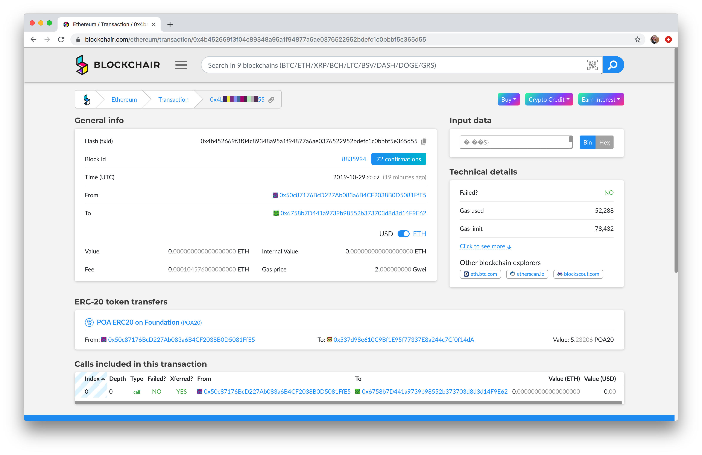

# Making a Payment with POA20 (Customer Perspective)

To pay using POA20, a wallet that supports POA20 along with the required amount of POA20 is needed. Depending on the method (web button, ecommerce plugin or in-person POS) the interaction will vary.&#x20;

In this example, an in-person request for payment is received. [Nifty Wallet](../nifty-wallet/) is used to complete the payment.

1\) Receive payment request.Open Nifty Wallet, connect to the Ethereum Mainnet, and **click on the dots** next to the POA20 token. This will open a second menu. Click **Send**.

2\) Enter in the payment address and POA20 amount from the POS invoice. If using a different wallet, it is possible to scan in QR code, however, you will still enter in the payment amount.

* 1\) Payment Address: 0x537d98e610c9bf1e95f77337e8a244c7cf0f14da
* 2\) Payment Amount: 5.23206000
* 3\) Click **Next**

.png>)

3\) Click **Submit **to complete the wallet transaction. It will be confirmed in your wallet before it is confirmed through Coinpayments.

4\) The Payment Status page for this request will auto-refresh every 60 second, however the transaction may take some time to post here. If your transaction is viewable in a block explorer, you can be confident that the payment has gone through.

