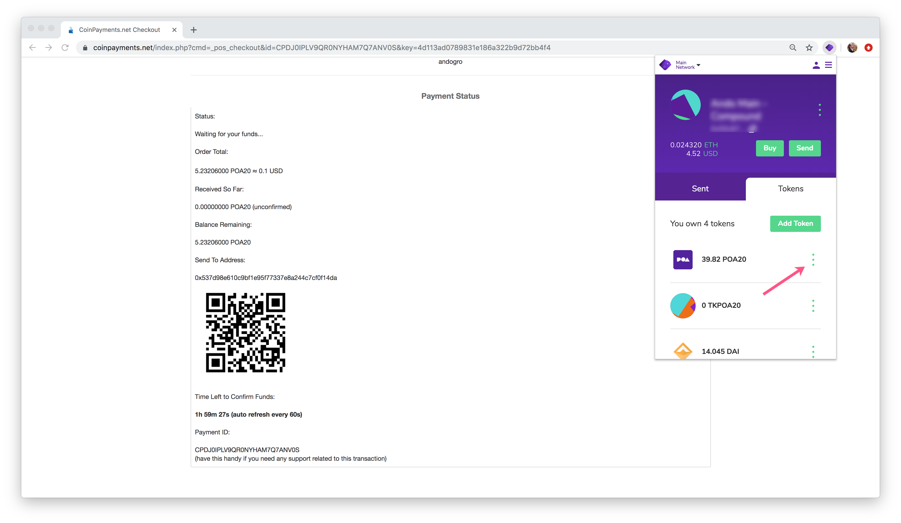

# 使用POA20付款（客户角度）

要使用POA20付款，需要一个支持POA20以及所需数量POA20的钱包。 根据方法（Web按钮，电子商务插件或当面POS）的不同，交互也会有所不同。 

在此示例中，收到了亲自付款请求。 [Nifty Wallet](https://www.poa.network/v/zhong-wen/for-users/wallets/nifty-wallet)用于完成付款。 

1）收到付款请求。打开Nifty钱包，连接到以太坊主网，然后**单击**POA20令牌旁边的点。 这将打开第二个菜单。 单击**发送**。

2\) 输入付款地址和POS发票中的POA20金额。 如果使用其他钱包，则可以扫描QR码，但是您仍将输入付款金额。

* 1\) 付款地址: 0x537d98e610c9bf1e95f77337e8a244c7cf0f14da
* 2\) 付款金额: 5.23206000
* 3\) 点击**下一步**

3\) 单击**提交**完成钱包交易。 在通过Coinpayments进行确认之前，将在您的钱包中进行确认。

4\) 该请求的“付款状态”页面将每60秒自动刷新一次，但是交易可能需要一些时间才能在此处发布。 如果您的交易在区块浏览器中可见，那么您可以确信付款已经完成。

