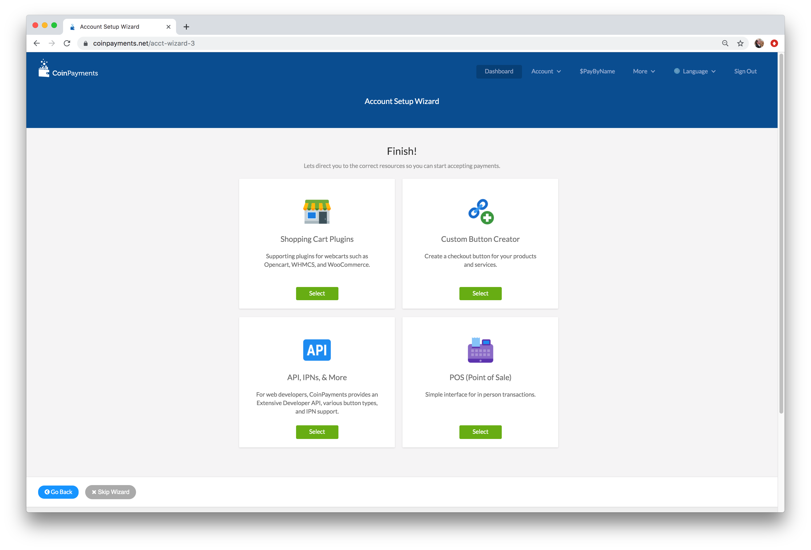
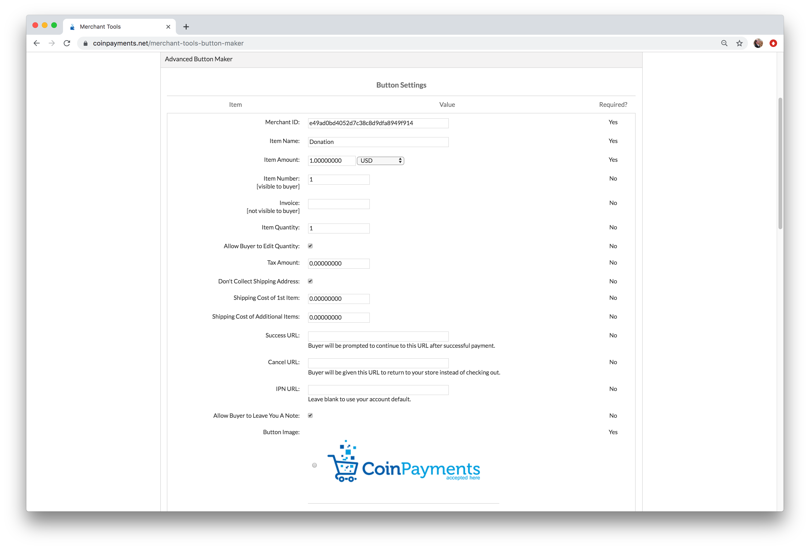
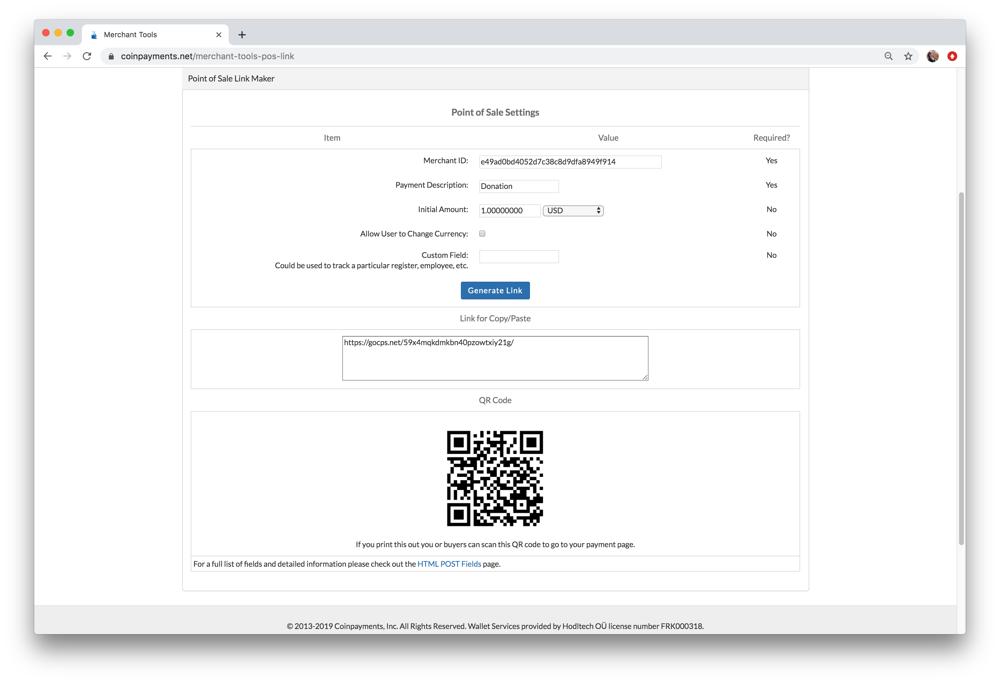
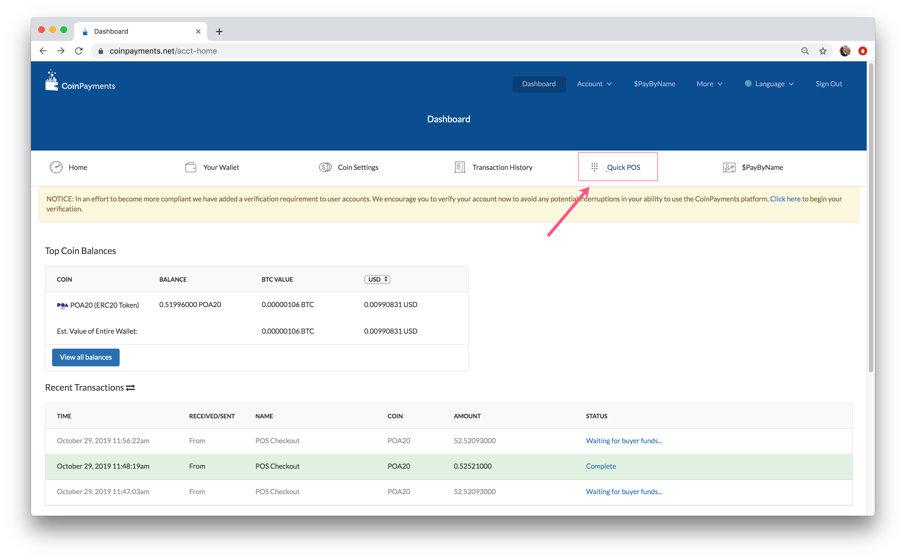
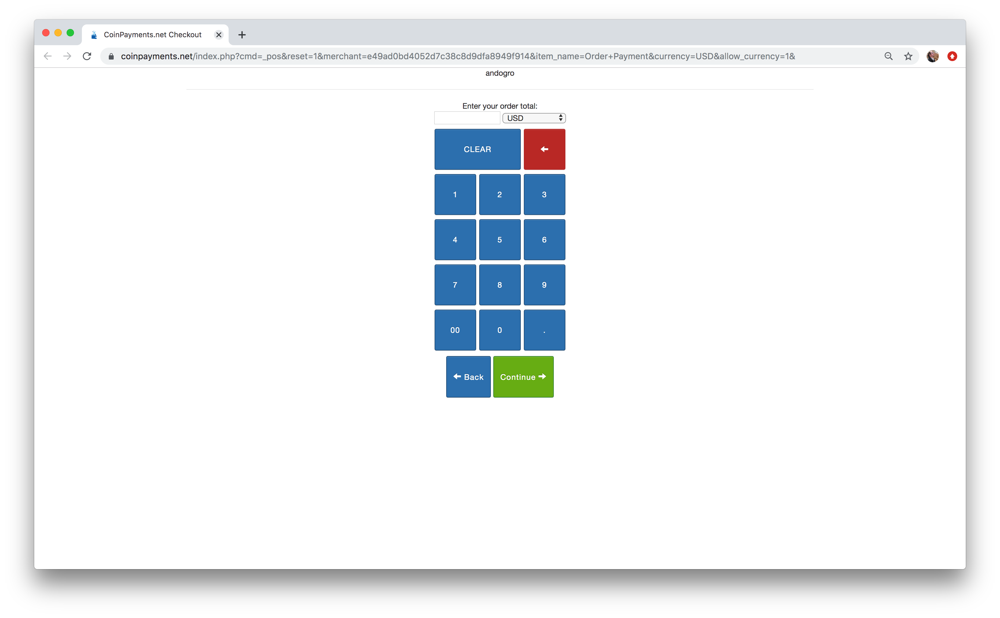
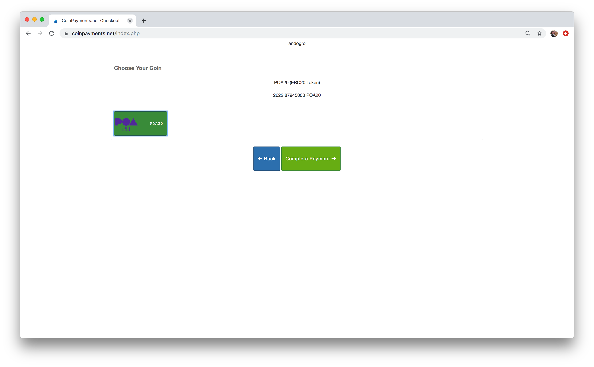
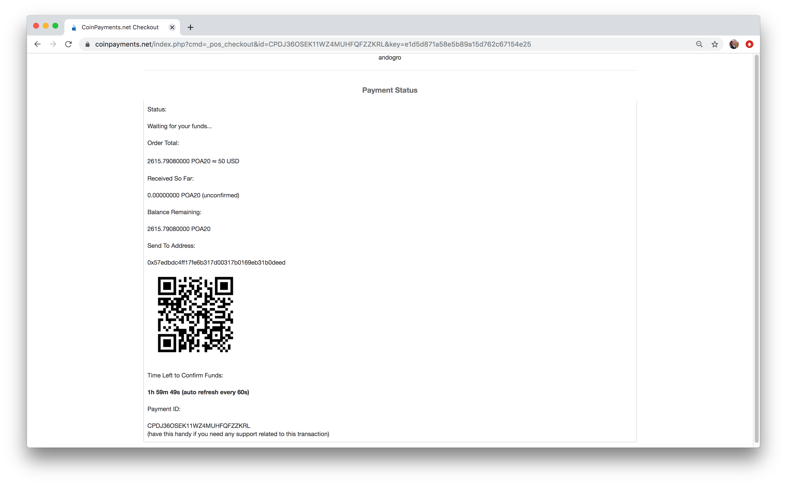

# Merchant Payment Method Setup



### Shopping Cart Plugins 

Plugins are available for most ecommerce applications. The list is available at [https://www.coinpayments.net/merchant-tools-plugins](https://www.coinpayments.net/merchant-tools-plugins)

### Custom Button Creator

Creates an html button which can be embedded into a website. Fill in the form and click **Generate Button** to receive your custom button.



**Example Generated Button Output**. \([See all HTML POST fields here](https://www.coinpayments.net/merchant-tools-buttons).\)

```
<form action="https://www.coinpayments.net/index.php" method="post">
	<input type="hidden" name="cmd" value="_pay">
	<input type="hidden" name="reset" value="1">
	<input type="hidden" name="merchant" value="e49ad0bd4052d7c38c8d9dfa8949f914">
	<input type="hidden" name="item_name" value="Donation">
	<input type="hidden" name="item_number" value="1">
	<input type="hidden" name="currency" value="USD">
	<input type="hidden" name="amountf" value="1.00000000">
	<input type="hidden" name="quantity" value="1">
	<input type="hidden" name="allow_quantity" value="1">
	<input type="hidden" name="want_shipping" value="0">
	<input type="hidden" name="allow_extra" value="1">
	<input type="image" src="https://www.coinpayments.net/images/pub/buynow-med-grey.png" alt="Buy Now with CoinPayments.net">
</form>
```

### API, IPNs and More

Instructions for custom integrations are available. Start here [https://www.coinpayments.net/merchant-tools-ipn](https://www.coinpayments.net/merchant-tools-ipn)

### Point of Sale \(POS\) In-Person Payments

This is the preferred method for accepting in-person payments. 

* For a pre-filled version \(contains purpose and amount charged\), use the POS interface to generate a link/QR code.



* Quick POS is also available from the Merchant Dashboard. This will open a new tab with a payment calculator.



* Enter in the payment amount and click **Continue**.



* Select the POA20 Token as the payment method and click **Complete Payment**



* Show the payment screen to the customer. They can scan the QR code with a [mobile wallet application](../wallets/) that supports POA20 and enter in the amount required for payment.



## 

