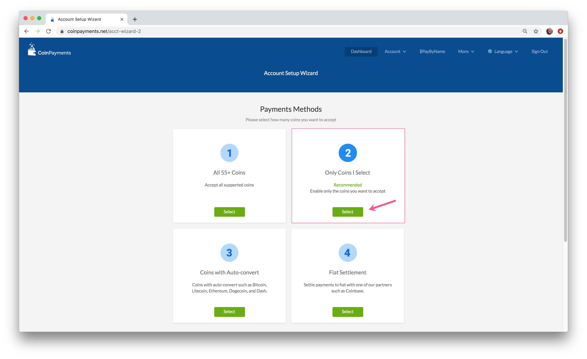
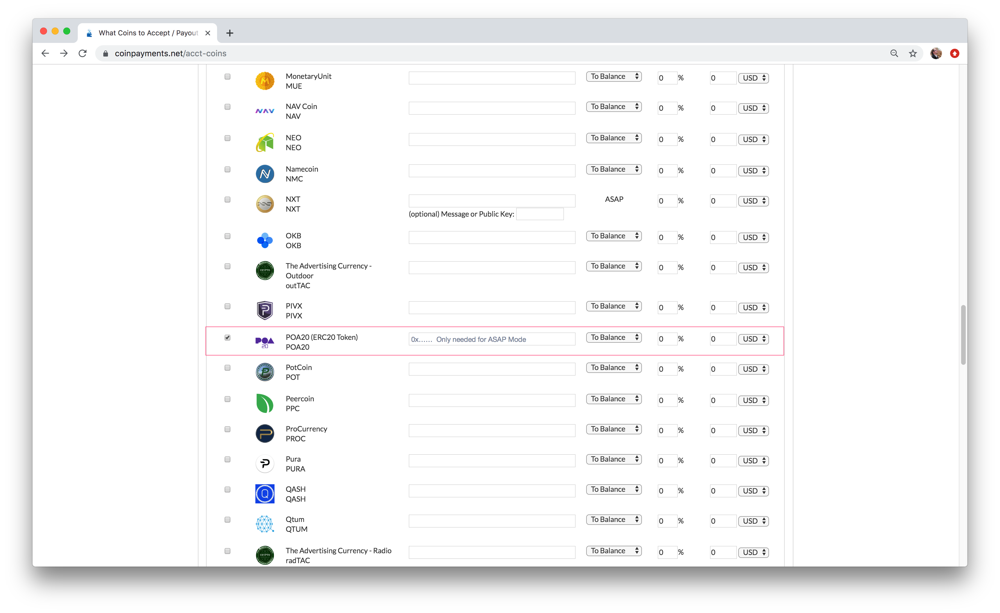

# Setup Merchant Account

1\) Select the **Merchant Account** box to start the setup wizard.

2\) In payment methods, select 2, **Only Coins I Select**

3\) From the list, select **POA20**. If you want to receive payments to an Address **immediately following confirmation**, **input that address in the Your Payment Address field** and **change the Payout mode to ASAP or ASAP + Convert**. Otherwise, purchases will be sent to your CoinPayments wallet address. 


Options for Payout Modes and Discount options are displayed below.


💲 **Payout Modes:**

* **To Balance:** Received payments are stored in your CoinPayments wallet for later withdrawal at your leisure.
* **ASAP:** Received payments are sent to the address you specify as soon as they are received and confirmed.
* **Nightly:** Received payments are grouped together and sent daily \(at approx. midnight EST GMT-0500\). The main benefit of this option is it will save you coin TX fees.
* **To Balance + Convert:** Received payments are converted to the selected coin and stored in your CoinPayments wallet. In some cases such as if the amount received is too large to convert at current market volumes you may receive the original currency instead.
* **ASAP + Convert:** Received payments are converted to the selected coin and sent to the address specified. In some cases such as if the amount received is too large to convert at current market volumes you may receive the original currency instead in your CoinPayments wallet.

💲 **Discount Options**: Enter a positive number to discount an item paid for with cryptocurrency, or a negative item to increase price if cryptocurrency is used.

4\) Once you have chosen the coins to select and options scroll to the bottom of the form and click **Update Coin Preferences**. You will be forwarded to the Merchant payment method setup screen.


[Next: Merchant Payment Methods Setup](merchant-payment-method-setup.md)


