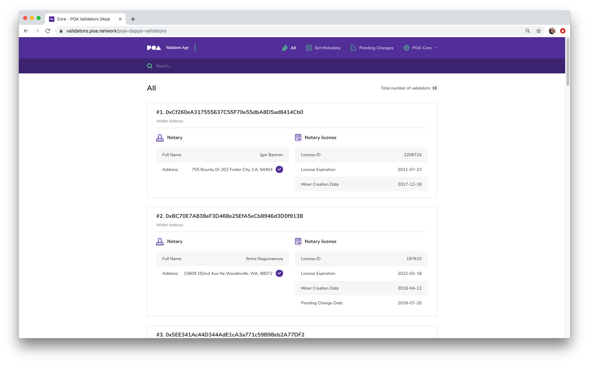

# 治理

在POA网络中，验证人管理自己和与共识相关的底层链上合约，以确保网络的安全性和性能。 网络的安全性取决于网络上验证器的数量，即更多验证器=更大的分发和安全性。 但是，太多的验证器会影响网络的性能。

POA网络的目标是（在美国境内）最大限度地增加验证器的数量和分布，以保护网络并同时保持网络性能。

验证程序链上治理是通过部署到网络的分布式应用程序（DApp）完成的。 这些DApp允许验证人对投票进行提议和投票，增加或减少批准投票，管理基本合同和管理排放资金所需的票数。

此外，验证者还将在POA论坛中讨论想法并提出计划。 在这里，新的验证人候选人也可能会介绍自己，以便可能被选入验证人集。

* [当前验证人列表（将您的网络设置为POA网络）](https://validators.poa.network/) 
* [有效和先前的验证人投票记录（将您的网络设置为POA网络）](https://voting.poa.network/poa-dapps-voting) 
* [POA验证人论坛](https://forum.poa.network/c/poa-core/notaries-intro) 
* [解释文章](article-a-successful-year-of-on-chain-governance.md)

