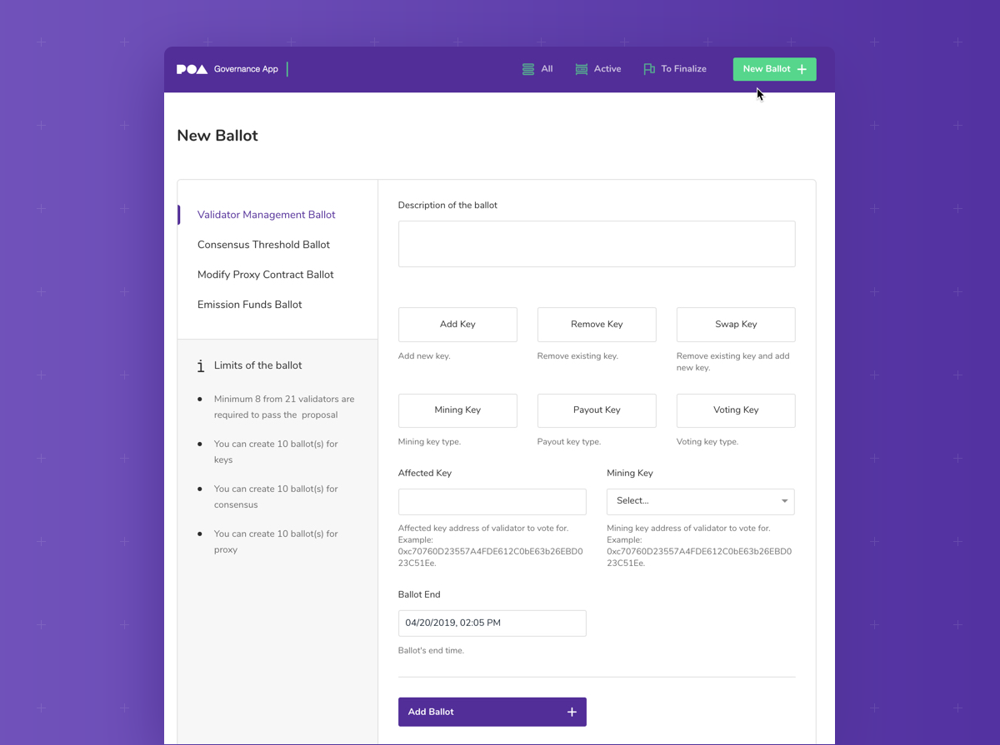

# 文章：链上治理成功的一年


本文最初于2019年3月发布。


2019年2月21日，第一份POA排放基金投票（ID：0）最终确定。 结果很接近。 八位验证者投票决定发送排放资金以支持POA基金会团队，九位投票者冻结资金直到下一个提案。 四个验证者选择不投票，这意味着**超过80％**的当前验证者参与了投票。

这是EmissionFunds的第一次投票，但这是通过POA链上治理流程提议并决定的第46次成功投票。 第一次投票于一年前，即2018年2月19日完成。该初始投票建议增加新的主网验证程序（Keys Ballot（ID：0），候选人以5比5的比例被否决）。

从那时起，添加了许多新的验证人，其他验证人已被拒绝或投票出去，并且已采取措施提高共识阈值（ConsensusBallot（ID：0），该验证人通过了8到7个）。 完整的投票列表可以在[https://voting.poa.network/poa-dapps-voting/](https://voting.poa.network/poa-dapps-voting/)上查看（将“网络”下拉列表设置为POA网络以进行查看）

一年多来，POA一直是一个完全自治的区块链。 与其他链上治理模型不同，POA的独特模型依赖于已知的，受信任的个人，他们使用同等的投票权来保护和服务于网络。

### 自治证明

POA Network的自治证明模型创建了一个公共的道德和负责任的治理体系。 在将网络验证人考虑为核心网络之前，必须先获得美国公证人许可证。 每个验证人都必须使用网络的“身份证明”[去中心化应用程序（DApp）](https://www.poa.network/for-validators/validator-dapps)来证明其身份和公证状态。

美国公证人有义务为签署正式文件提供公正可靠的证人。 他们确认当事方之间合同的合法性和完整性。 在POA网络中，每个验证者的信息（姓名，地址，公证许可）都是[公开可用](https://core-validators.poa.network/)的。 这种透明性强烈激励他们为网络的最大利益而努力。

为了使网络治理公平运行，这些验证人必须是自治个人，这一点很重要。 他们彼此不隶属，他们居住在美国的不同地区，从事不同的职业，并做出独立而明智的决定。

### 成为验证人

网络中的当前验证人提名并投票选出新的验证人。该过程从[POA论坛](https://forum.poa.network/c/poa-core/notaries-intro)中的介绍开始。该论坛提供了透明对话的机会；当前的验证人（和任何其他论坛参与者）可以询问候选人的问题，以评估其成为验证人的兴趣。 

如果当前的验证人批准了候选人，则他们可以提名他们作为验证者加入Sokol测试网络。该网络为新的验证者提供了参与共识的机会，并确保他们可以成功地运行节点并在移交给主网之前执行管理职责。 

如果他们成功，并且符合所有资格（美国居民，年满18岁，公证人，积极参与测试网），则可以由当前的主网验证员提名Sokol验证员，以转到POA核心网络。对于那些已经成功成为主网验证者的人，从论坛介绍到POA主网验证人的[平均时间约为125天](https://forum.poa.network/t/poa-validators-candidates-guide/1250)。

### 激励与责任

选出并添加为节点后，验证人将在链上验证的每个区块获得1个POA令牌以及交易费用。 当所有节点均正常运行时，每5秒验证一次块。 拥有21位验证人（当前人数，可能有变），验证者每105秒会收到@ 1令牌（+费用），或者每24小时获得@ 822令牌。

该区块奖励激励验证人维护其节点并参与链上治理。 如果节点以某种方式损坏，或者验证人始终未能参与治理（可以使用[poa-ballot-stats](https://github.com/poanetwork/poa-ballot-stats)工具进行检查），则任何验证人都可以提出表决以删除不符合要求的验证人。

当前所有验证人都有责任保护网络，这包括监视其验证者同伴节点并通过自治过程解决问题。 当更新POA协议的票投在链上时，验证人会事先在POA论坛中讨论利弊。 

该平台提供了进行公开对话的机会，所有社区成员都可以看到并参与讨论。 例如，最近的EmissionFunds选票在投票开始前[经过了数周的辩论](https://forum.poa.network/t/first-round-of-poa-core-emission-funds-discussion-february-2019/1933)。

### 保护网络

验证人通过维护提供区块链共识的节点来为POA网络提供安全性。 所有交易都需要达成共识，以确保分类账在所有节点上都是一致且准确的。 POA网络上的交易多种多样，包括：

* **POA代币作为一种交换媒介**：[DopeRaider](https://www.stateofthedapps.com/dapps/doperaider)之类的游戏在游戏购买和角色操作中都使用POA代币。 玩家根据游戏中的选择赚取或失去POA。
* **POA代币支付gas费用**：诸如[Geon](https://www.stateofthedapps.com/dapps/geon-app)之类的DApp使用POA核心网络来利用低成本和高速度。 用户使用Geon代币进行交易； POA令牌用于支付发送费用。 [肯尼亚的社区](https://www.bloomberg.com/news/features/2018-10-31/closing-the-cash-gap-with-cryptocurrency)也正在使用POA网络来降低交易费用。 
* **桥接POA代币**：用户可以将POA桥接到主网上的POA20，然后将POA20用作[EthLend](https://ethlend.io/home)上的贷款质押，通过[Coinpayments](https://www.coinpayments.net/)进行商户付款，或将POA和POA20套利到各种市场交易所。

验证人负责提供区块链节点和安全性，以快速有效地促进这些交易。 当需要升级时，验证者建议进行链上投票以维护POA网络的功能和完整性。

### 发起选票

发起投票很简单，并且可以通过Governance DApp完成。 此DApp支持以下投票类型：

* **验证人管理**：添加或删除验证人，交换验证者密钥。 
* **共识阈值**：增加或减少批准投票所需的票数。 
* **代理合约**：修改构成网络的基础智能合同-无需硬分叉即可用于更新网络。 
* **排放资金**：管理排放资金-可能每3个月创建一次。

要创建投票，验证人只需访问DApp，选择投票标准（描述和结束日期），然后将其提议给组即可。 投票结束时，将对票数进行计票，并在链上制定决定。

### 持续的自治

POA链上治理模型已经工作了一年多，以维持和改善网络。 验证人必须对执行职责负责，这会在过程中产生高度的参与和参与。 由于他们的身份受到监视，而且投票的参与是透明的，因此可以通过信任POA网络安全地进行和记录交易的社区来查看和检查验证人的行为。 

[Artis](https://artis.eco/en/)，[Lukso](https://www.lukso.network/)，[Ocean](https://blog.oceanprotocol.com/ocean-on-poa-vs-ethereum-mainnet-decd0ac72c97?gi=5704f5b58c5f)，[Colu](https://www.colu.com/)和其他协议见证了POA核心在POA链上的POA链治理的成功，并将其用于自己的网络和项目。 2019年5月，Kovan测试网络还采用了POA治理工具。 随着我们继续改进POA的链上治理工具，我们希望看到更多协议采用链上治理作为保护和维护其链的可行方法。


本文来自POA论坛：[https://forum.poa.network/t/a-successful-year-of-poa-on-chain-governance/2354](https://forum.poa.network/t/a-successful-year-of-poa-on-chain-governance/2354)


