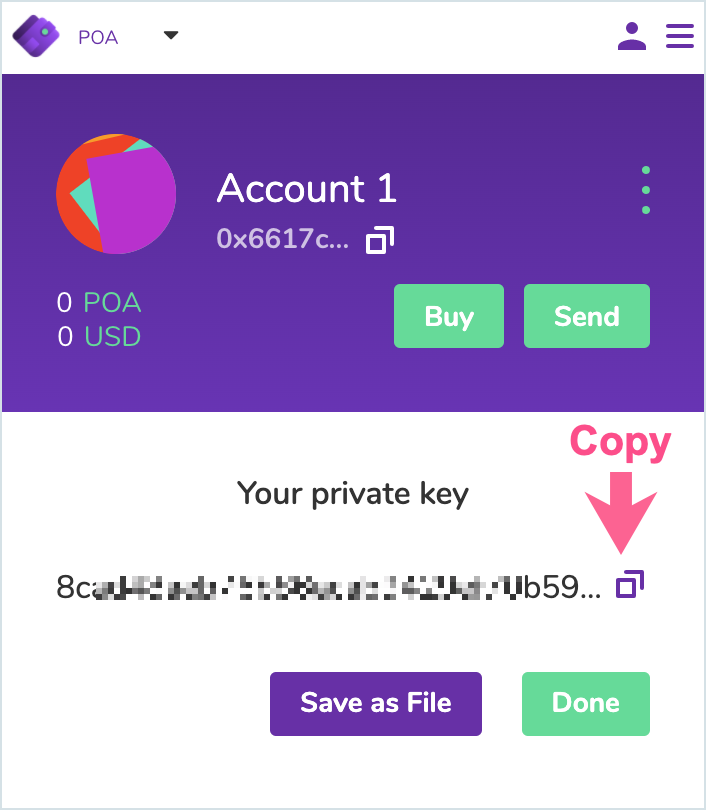
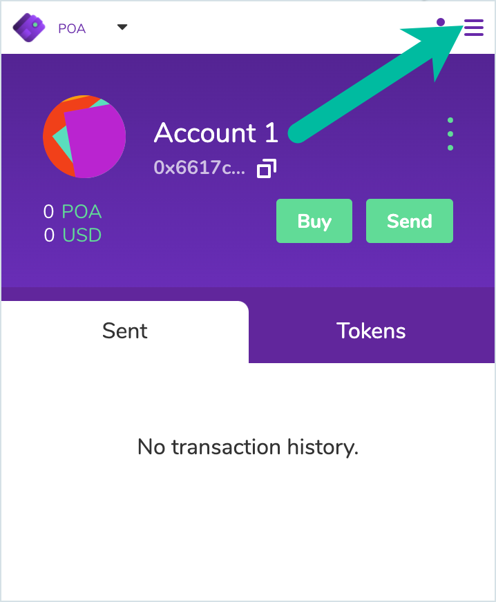
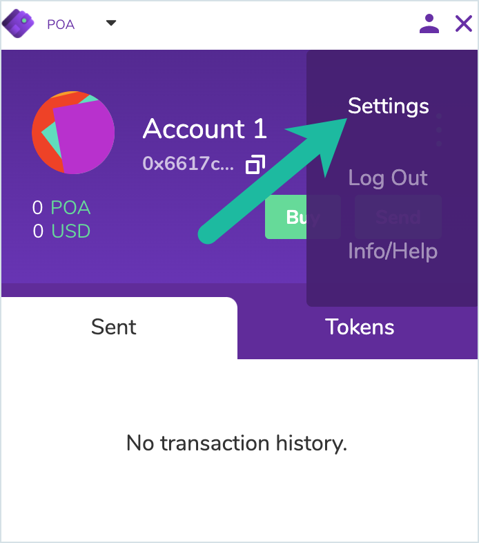
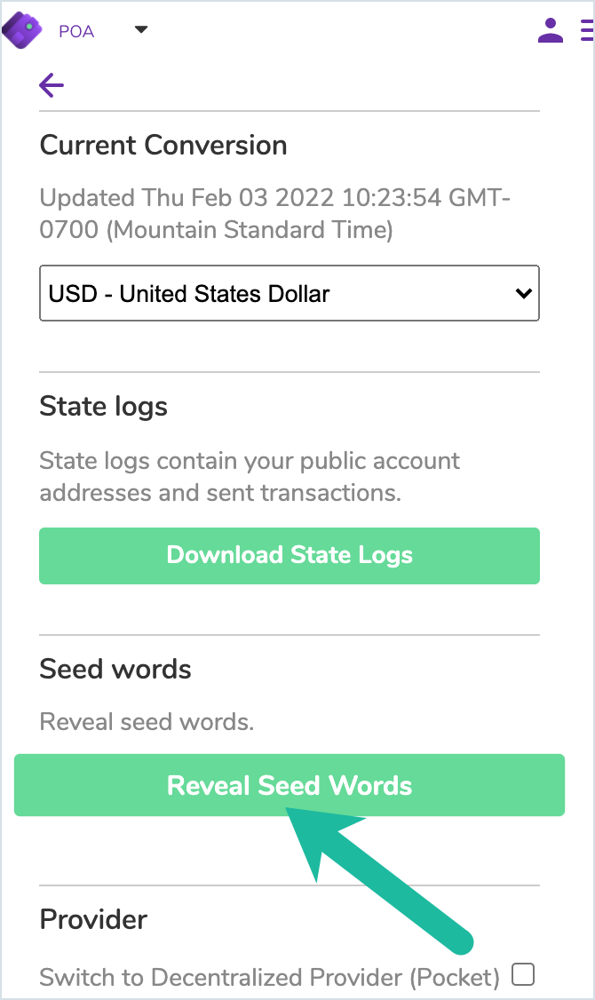
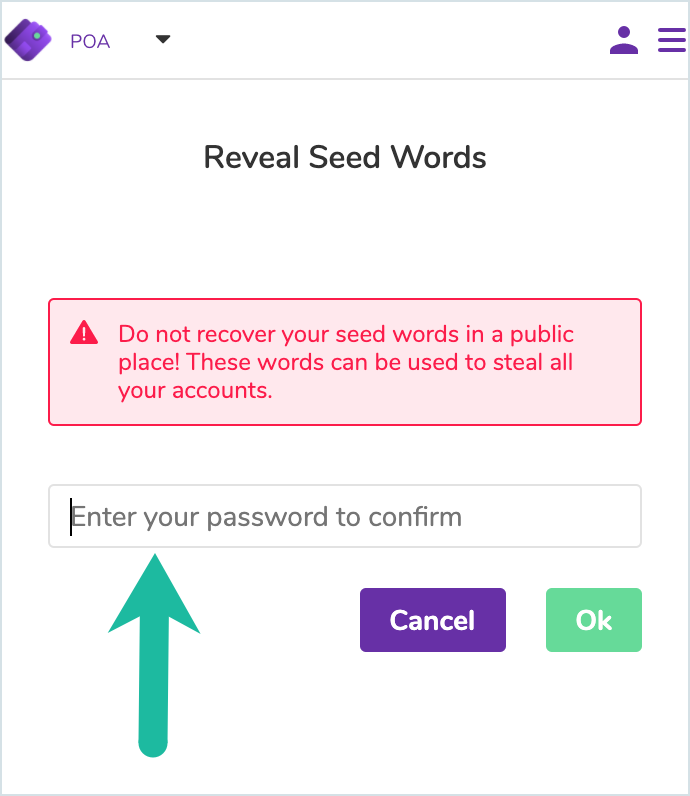
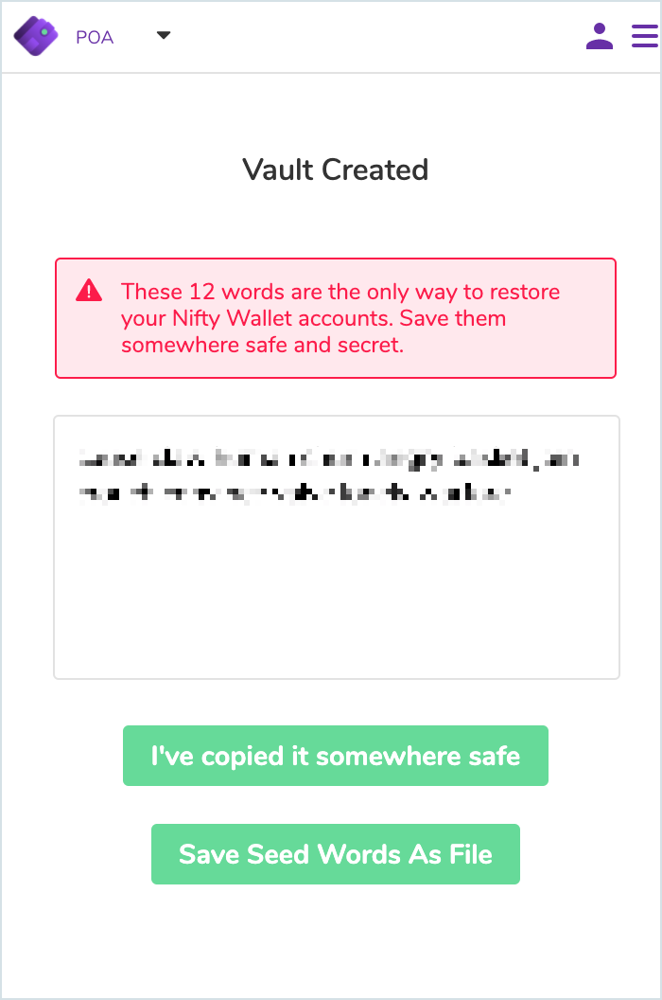

# ❌ Nifty Wallet (Discontinued)


**Nifty Wallet is discontinued.** \
As a result of changing crypto market conditions and to continually improve support for our growing family of Gnosis Chain products, certain existing products will be retired in 2022. This list includes the **Nifty Wallet browser wallet**. Nifty Wallet extension will be delisted from Google Chrome web store in the near future.&#x20;

See instructions below to move your address to another wallet.


## Move / Export an Address

There are several ways to get the account information you need to move your wallet address(es) to a supported wallet.

### Access private key for individual accounts

1\) Select an account and click the 3 vertical dots.

.png>)

2\) Select **Export Private Key.**

****.png>)****

3\) Enter your Nifty Wallet password**.**

.png>)=

4\) Copy your private key(pk) and import into your wallet of choice ([such as MetaMask ](https://metamask.zendesk.com/hc/en-us/articles/360015489331-How-to-import-an-Account)or another wallet), or download a csv of your pk. **Keep the pk secure at all times and remove from your online machine after you have setup a new wallet. Anyone with the pk will have access to use your address.**

### Access seed phrase for all created accounts&#x20;


This does not include copied accounts or added hardware accounts, only all accounts created within the Nifty Wallet interface


1\) Select the "hamburger menu" at the top of your wallet.

2\) Select **Settings**.

3\) Scroll down and press **Reveal Seed Words**.

4\) Enter your Nifty Wallet Password.

5\) Copy and save in a secure, offline location. You can use this seed phrase to [restore a wallet on MetaMask](https://metamask.zendesk.com/hc/en-us/articles/360015289612-How-to-restore-your-MetaMask-wallet-from-Secret-Recovery-Phrase) or another application.

## About Nifty Wallet

Nifty Wallet is a full-featured browser wallet built for interacting with web3 applications. Originally forked from MetaMask, Nifty Wallet has been refactored by POA to include an expanded list of RPC endpoints and expanded to include features like the ability to interact with contracts, connect to a decentralized node network, and more.

Nifty Wallet is the preferred browser-based wallet for interaction with POA Core and POA Sokol.&#x20;

* [Chrome extension](https://chrome.google.com/webstore/detail/nifty-wallet/jbdaocneiiinmjbjlgalhcelgbejmnid?hl=en)
* [Github Repository](https://github.com/poanetwork/nifty-wallet)
* [Nifty Wallet Release Information](https://github.com/poanetwork/nifty-wallet/releases)


Nifty Wallet and MetaMask do not function properly when both are activated at the same time as chrome extensions. To use one or the other, **right click** on the extension icon, go to **Manage Extensions**, and **toggle off/on** the application you want to use. All data will be preserved in the wallet for future access.



We are currently updating instructions here. For immediate help, please see the basic wallet guide: \
[https://forum.poa.network/t/nifty-wallet-guide/1789](https://forum.poa.network/t/nifty-wallet-guide/1789)


## Using Nifty Wallet

* [Getting Started](getting-started.md)
* [Interacting with Smart Contracts / Calling Contract Methods](import-and-interact-with-smart-contracts.md)
* [Connecting to a hardware wallet](connect-to-a-hardware-wallet-ledger-and-trezor.md)
* [Connecting to Pocket](connect-to-pocket-decentralized-network.md)
