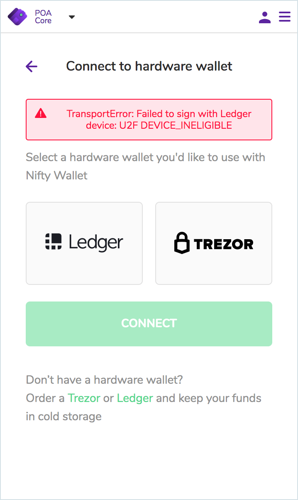
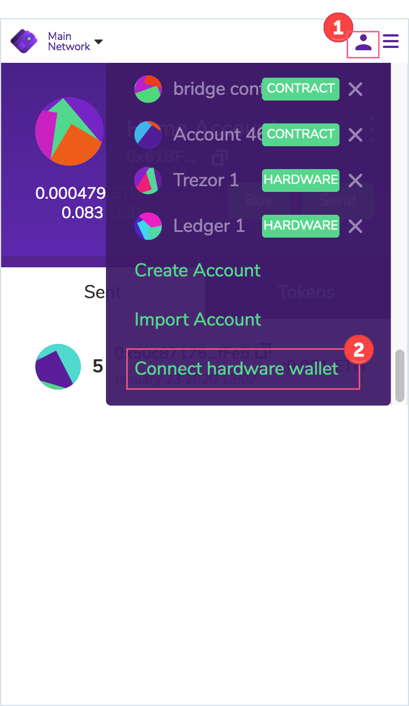
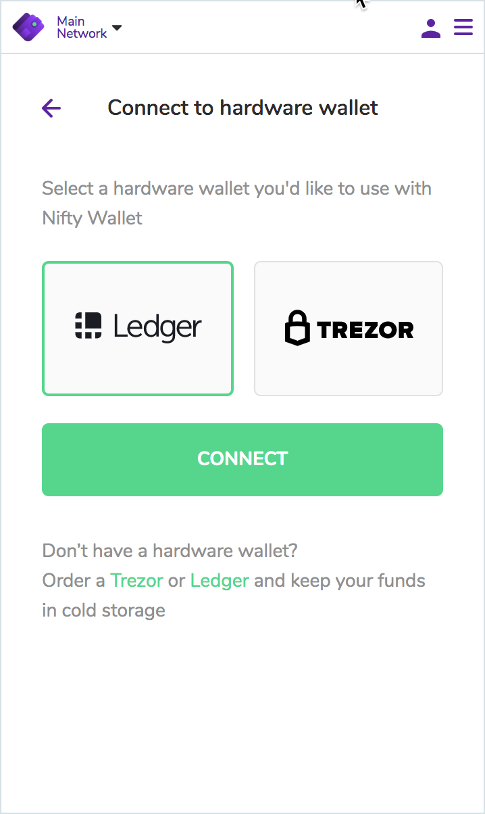
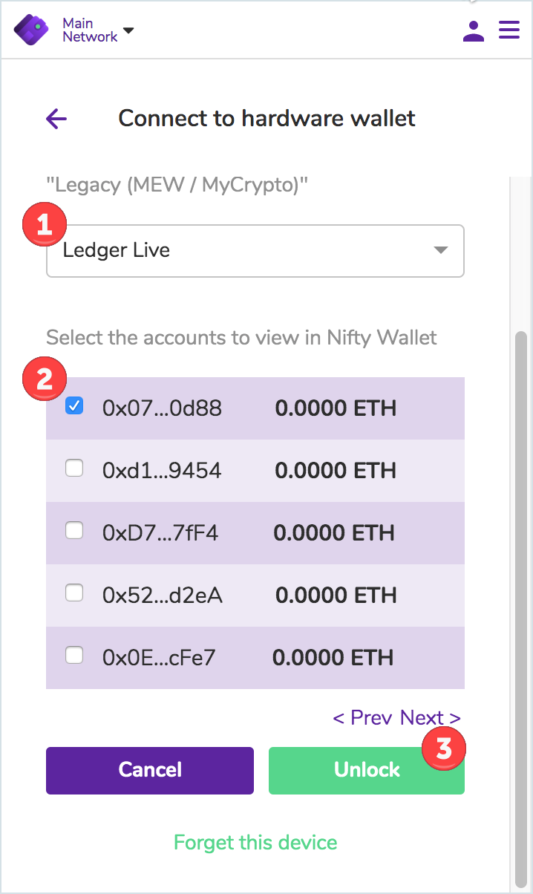
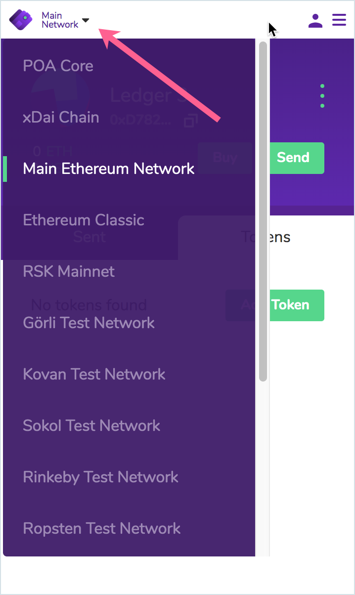

# Connect to a Hardware Wallet \(Ledger & Trezor\)

Nifty supports connections with [Ledger](https://www.ledger.com/) and [Trezor](https://trezor.io/) devices. You can connect to a hardware wallet and use Nifty to view your hardware wallet balances and send and receive transactions.

## Ledger

1\) You will need to setup your Ledger with applications for the different chains you intend to interact with. This will involve using the [Ledger Live](https://www.ledger.com/ledger-live/) application. Basic resources on getting started with Ledger:

* Setup a new device: [https://support.ledger.com/hc/en-us/articles/360000613793-Set-up-as-new-device](https://support.ledger.com/hc/en-us/articles/360000613793-Set-up-as-new-device)
* Install the POA application: [https://support.ledger.com/hc/en-us/articles/360007802253-Proof-of-Authority-POA-](https://support.ledger.com/hc/en-us/articles/360007802253-Proof-of-Authority-POA-)


The Ethereum application must be installed before the POA app.


2\) Once you've installed the Ethereum and POA applications, make sure your Ledger is connected to your device and enter one of the applications \(Ethereum or POA\) by navigating to that application and pressing both buttons on the Ledger at the same time. You need to see the **Application is ready** screen on your Ledger before you connect with Nifty. **Otherwise, you will get this error:**

3\) Open Nifty Wallet, click on the **Accounts Icon**, scroll down and press **Connect hardware wallet**. 

4\) Select **Ledger** and press **Connect**.

5\) Select:

* 1\) Wallet HD path \(where ledger is currently connected. If your addresses are incorrect, try the Legacy \(MEW / MyCrypto\) path.
* 2\) Account\(s\) to interact with.
* 3\) Press **Unlock.**

6\) Accounts will populate and named as Ledger 1, Ledger 2 etc. You can change the account name by hovering over the name and clicking **edit**. From here you can send and receive transactions to your Ledger account. Make sure you select the appropriate Network from the dropdown. If you want to send POA for example, you must connect to the POA Network.

## Trezor


Instructions are similar to the above. - You will connect and unlock your device, select Trezor, and follow the prompts to select which addresses you would like to interact with. Detailed instructions in process.


