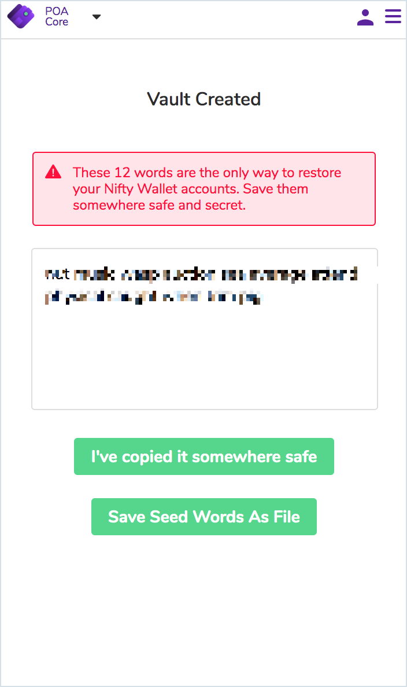
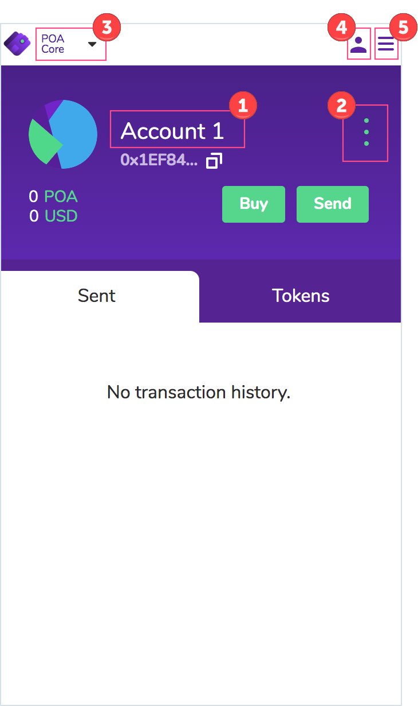

# Getting Started

1\) Install the plugin for your browser. The app is compatible with Chrome and Brave browser

* [Google Chrome Extension](https://chrome.google.com/webstore/detail/nifty-wallet/jbdaocneiiinmjbjlgalhcelgbejmnid)


Compatible with Google Chrome v59.0.3071.115 or later.


2\) __Click on the **purple app icon** in your browser toolbar to open. Accept Terms of Use.

3\) Create a new vault or import an existing vault \(called a DEN\) which will hold all of your wallet information.

* **Create New** 
  * Enter a secure password, save in a secure location.
* **Restore** from previous Nifty vault
  * Click **Import Existing DEN.**
  * Enter the 12 word phrase from your previous wallet.
  * **Create a new password** and save in a secure location

4\) Copy your seed words and store in a secure location.

5\) Your wallet is ready to use! Below are some config and interaction options.

     1\) **Change the account name**: hovering over the current name \(Account 1\), click **edit**, change name and click **save**.

     2\) **Address interaction** - brings up a menu with several options.

* View on block explorer: Opens account address in BlockScout
* Show QR Code
* Copy address to clipboard
* Export Private Key: Enter password to export

     3\) **Dropdown to switch the chain/network**. Nifty includes support for:

* POA Core
* xDai Chain
* Main Ethereum Network
* Ethereum Classic
* RSK Mainnet
* Gorli Testnet
* Kovan Testnet
* Sokol Testnet
* Rinkby Testnet
* Ropsten Testnet
* Any Custom RPC

     4\) **Account dropdown**

* Create Account
* Import Account: Can choose Private Key, JSON File, Contract, or Proxy Contract
* Connect a Hardware Wallet: Ledger and Trezor Support

     5\) **Settings**

* Settings: Ability to change Conversion, State Logs, Reveal Seed Phrase, Switch to a Decentralized Provider \(Pocket\), and change the account password.
* Logout
* Info/Help \(Shows current version\)

