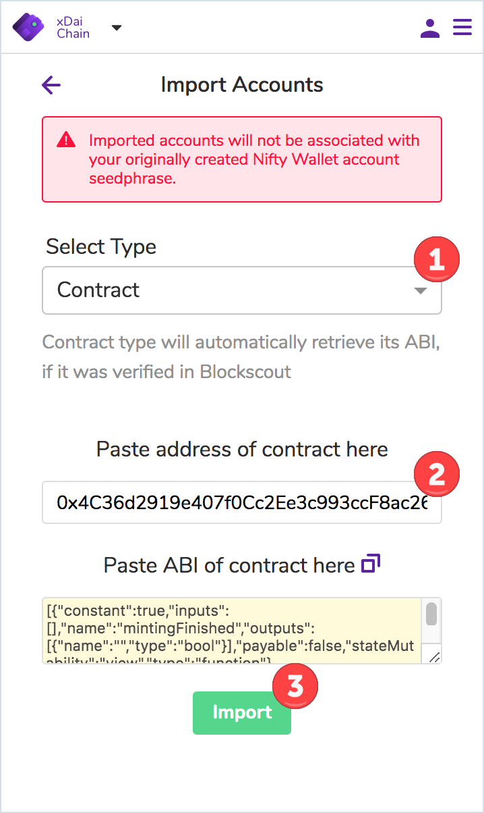
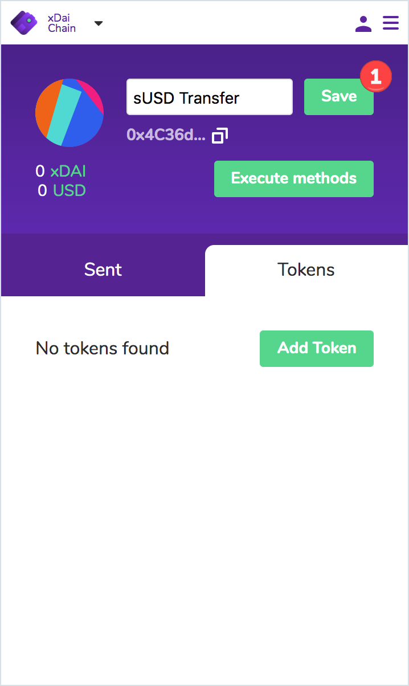
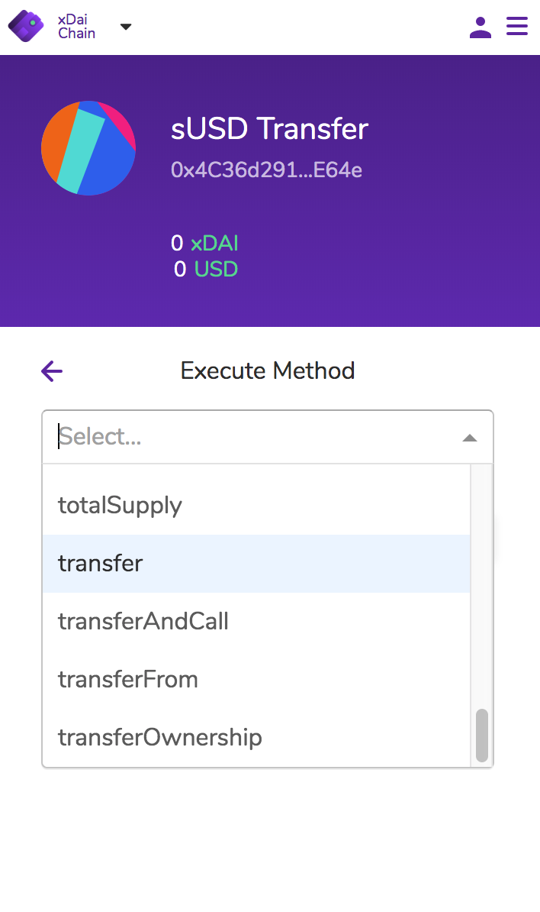
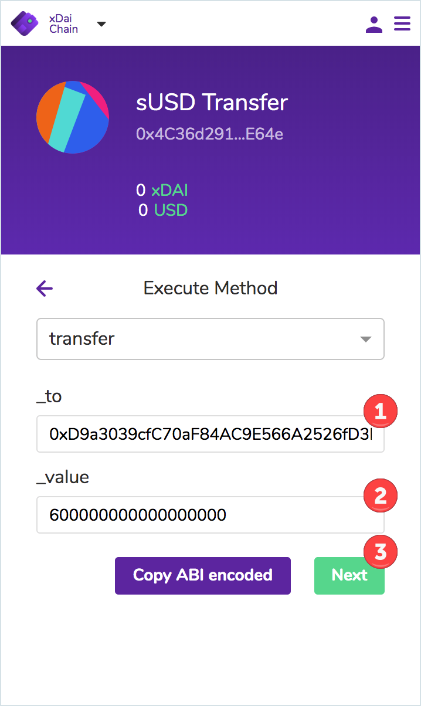
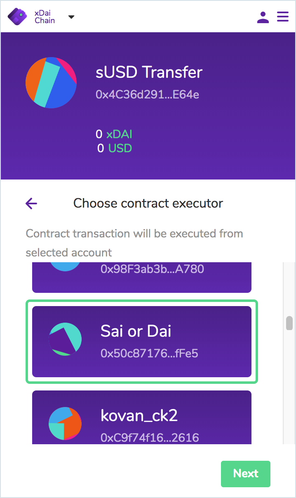
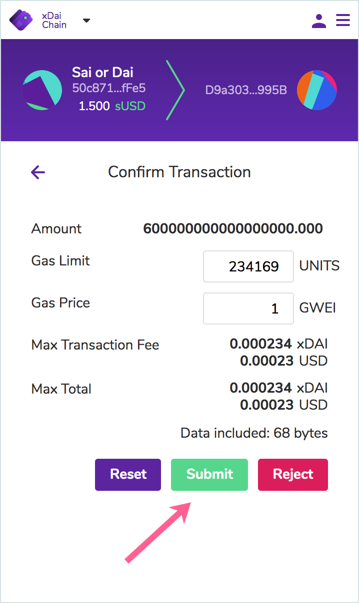
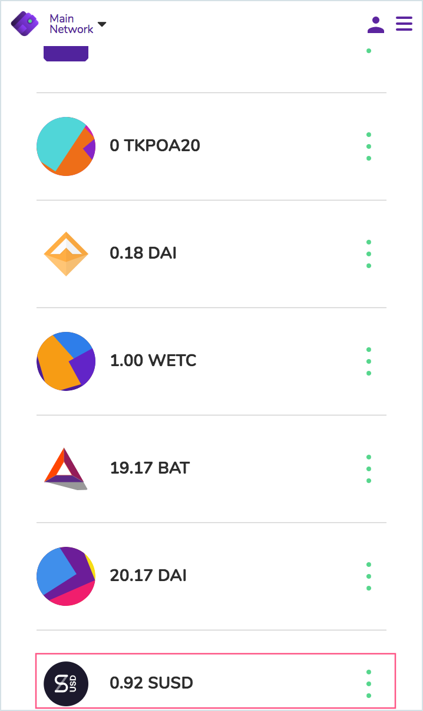

# Import and Interact with Smart Contracts

Nifty wallet is designed for developer interaction. You can import BlockScout verified contracts simply by entering the contract address - the ABI automatically populates from there. If a contract is not BlockScout verified, you can also paste in the ABI.

In this example, we import a token contract and send an amount to a bridge mediator contract, which transfers the token \(sUSD\) from the xDai chain to the Ethereum Mainnet.


This tutorial is for demonstration purposes for using the Contract Import and Interaction features of Nifty wallet. You need sUSD on the xDai chain to complete the exact steps below. If interested, you can [obtain through this process](https://docs.tokenbridge.net/eth-xdai-amb-bridge/susd-bridge-extension/transfer-susd-through-the-bridge-extension). 



We recommend starting with a contract deployed to a testnet \(like Kovan, Sokol, etc\) to explore your contract functionality fully without spending any real currency.


### 1\) Open Nifty Wallet to Get Started

1. Connect to the chain where the contract is deployed. Here we use the xDai chain.
2. Click on the **Accounts** Icon.
3. Scroll down and select **Import Account**.

###  2\) Import Contract

1. Choose **Contract** in Select Type Dropdown.
2. Paste in the **Contract Address** \(we use`0x4C36d2919e407f0Cc2Ee3c993ccF8ac26d9CE64e` \). If the contract is verified in BlockScout, the ABI will auto-populate. If not, paste the ABI. [Here are a few ways to retrieve the ABI of a contract.](https://ethereum.stackexchange.com/questions/3149/how-do-you-get-a-json-file-abi-from-a-known-contract-address)
3. Click **Import**.

### 3\) Change the Account Name

1. This makes the account easier to find. Hover over the account name and "edit" will appear. Click on **edit** to change the name. Click **Save**.

### 4\) Select Methods

1. Click the Execute Methods button to see all of the available methods. We choose the **transfer** method.

###  5\) Enter Values

The transfer method accepts two arguments. 

1. In the `_to` field, we enter the bridge mediator contract address `0xD9a3039cfC70aF84AC9E566A2526fD3b683B995B`
2. In the _`_`_`value` field, we enter a value of sUSD in Wei to transfer.  We must have this amount in the account we will use to execute the call \(min 0.5 sUSD or 500000000000000000 Wei\)
3. Click **Next** to continue.

### 6\) Select Address to Execute the Method

Select an address to execute the contract call. In this case, the address must contain the amount of sUSD to transfer as well as a small amount of xDai to cover the gas costs. Choose an address and press **Next**.

### 7\) Confirm Transaction

Check gas fees and details and press **Submit**. The transaction should process. Once confirmed, check in BlockScout, and change networks to the Eth Mainnet see the new Balance.

### 8\) View Transaction in BlockScout



