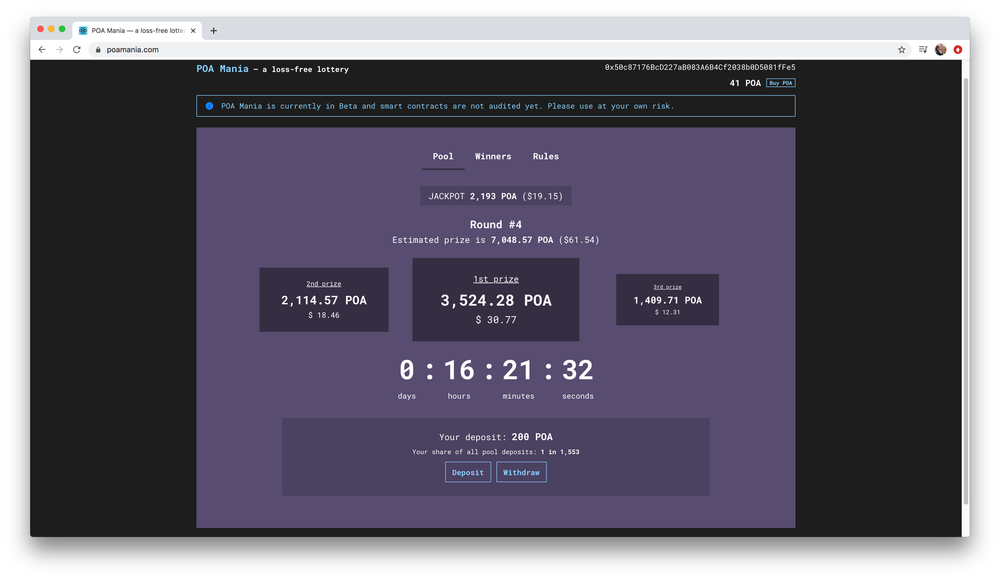

# POA Mania

A no-loss lottery where POA hodlers can win an extra slice of POA Pie 🥧. Emission fund rewards are distributed to the winners every round. Featuring:

* 🏆 3 winners per round. Rounds close daily.
* 🎆 Each round, 15% of prize pool is added to an ongoing jackpot. There is a 1% chance of winning the jackpot per round.
* 💰 Prizes based on emission funds independent of the amount in the pool.
* ⏳ Close a round, win POA. 
* 🎲 On-chain, decentralized randomness decides the winners.

## 🎲 POA Mania 

POA Mania is currently available on POA core and the Sokol testnet. We are using the new RANDAO-based randomness contracts to support this decentralized, no-loss, on-chain lottery. 

#### **POA Core:**

* Link: [http://www.poamania.com](http://www.poamania.com)
* Telegram Bot on POA Telegram: [https://t.me/oraclesnetwork](https://t.me/oraclesnetwork) 
* Proxy Contract Address: [0xf7ECea96dA4951e88E699cfb67d909Ec74Ba917E](https://blockscout.com/poa/core/address/0xf7ECea96dA4951e88E699cfb67d909Ec74Ba917E/transactions)
* POA Mania Contract: [0x0C31e682d401c465fdD05e40cE7149F8497B18E5](https://blockscout.com/poa/core/address/0x0C31e682d401c465fdD05e40cE7149F8497B18E5)

#### **Sokol Testnet:**

* Test Application[: https://poa-mania.herokuapp.com/](https://poa-mania.herokuapp.com/)
* SPOA for testing: [https://www.poa.network/for-developers/getting-tokens-for-tests/sokol-testnet-faucet](https://www.poa.network/for-developers/getting-tokens-for-tests/sokol-testnet-faucet)
* Testing Telegram Bot[: https://t.me/poamania](Https://t.me/poamania)

#### Github Repository:

[https://github.com/poanetwork/poamania-contracts](https://github.com/poanetwork/poamania-contracts)

