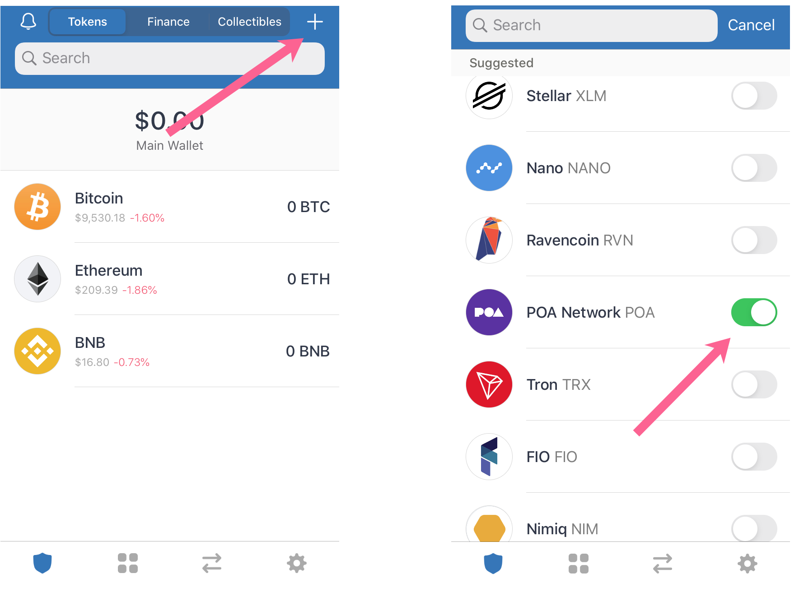
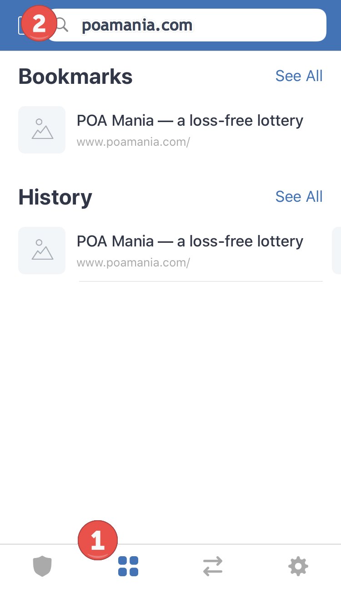
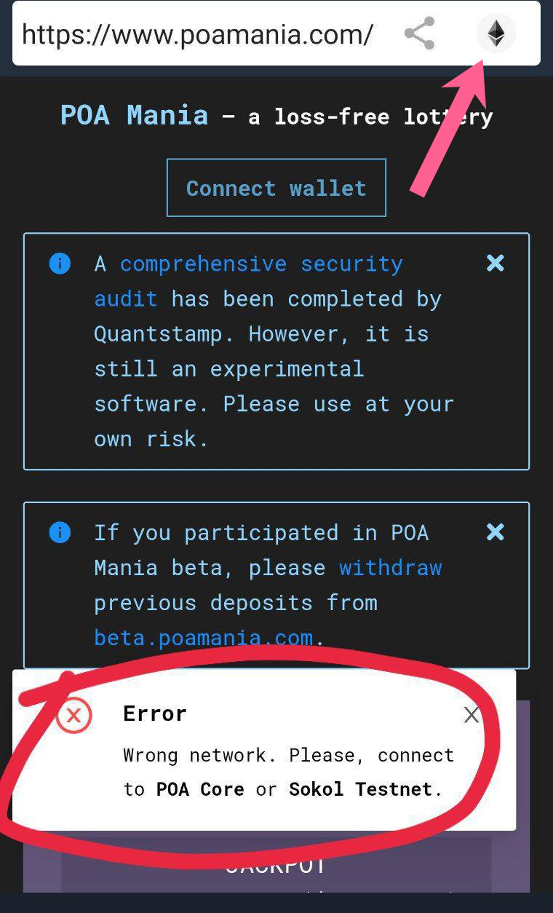
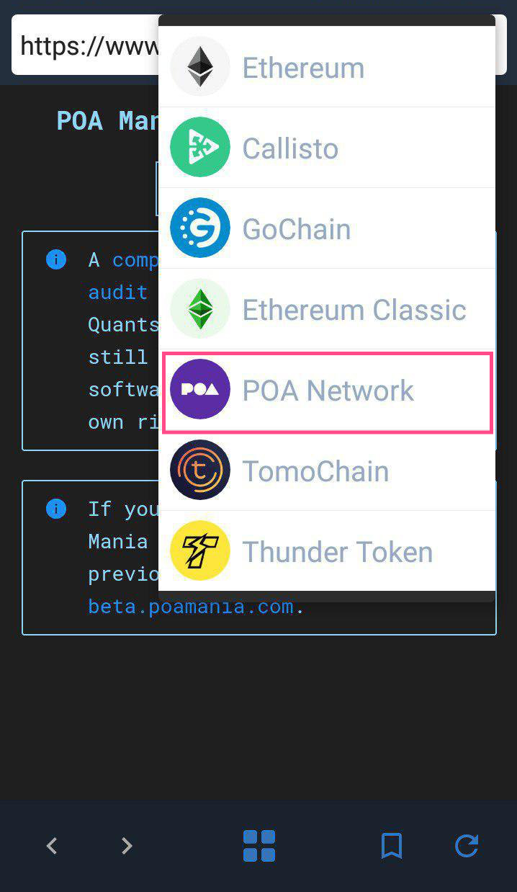
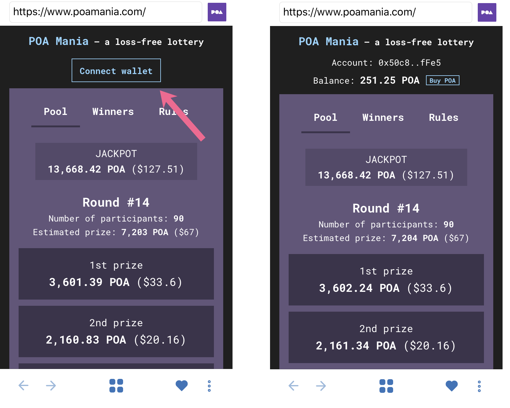
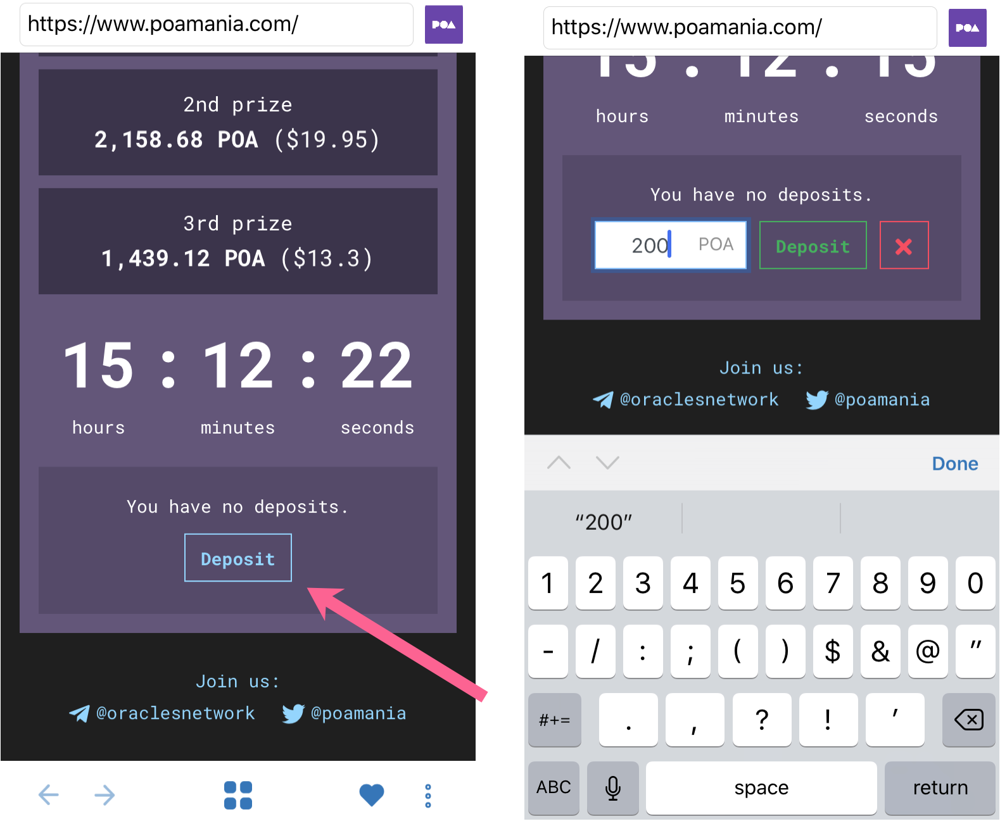
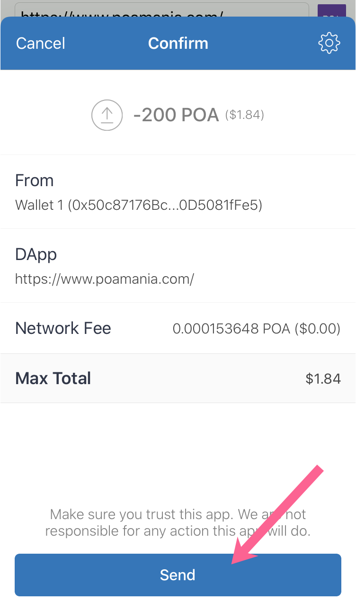
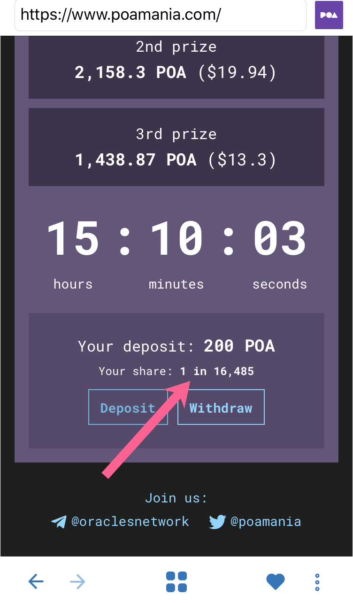

# POA Mania on Trust Wallet

You can access with a mobile device connected to a web3 wallet, or use a POA supported mobile wallet. Here, we use [Trust Wallet](https://trustwallet.com/) to connect to the POA Network and deposit POA into POA Mania.


See our [Trust Wallet post](../wallets/trust-wallet.md) for more info on TW.


## Getting Started

1\) Open Trust Wallet and connect to your POA Network wallet. If you don't have a POA Wallet setup in Trust Wallet yet, you can create a new multi-coin wallet or import an existing wallet.  Once created or imported, press the + button and toggle on the POA Network to add the network to your wallet. If you don't have POA coins, you can send it to this wallet as you normally would \(see instructions below for basic trust wallet features\).

2\) Use the Browser icon \(1\) to navigate to \(2\) poamania.com.

3\) Switch to the POA Network \(if needed\)

If using a multi-coin wallet, the Ethereum network will be selected by default. To change, click on the icon in the upper-right hand corner and select POA Network from the dropdown list.

4\) Click **Connect Wallet**. You will see your Account address along with any POA Balance you have. If you don't have POA, you can follow the link to purchase from Binance through the application \(click **Buy POA**\)

5\) Scroll down and click Deposit. Enter in an amount between 100 \(minimum\) and 50,000 \(max\) POA and click Deposit.

6\) Confirm info and click **Send** to process the transaction in Trust Wallet.

7\) Transaction sent and mined - click the link to check on BlockScout.

You are now entered! You will see your deposit amount and your share of the total pot.

8\) Each day a participant can close a round \(the button appears when a round is complete\). When this happens, 3 addresses are drawn as winners. To withdraw, follow a similar process to above but instead of Deposit click **Withdraw**. See other [POA Mania ](./)topics for more info.

You can check previous winners in the winners tab and receive daily updates by following PoaMania on twitter.



## Resources



