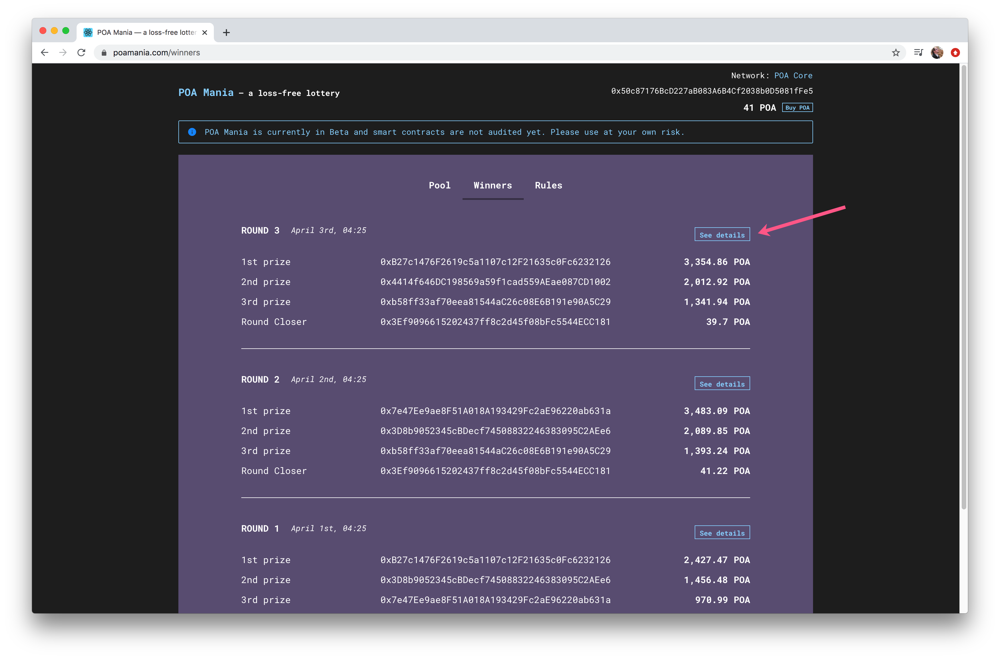
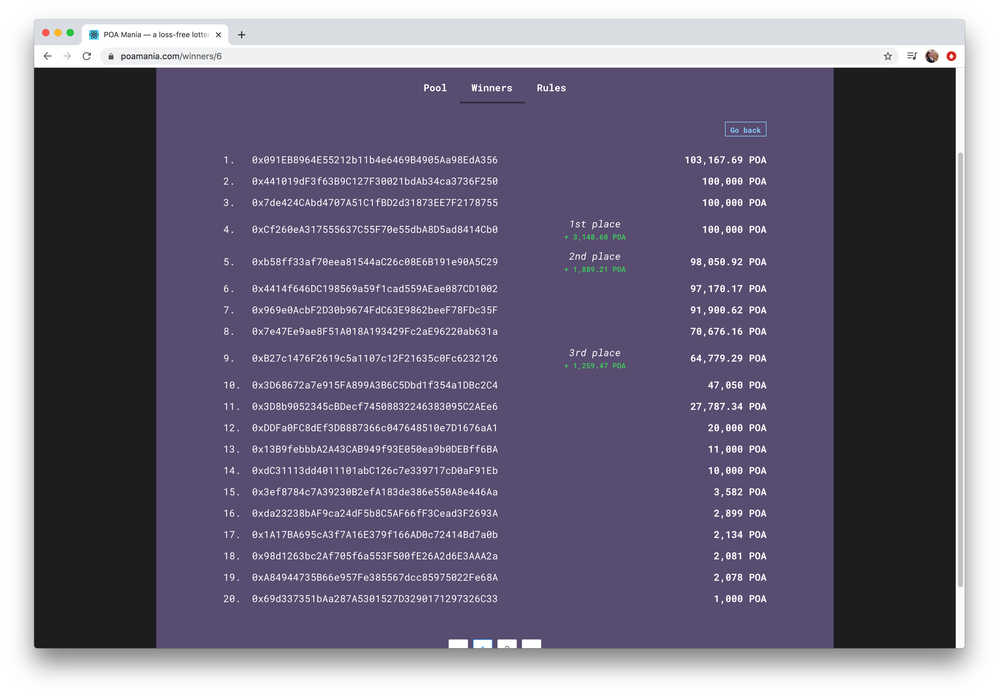
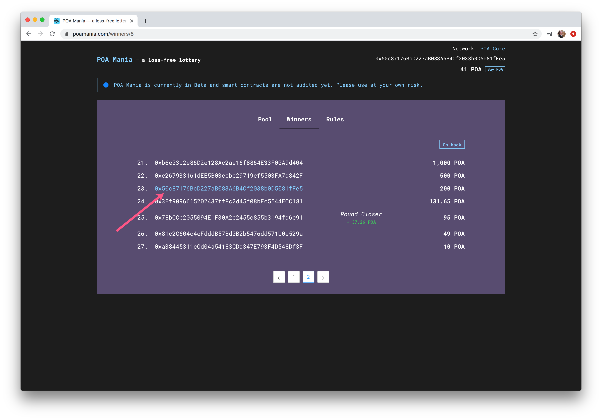

# Round Details

Useful stats are available within the application for each round of POA Mania. These include:

* A participant list of unique wallet addresses, ordered by total deposit amount in the round.
* First, Second and Third place winners, as well as the Round Closer for the round.
* If a wallet is connected and a deposit from that address was active during a round, the address is highlighted within the round participant list.

Data is populated by querying the [POA Mania subgraph](https://thegraph.com/explorer/subgraph/maxaleks/poa-mania) on [The Graph ](../../for-developers/thegraph-data-indexing.md)platform. The DApp pulls data for the winners tab as well as the user list details for each round.&#x20;

To view details for any round, click **See Details** button next to a round in the **Winners** tab.

Detailed stats are displayed per round, including deposit amounts, winners and the amount of POA won for for 1st, 2nd and 3rd place.

A participant's address is highlighted when a wallet is connected.

