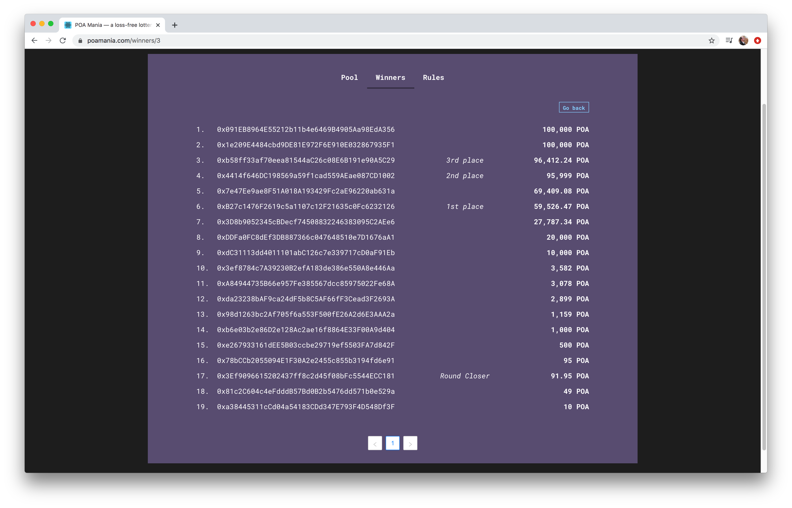

# Round Details

Useful stats are available within the application for each round of POA Mania, including:

* Every unique wallet address that participated in a round, ordered by total deposit amount in that round.
* First, Second and Third place winners, as well as the Round Closer for the round.

Data is populated by querying the [POA Mania subgraph](https://thegraph.com/explorer/subgraph/maxaleks/poa-mania) on [The Graph ](../../for-developers/thegraph-data-indexing.md)platform. The DApp pulls data for the winners tab as well as the user list details for each round. 

To view details for any round, click **See Details** button next to a round in the Winners tab.

Detailed stats are displayed per round.

