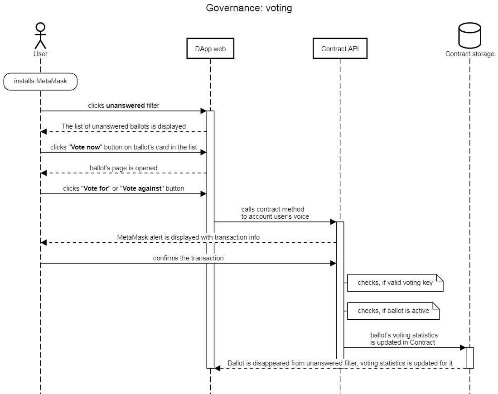

# Governance DApp

This client-side DApp provides the list of existing ballots with the ability of filtering by active, unanswered, and expired ballots, and gives the opportunity to create new ballots and to vote for or against notaries.

The governance is available only with a valid voting key that should be selected in the MetaMask Google Chrome plugin.

#### Creating a new ballot

 Valid notary of the POA Network fills out a form in DApp providing:

* _mining key_ - mining key of a new or existing notary, which will be voted on
* _affected key type_ - key type \(mining, payout, or voting key\) of a new or existing notary, which will be voted on
* _memo_ - brief information about notary, which will be voted on
* _action_ - add affected key to the network or remove it from the network

If the affected key type is mining key, the user will be asked to provide personal data of the notary \(owner of this mining key\) such as full name, physical address, U.S. state name, zip code, notary license ID, and notary license expiration date.

At the final step, one transaction to create a new ballot in POA contract will be pushed to the blockchain to add a new ballot after the user presses "Continue" button. It should be noted, that in case of a mining key, it will be two consistent transactions: to add personal data of a notary and a new ballot to contract. User will see MetaMask popups equal to the number of transactions. After the confirmation and successful mining of the transaction by existing validators, the user will see the created ballot in the list and be able to vote on it.

#### Voting on a ballot

The user can see all his/her unanswered ballots by clicking on the self-titled button on the filtering panel. The list of unanswered ballots will be displayed after filtering, and the "Vote now" button will be enabled for any item in the list. After clicking on this button, a preview of the ballot will be opened with the notary's personal data, statistics of voting, and time to ballot's ending. Two buttons will be enabled here: "Vote for" and "Vote against". After clicking on any of them, the transaction to account the user's voice will be generated, and a MetaMask popup will be shown with the transaction information. After the confirmation and successful mining of the transaction by existing validators, the user will see the updated statistics with his/her voice, and the ballot will disappear from the unanswered ballots filter.

### Possible cheating

1. _user can create ballot or vote with his/her own dummy key_ It is impossible, because only a valid payout key can govern. It is checked on the contract side.
2. _same user can vote for or against a notary twice_ It is restricted at the contract side.
3. _user can vote after ballot's time has ended_ It is restricted at the contract side.
4. _notary with counterfeit license can become a member of the network_ It is impossible in practice, because any of the voters can check public information about every notary before voting.
5. _user can govern other notaries alone_ It is impossible, because the minimal amount of voices for a ballot is equal to 3.

_user can manage the time of a ballot_ Duration of a ballot is constant and equal to 48 hours. It is set in the contract.

