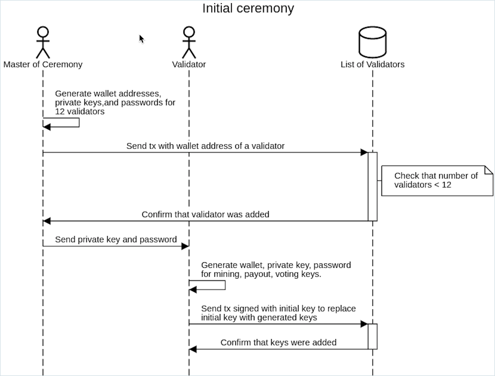

# Initial ceremony DApp

During the initial ceremony a master of ceremony creates a set of keys for each validator. He/She distributes them to validators one by one. Before each distribution of keys, he/she sends a transaction to a smart contract with a list of validators. That smart contract is used by consensus algorithm to determine if a validator has rights to participate in consensus and create blocks. The validator's smart contracts are used by other DApps, e.g. Governance DApp and Payout DApp.

A validator generates three keys in the Initial Ceremony DApp:

* mining key, required to participate in consensus and create blocks.
* voting key, required to create ballots and vote on ballots.
* payout key, not required. Used in Payout DApp to send daily mined coins from the mining key to the payout key. If a mining node should be compromised, an attacker will get daily earnings or less.

All keys are generated on the client side and not transmitted over the Internet without a validator's permission and willingness. When keys are generated, the validator stores them on secure local storage, e.g. saves them to a hardware wallet and the password to a password manager. The validator signs a transaction to the validator's contract with the initial key, provided by the master of ceremony.

Initial ceremony is a required procedure to start a new network based on POA Network's ideas of independent validators.

