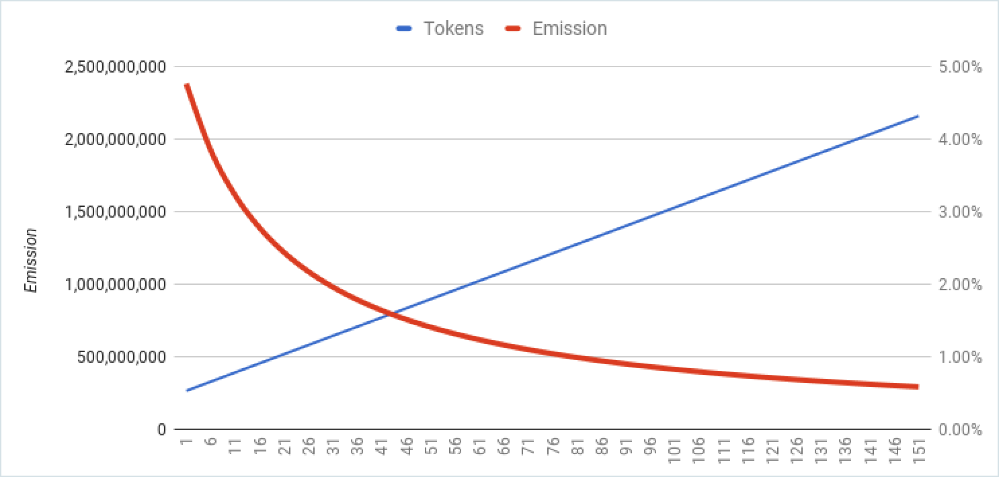

# POA Network Functionality

### Validators

Independent U.S. public notaries with active commission license will be the first validators in POA Network. For the initial ceremony, 12 initial keys will be created by a master of ceremony. He will distribute those keys to individual validators. Each validator will change a key to a new subset of keys using a client-side DApp. After the initial distribution of licenses, an additional validator can be added through the voting process on the built-in Governance DApp. A majority of votes will be needed from validators to be accepted into the smart contract with a list of validators.

### Economy

Crowdsale will take place before the launch of the main network. Purchased coins will be included in the genesis block and will create initial liquidity for the network.

Validators will start to create blocks and generate a reward for the network security. For each generated block, a validator who created it will get one coin and all fees for transactions. Each validator has equal rights to create a block.

The network will start with 12 validators. With 12 validators active, each validator will create one block every 12 blocks. For each block one coin will be created as a reward for validators and one coin for self sustaining of the network.

A block will be generated with an average time of 5 seconds. During the first year of the network, validators will create 31,536,000 sec/5 sec per block = 6,307,200 blocks.

The emission rate for validators is 2.5% for the first year of the network. The network will use disinflation model, and emission will decrease every year. An additional 2.5% will be added to support sustainability of the network.

Therefore, 2.5% of the network supply will be generated as a reward for validators to secure the network. And 2.5% of total supply will be distributed to support sustainability. Validators will be able to propose areas of spending:

* burn coins
* hold coins
* spend on R&D Foundation

Sustainability emission will be governed by decentralized apps.

### Use Cases

#### Inexpensive Network

POA Network provides inexpensive consensus to secure the network. Users can run Ethereum programs on POA Network and spend less money on transaction fees. Overall cost of the network's security will also be cheaper due to lower market cap.

**Problem**

Though the issuance of ETH is in a fixed amount each year, the rate of growth of the monetary base \(monetary inflation\) is not constant. This monetary inflation rate decreases every year, making ETH a disinflationary currency \(in terms of monetary base\). Disinflation is a special case of inflation in which the amount of inflation shrinks over time.

In 2017 the issuance rate of Ether is 14.75%. Roughly five Ethers per block are issued. Because Ethereum rewards Uncles it means that there may be more or less than five Ethers.

By 9/7/2017 miners generated 21,335,541.72 ETH as Mining Block Reward and 1,181,201.88 Mining Uncle Reward. For securing the network, they received a total of 22,516,743.6 ETH. Using the 9/7/2017 price of $303.86, security of the network costs 22516743.6 ETH \* $303.86 = $6,841,937,710.296.

There are 56,048,767 transactions on the network. Security of a transaction in the main Ethereum network costs are about $122.07 at the current rate.

**Solution**

In POA Network the issuance rate is 2.5% with future disinflation. There is no Mining Uncle Reward in the network, because consensus is not based on Proof of Work.

#### Validators with known identity

Each validator of the network will prove his/her identity using "proof of identity" DApps. Each block will be attributed with the identity of a validator. If a miner breaks the rules of the open network, e.g. will not accept a transaction to a specific address, participants of the network will have legal instruments to resolve that problem.

#### Fast network

Validators in POA Network create blocks every five seconds. This rate is tested on Kovan testnet and usable in the long-term. A faster network allows for building new types of applications where response rate from the distributed consensus is important.

#### Legally recognizable hard forks

Hard fork is a change of the software. After applying this software, old clients will not be able to work on the new network. All validators on the network are residents of the U.S. Therefore, they are all located in the same legal system. Hard fork decisions will be signed as legal documents and will be recognizable in a court system. This will bring protections to participants of the network and will open new possibilities to decide how to deal with ongoing changes.

#### Model for experiments

The network is built to iterate fast. In the future many open and independent networks based on Ethereum protocol will operate and have interface for interoperability.

### Security Risks

#### Key compromise

During the initial ceremony, validators will be required to replace their initial keys with a set of three keys. Mining keys are located on a mining node. If a node is compromised, validators will create a ballot using Governance DApp and propose replacement of the mining key. If a voting key is compromised, a validator will ask another validator to create a ballot to replace his/her voting key. If a payout key is compromised, a validator will create a ballot to replace his/her payout key. Because payout is not required, a validator can specify a new payout key on a mining node without proposing ballots.

#### Censoring signer

Censoring signing is an attack vector in which a signer or a group of signers attempts to censor out blocks that vote on removing them from the validators list. To work around this, we restrict the allowed minting frequency of signers to 1 out of N. This ensures that malicious signers need to control at least 51% of signing accounts, at which case it's game over anyway.

#### Regulatory risks

All validators are required to have an active notary commission. Doing block validation under the name of a notary public may be considered as false advertising and a regulator may revoke the notary commission from the validator. The network will mitigate the risk by providing additional identity checks for a validator. Eventually, those unbiased checks will replace the need for a validator to have an active notary commission.

#### Collusion of validators

Validators may become an affiliated group even though we require them to be independent. Before distribution of initial keys, the master of ceremony will require validators to sign a non-affiliation agreement between them and the network. All validators are in the same jurisdiction, where the general public may enforce that agreement.

### Deployment

We provide a deployment script for cloud installation of mining, boot, and general purpose nodes. For a validator, setting up a node is a one-button solution. For a mining node, a validator will provide

* Mining Address. The address of the mining key received at the initial ceremony.
* Mining Keyfile. File with the private key of the mining key.
* Mining Keypass. The password to unlock the private key of the mining key. 
* Admin Username. Username of admin user of the virtual machine, e.g. `root`.
* Admin SSH public key. Content of admin's SSH public key. We do not allow use of passwords for the VMs.
* Netstats Server. Network statistics, e.g. number of Active Nodes, Last Block, Avg Block Time, Best Block, Gas Spending, Gas Limit, List of validators with parameters. 
* Netstats Secret. Password to the netstat server.

