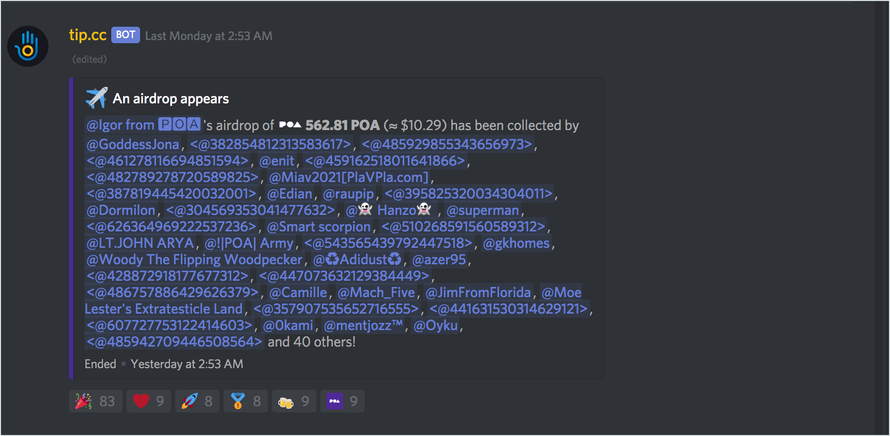
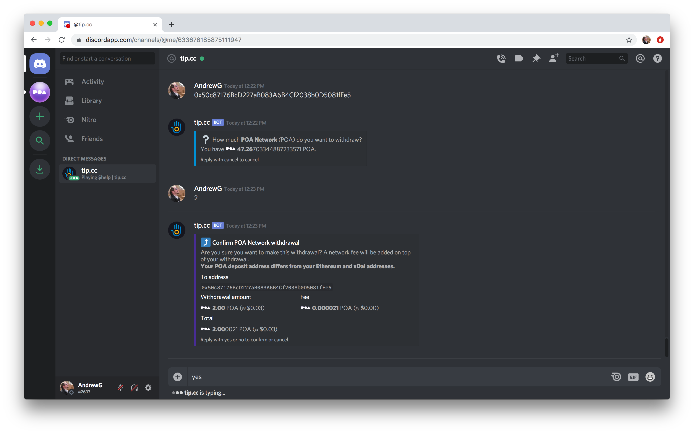

# 通过Discord获取空投

### 接受空投 

1\) 转到Discord（[https://discordapp.com/](https://discordapp.com/)）并打开POA和xDai discord服务器。 如果您以前从未访问过，邀请链接为[https://discord.gg/mPJ9zkq](https://discord.gg/mPJ9zkq)

2\) 访问“**游戏**”标题下的＃🍸**drops**频道。

3\) 当出现空投时，你可以通过 🎉图标进行响应来索取一部分奖励，所获的空投的多少取决于参数，空投将持续一段可变的时间，并且可能包括不同数量或类型的货币。

### 提现空投 

1\) 转到Discord（[https://discordapp.com/](https://discordapp.com/)）并打开**POA和xDai discord**服务器。

2\) 使用tip.cc机器人创建直接消息。 您将在网络界面的右上方看到该漫游器（如果没有，请激活上面的成员列表）。 **右键**单击并选择**消息**以启动直接消息。

3\) 将打开一个直接消息窗口。


有用的tip.cc命令：

* 一般消息: **$help** 
* 检查余额: **$balances**


4\) 你可以使用 `$withdraw poa` 命令进行提现操作。 

5\) 输入您要汇款的钱包地址。

6\) **输入金额。** 您将看到一条确认消息，其中包括地址，提款金额和费用。输入 `yes` 来完成交易。

7\) 提款已确认，资金已发送至您选择的钱包。 要检查交易，请单击**交易ID**在BlockScout中查看。

**交易示例**： [https://blockscout.com/poa/core/tx/0xf57af26656fc977f04a8cce7ffa936d785796c095ed12e3d2018861baff8d672/internal\_transactions](https://blockscout.com/poa/core/tx/0xf57af26656fc977f04a8cce7ffa936d785796c095ed12e3d2018861baff8d672/internal_transactions)

