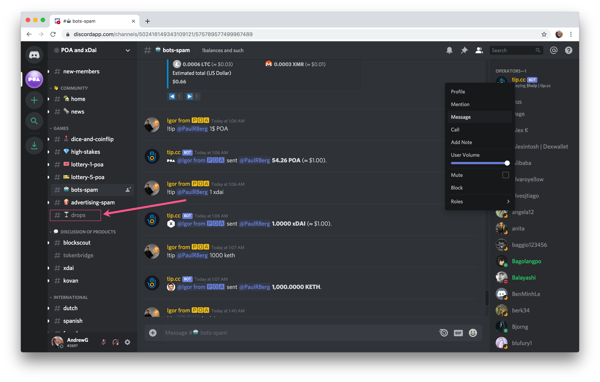
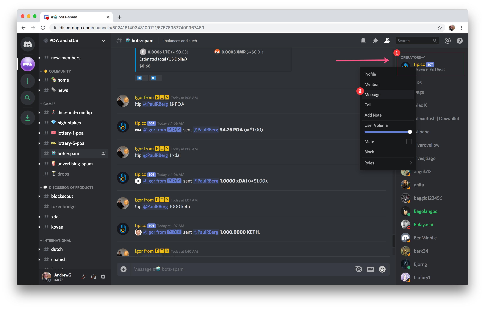
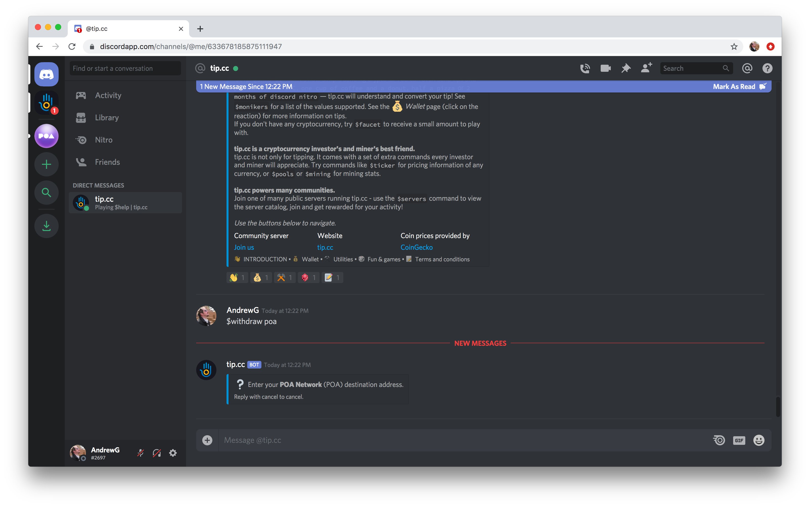

# Getting Airdrops via Discord

### Receive an Airdrop 

1\) Go to Discord ([https://discordapp.com/](https://discordapp.com)) and open the **POA and xDai** discord server. If you have not visited before, the invite link is [https://discord.gg/mPJ9zkq](https://discord.gg/mPJ9zkq)​‌

2\) Visit the **#**🍸 **drops** channel under the **Games** heading.

3\) When an airdrop appears, claim a portion by responding with the :tada: icon. Depending on the airdrop parameters, the drop will last for a variable period of time and may include a different amount or type of currency.

### Withdraw an Airdrop 

1\) Go to Discord ([https://discordapp.com/](https://discordapp.com)) and open the **POA and xDai** discord server.‌

2\) Create a direct message with the [tip.cc bot](https://top.gg/bot/617037497574359050). You will see the bot in the top right of the web interface (if not, activate member list above). **Right click** and select **Message** to start a direct message.

3\) A direct message window will open.


Useful tip.cc commands:

* General info: **$help**&#x20;
* Check balances: **$balances**


4\) Start a withdrawal with the `$withdraw poa` command.&#x20;

5\) Enter the wallet address where you would like to send the funds.&#x20;

6\) **Enter the amount**. You will see a confirmation message which includes the address, withdrawal amount and fee. Enter `yes` to complete the transaction.

7\) Withdrawal is confirmed, and funds are sent to the wallet of your choice. To check the transaction, click on the **Transaction ID** to view in BlockScout.‌

**Example transaction:** [https://blockscout.com/poa/core/tx/0xf57af26656fc977f04a8cce7ffa936d785796c095ed12e3d2018861baff8d672/internal\_transactions](https://blockscout.com/poa/core/tx/0xf57af26656fc977f04a8cce7ffa936d785796c095ed12e3d2018861baff8d672/internal\_transactions)

