# POA20 Token Swaps on 1inch.exchange

1inch.exchange offers the ability to swap POA20 with a large list of other ERC20 tokens. The exchange compiles rates from [several different decentralized exchanges](../about-poa-token/poa-and-poa20-exchanges.md#poa20-markets) and provides the best rates.  Features include a dedicated DApp \(not required\) and [GasToken](https://gastoken.io/) utilization, which lowers transaction costs.

To start, enable a web3 wallet extension like [Nifty Wallet](../wallets/nifty-wallet/) \(used in this tutorial\) or MetaMask. The account must contain a small amount of Ether for transactions.

## Swapping ETH for POA20


Any token combination can be used for a swap as long as it is covered through one of the supported exchanges \(like Bancor or Uniswap\).


1\) Go to [1inch.exchange](https://1inch.exchange)

1. Select **From** token - in this case we chose ETH.
2. Enter **Amount** of ETH you want to swap \(.01\).
3. Select **To** token. We want to swap ETH into POA20
4. The amount will auto-populate based on the best exchange rate \(115.582...\).

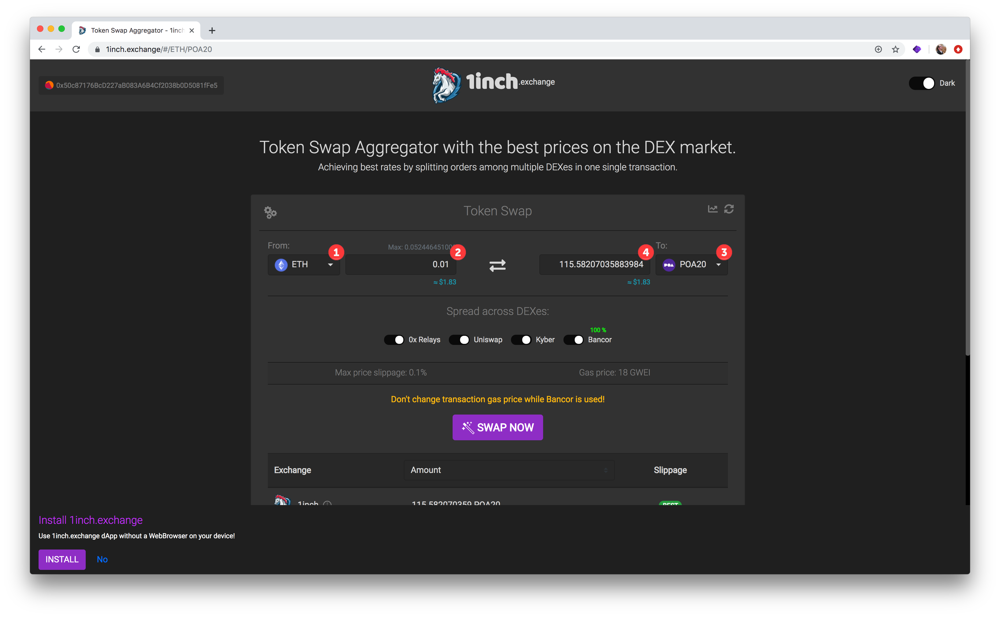

2\) Check rates below. In this example, Bancor provides the best rate, but the margin is small between Bancor and Uniswap. We are swapping a small amount, so it will make sense to look at gas fees to determine the best overall value.

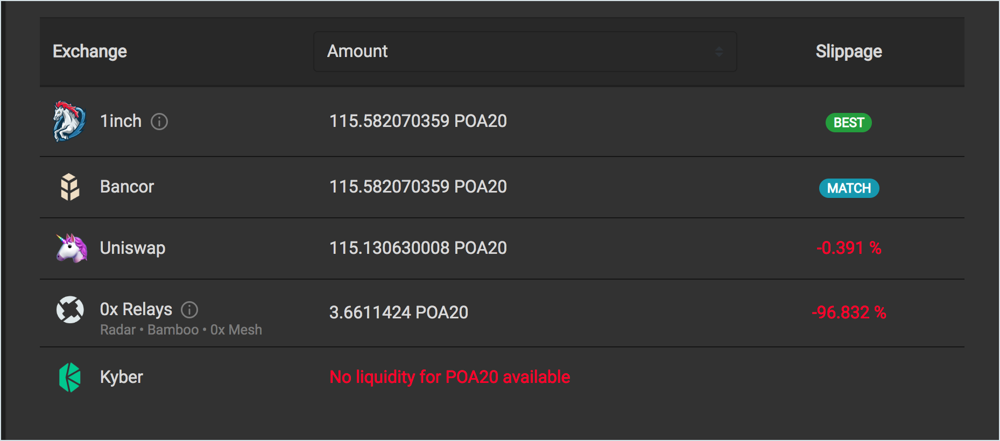

3\) To continue with the recommended exchange \(Bancor\), click the **SWAP NOW** button. Your web3 wallet should popup to confirm the transaction. Click **Submit** to process


When Using Bancor, do not change the Gas Price \(it is included as part of the contract call\). Changing the price will cause your transaction to fail.


4\) Once the transaction is finalized, you will see a link to check the transaction in Etherscan. In this instance, the gas fee was substantially lower than 18 GWEI, but still added significant cost % to the total.

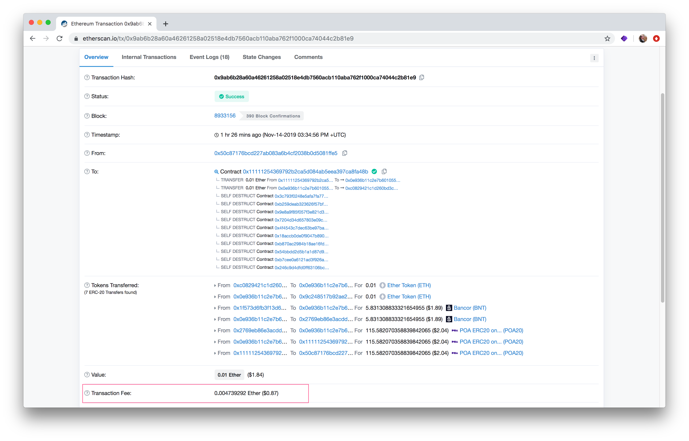

5\) To compare, we ran the same transaction but selected Uniswap this time. To enable, we switched off the Bancor DEX. 100% of the transaction was moved to Uniswap.

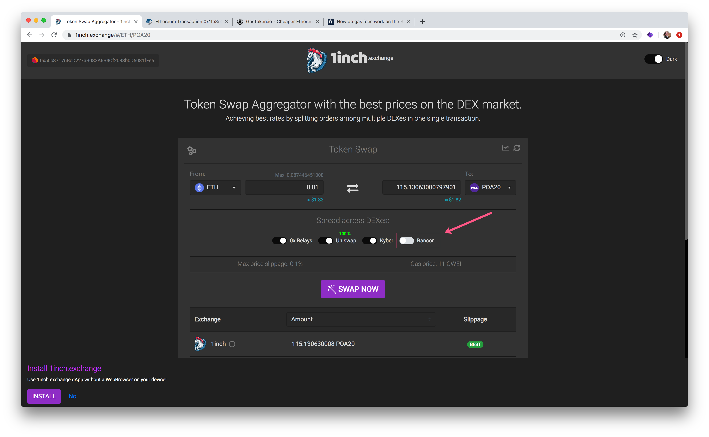

6\) In Nifty Wallet, we changed the recommended Gas Price from 11 to 2 GWEI.

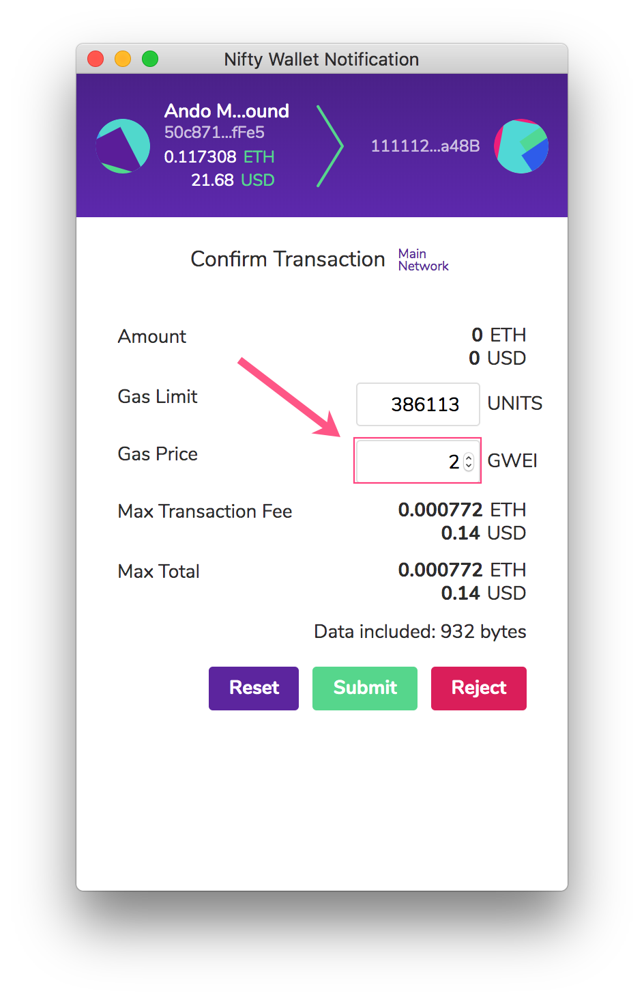

7\) The final transaction fee cost was 0**.**000154138 Ether \($0.03\) for Uniswap vs. 0**.**004739292 Ether \($0.87\) for Bancor.  Even though the rate on Uniswap was slightly worse, the total cost including fees was favorable in this instance.

## Swapping POA20 for BAT

The process is similar to transform POA20 into ETH, DAI or any other supported ERC20. However, it requires 2 separate transactions, one to unlock POA20 and a second to swap tokens.

In this case, we'd like some BAT to help support [Brave Browser](https://brave.com/) content providers.

 1\) Go to [1inch.exchange](https://1inch.exchange)

1. Select **From** token - in this case we chose POA20.
2. Enter **Amount** of POA20 you want to swap.
3. Select **To** token. We want to swap POA20 into BAT.
4. The amount will auto-populate based on the best exchange rate.
5. Click **Unlock**.

2\) In your web3 wallet, check the transaction cost. You can lower the max fee amount for this transaction. Click **Submit.**

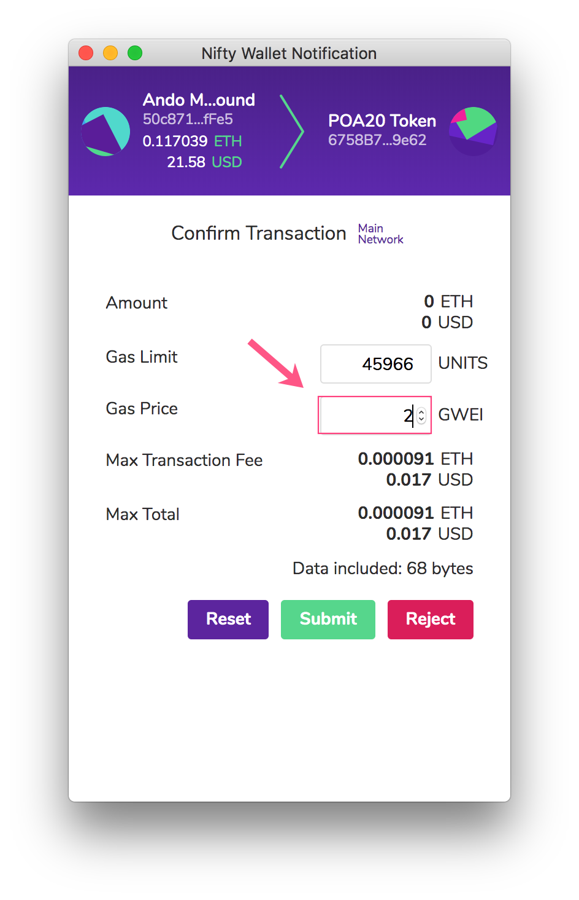

3\) Once the first transaction has processed, the **SWAP NOW** button will appear. Click the button and confirm the second transaction \(**do not change gas price for this transaction if using Bancor**, otherwise you can adjust\)

4\) Your sent transaction will be confirmed in the interface.


The transaction may still be processing during this time, click to check the tx in etherscan for details.


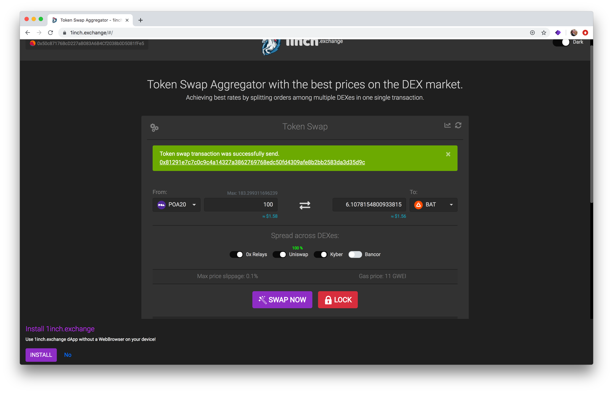

5\) Check your Nifty Wallet balance. If you need to add a token you have traded for:

     1\) Select the Tokens Tab and click **Add Token.**

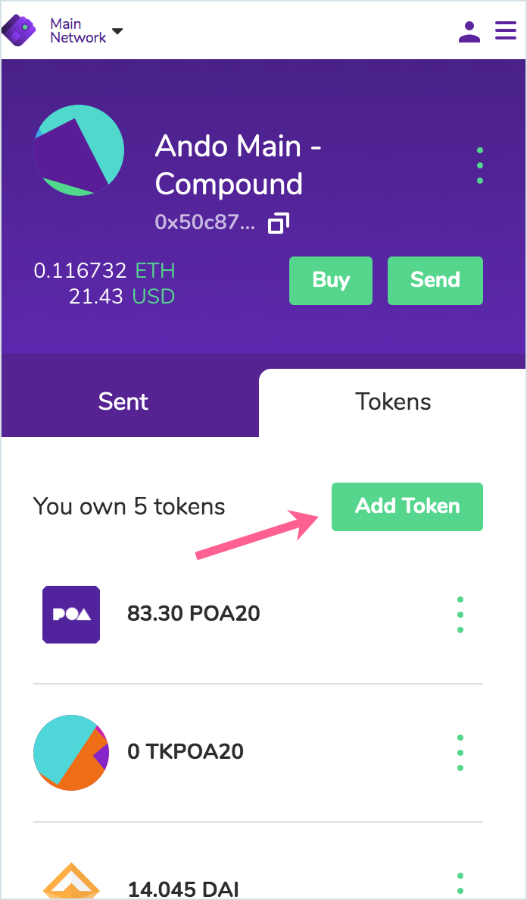

   2\) Search for your token and click **Next** to add. Confirm the addition.  
_If your token does not appear, you can enter the token address in the Custom Search._ 

   __3\) Click **Add Tokens** to confirm. 

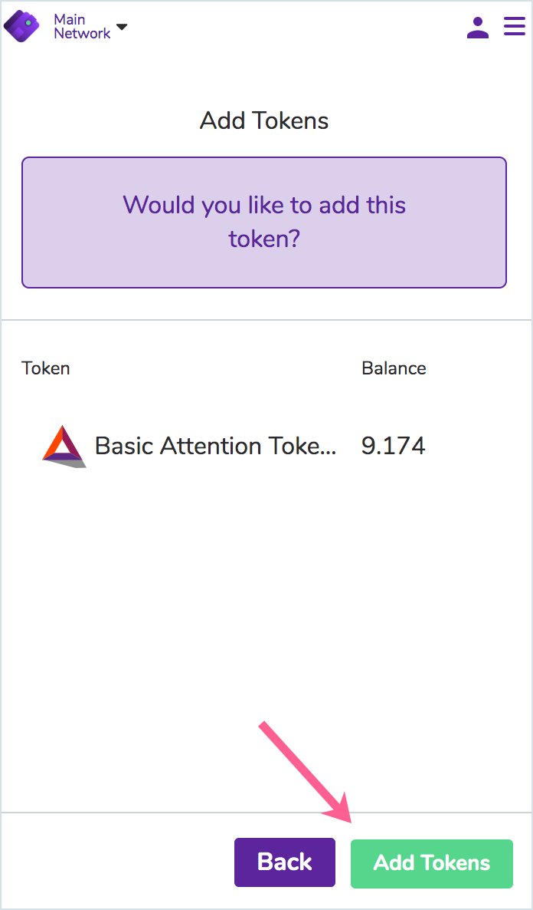

   4\) Your Token / balance will appear in the list

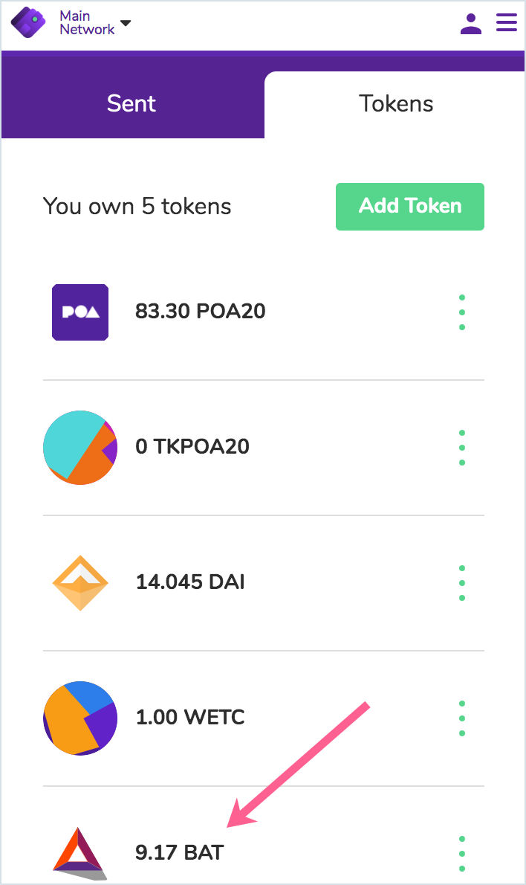

6\) Etherscan Transaction.

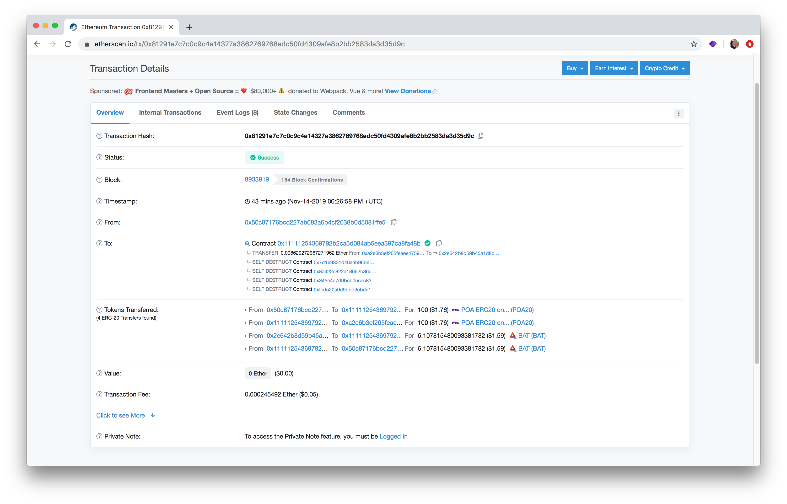

