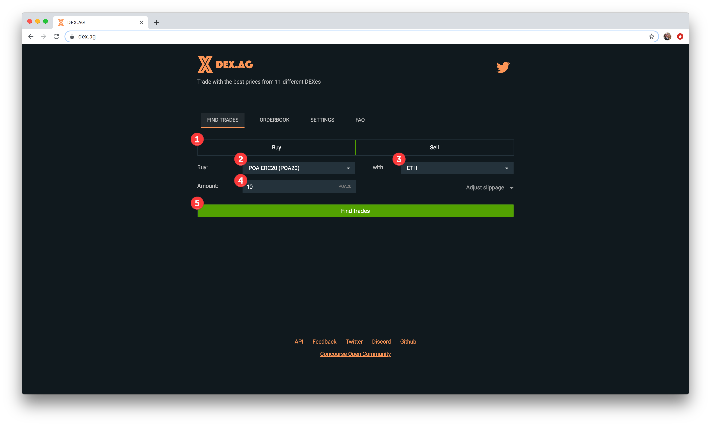
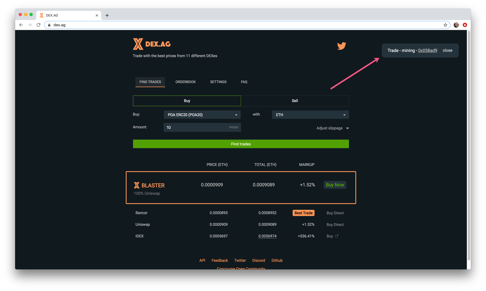
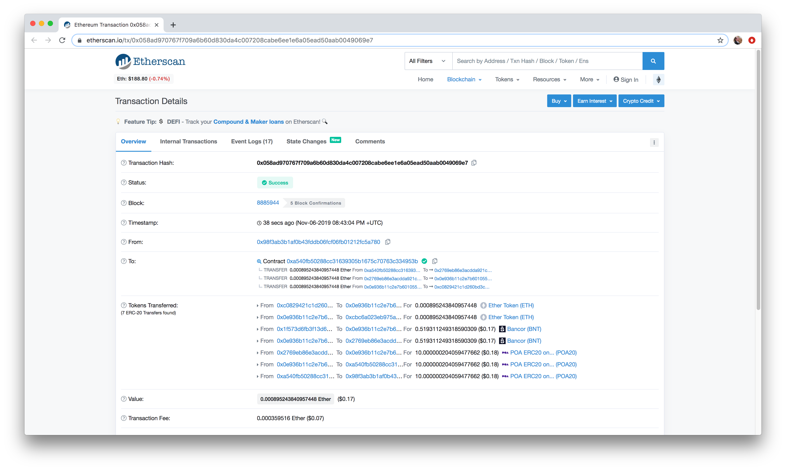
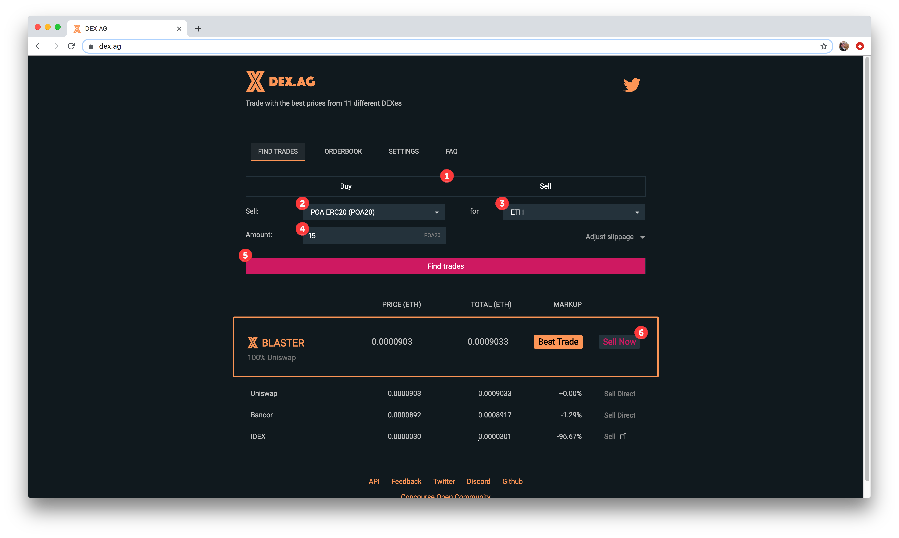
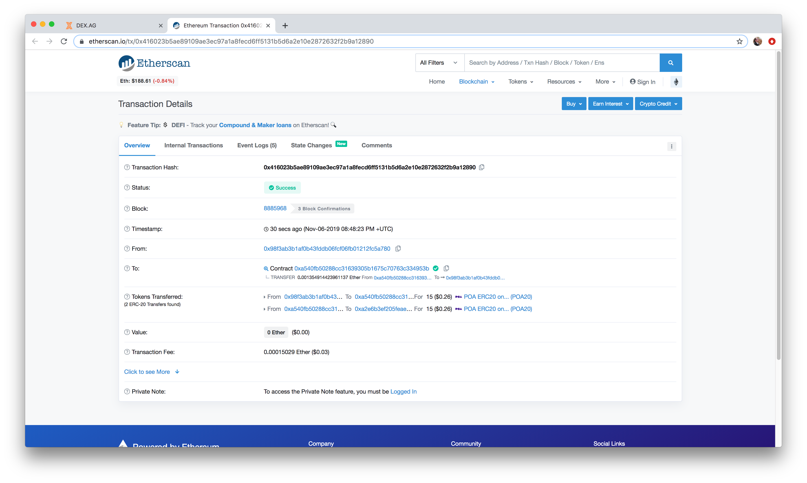

# Trading POA20 on DEX.AG

POA20 is available to buy and sell on [several different decentralized exchanges](../about-poa-token/poa-and-poa20-exchanges.md#poa20-markets). However, rates can differ from exchange to exchange. DEX.AG pulls rates from all exchanges, offering a quick list sorted by rates. Plus, there are no extra fees for using DEX.AG - only the fees charged by the exchange you choose.

To start, you will need a connected web3 wallet like [NiftyWallet](../nifty-wallet/) or MetaMask and funded with some Ether for transaction fees.&#x20;

## BUY POA20

**1) Go to DEX.AG to get started**

1. Choose the **Buy Button.**
2. From the Buy Dropdown, select **POA20** (you can type in to find quickly).
3. In the with field, select the currency to buy POA20 with. In this example we choose ETH, but you can use a wide variety of tokens.
4. Select the **amount to purchase** in POA20.
5. Click the **Find trades** button.

**2) Select an exchange to use from the list**

You will see a list of exchanges along with the rates.The XBlaster option can include multiple exchanges for large amounts. In this case, it highlights Uniswap, but that is not the Best Trade. We chose the Bancor option for this trade. Click **Buy Direct** to start.

.png>)

**3) Confirm transaction in Web3 Wallet**

Our Nifty Wallet pops up to confirm the transaction. Initially, GWEI was set to 10. We reduced to 1 to minimize fees and the transaction went through easily. **Be sure to check gas price and set accordingly** (for large transactions you may be comfortable with higher fees to ensure they go through). Click **Submit** to process the transaction.


With Bancor transactions in particular, do not increase the default gas price as this will result in a failed transaction. You can lower, but do not raise.


.png>)

**4) Transaction Processing**

You will see the transaction processing on the site.

**5) Success!**

Check the transaction. The link from DEX.AG will take you to the transaction record in Etherscan.

## SELL POA20

The selling process is conducted in the same way.

**1) Go to DEX.AG to get started**

1. Choose the **Sell Button.**
2. From the **Sell** Dropdown, select **POA20** (you can type in to find quickly).
3. In the **for** field, select the currency to buy POA20 with. In this example we choose ETH, but you can use a wide variety of tokens.
4. Select the **amount to sell** in POA20.
5. Click the **Find trades** button.
6. Select the exchange and click **Sell** (we choose the Uniswap option in this example).

2\) Confirm transaction in Web3Wallet, as described in step 3 above.

3\) Once processed, check the transaction. It's that easy!

