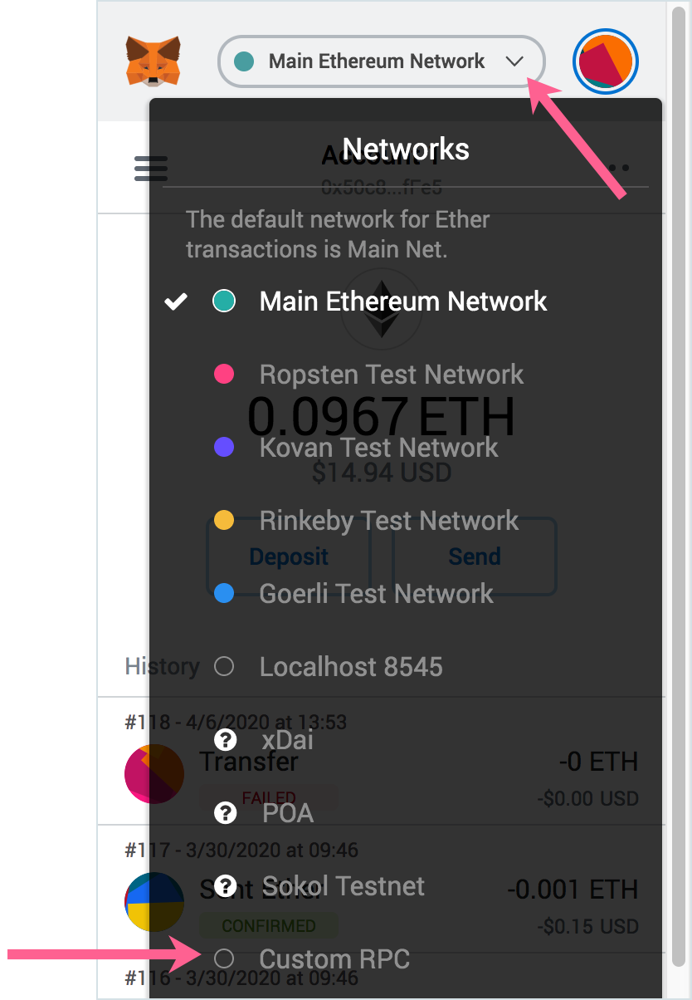

# MetaMask

**Wallet Type**: Web3 wallet: Extensions available for [Chrome, Firefox, Opera and more](https://metamask.io/)

**Description**:  MetaMask is the original web3 wallet. It allows you to run Ethereum dApps right in your browser without running a full Ethereum node. See below for setup with POA Network.  


[Nifty Wallet](../nifty-wallet/) and MetaMask do not function properly when both are activated at the same time as chrome extensions. To use one or the other, **right click** on the extension icon, go to **Manage Extensions**, and **toggle off/on** the application you want to use. All data will be preserved in the wallet for future access.


## Metamask Setup

1\) Open Metamask, and select "Custom RPC" from the Network Dropdown.

2\) In the "Custom RPC" Settings, add the POA Network details and click **Save**:

### POA Core

* Network Name: POA
* New RPC URL: https://core.poanetwork.dev
* ChainID: 99
* Symbol: POA
* Block Explorer URL: https://blockscout.com/poa/core


Note: MetaMask recently updated the ChainID to be a required field. When you update, you may need to reenter the chain id, and it will be converted to a hexidecimal. 

**POA: 0x63  
Sokol: 0x4d**


### POA Sokol

* Network Name: POA Sokol Testnet
* New RPC URL: https://sokol.poa.network
* ChainID \(Optional\): 77
* Symbol: SPOA
* Block Explorer URL: https://blockscout.com/poa/sokol

