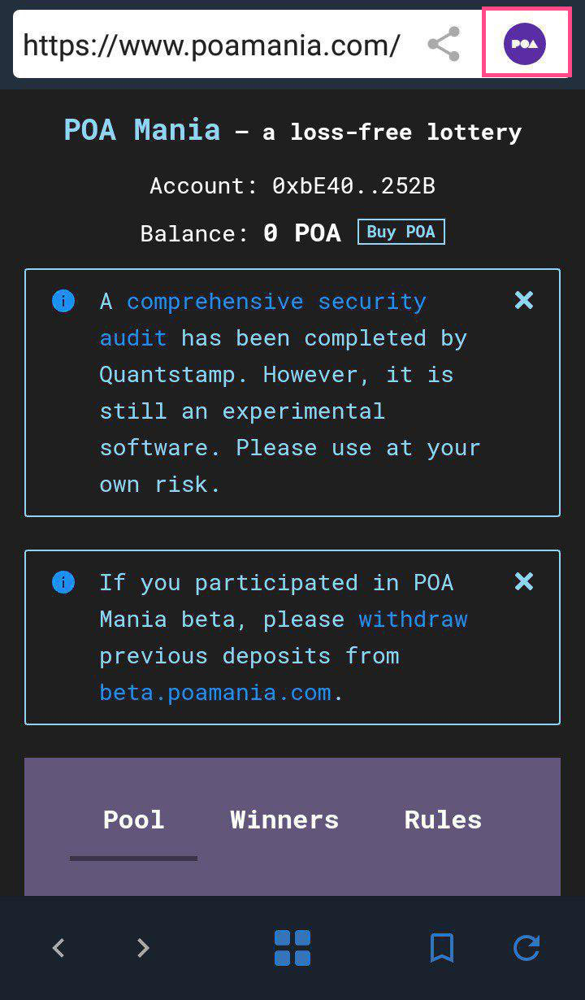

# Trust Wallet


Download Link: [https://trustwallet.com/poa-network-wallet](https://trustwallet.com/poa-network-wallet)


Trust Wallet provides a simple and secure Ethereum wallet for your mobile device. The UI is intuitive and easy to use. Local key storage creates a secure environment, and the ‘watch’ functionality lets you monitor balances on your hardware / cold-storage wallets \(like Ledger and Trezor\).

Trust Wallet also makes POA Network interaction a breeze!

1. The Trust Wallet ecosystem allows users to interact with DApps directly through the interface. This means you can use the POA Bridge or Bancor Exchange easily and safely without leaving the wallet.  


Note that the in-line browser is not available on the latest iOS version \(iPhones, iPad\). It works fine on Android. To interact with DApps through a browser on iOS, you can use [Opera](https://apps.apple.com/us/app/opera-touch-web-browser/id1411869974) which features DApp browsing capabilities.


2. POA20 token support allows you to view, send and receive POA20 \(or any other ERC20\) tokens.

3. Trust Wallet comes loaded with POA Network and POA Sokol Testnet networks! Switching to the POA network is as simple as opening network settings and switching to POA **\(**[**instructions below**](trust-wallet.md#switching-to-the-poa-network)**\).** 

## **Adding POA Tokens**

## **Switching to the POA Network**

To use DApps deployed on POA Network, like [POA Mania](https://www.poamania.com/), you will need to switch your wallet to the POA Network. 

* If using a multi-coin wallet, the Ethereum network will be selected by default. To change, click on the icon in the upper-right hand corner and select POA Network from the dropdown list.
* If you created or imported a POA only wallet, the POA icon should be selected automatically.


See the T[rust Wallet App knowledge base ](https://community.trustwallet.com/)for additional details.


