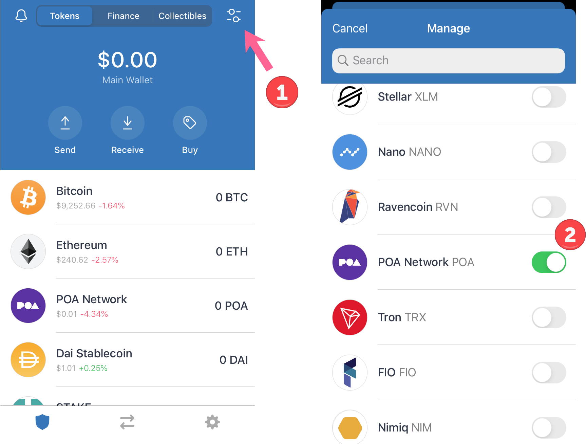

# Trust Wallet


Download Link: [https://trustwallet.com/poa-network-wallet](https://trustwallet.com/poa-network-wallet)


Trust Wallet provides a simple and secure Ethereum wallet for your mobile device. The UI is intuitive and easy to use. Local key storage creates a secure environment, and the ‘watch’ functionality lets you monitor balances on your hardware / cold-storage wallets \(like Ledger and Trezor\).

Trust Wallet also makes POA Network interaction a breeze!

1. The Trust Wallet ecosystem allows users to interact with DApps directly through the interface. This means you can use the POA Bridge or Bancor Exchange easily and safely without leaving the wallet.
2. POA20 token support allows you to view, send and receive POA20 \(or any other ERC20\) tokens.
3. Trust Wallet comes loaded with POA Network and POA Sokol Testnet networks! **Switching to the POA network is as simple as opening network settings and switching to POA.**

## **Adding POA Tokens**

\*\*\*\*

See the T[rust Wallet App knowledge base ](https://community.trustwallet.com/)for additional details.

