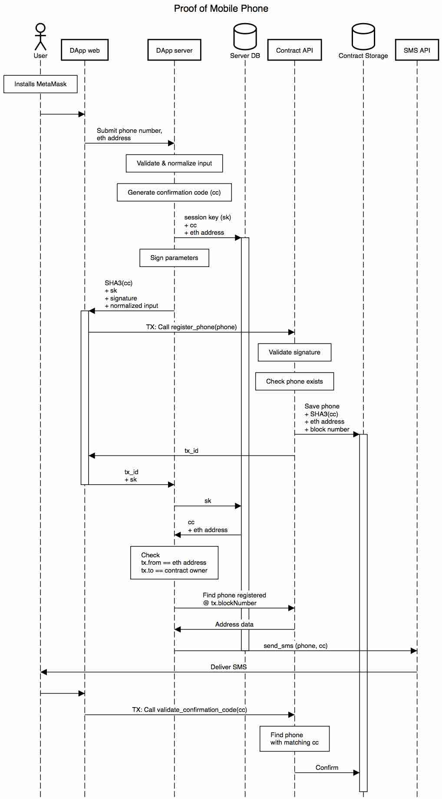

# 电话号码证明DApp

用户在DApp中填写一个提供其电话号码的表格，并将其提交给服务器。

服务器由一个Web应用程序和一个连接到区块链的Parity节点组成。该节点在用于部署PoP合约（合约的`所有者`）的以太坊帐户下运行。该帐户需要解锁。

服务器验证并规范化用户的电话号码：删除尾随空格，将其转换为国际格式。

然后，它生成一个随机的确认码（字母数字序列）并计算其SHA-3（严格来说是keccak256）哈希。此外，它还会生成一个随机会话代码（请参阅下文），并将其与用户的eth地址和纯文本确认代码一起存储在内存/数据库中。然后服务器将输入数据（即`str2sign =（用户的eth地址+用户的电话号码+确认码的哈希）`）合并为一个字符串，该字符串经过哈希处理并使用所有者的私钥签名（这就是为什么`所有者`帐户需要解锁的原因）。

签名，确认代码的哈希，用户的规范化电话号码和会话代码将发送回客户端。然后，用户在MetaMask中确认交易并调用合约的方法。合约以与服务器相同的顺序组合输入数据，对其进行哈希处理，然后使用内置功能`ecrecover`来验证签名属于`所有者`。如果不是，则合约拒绝交易，否则它将添加一些元数据，最重要的是当前块的编号，并将其保存在区块链中。

当交易被挖掘时，`tx_id`返回到客户端，然后通过客户端与会话代码一起返回到服务器。服务器通过会话代码查询内存并验证用户的eth地址。然后，它通过`tx_id`从区块链中获取交易。它验证`tx.to`等于`所有者`，`tx.from`等于用户的eth地址。然后，服务器使用`tx.blockNumbe`r使用合约的方法来查找添加到该区块号的电话号码。用户应被限制为每个eth块最多注册一个电话号码。

然后，服务器使用会话代码从内存中获取纯文本确认代码，并通过SMS服务（twilio.com）将其发送到用户的电话号码。然后，服务器从内存中删除会话代码以防止重用。

收到带有验证码的SMS后，用户将返回DApp并在MetaMask中确认交易，该交易将确认码直接发送到合约的方法，而无需调用服务器。似乎没有必要使用`所有者`的私钥签署此交易。Contract计算确认码的哈希值，然后循环遍历用户的电话号码以找到匹配的电话号码。

### 可能的作弊 

1. _用户可以生成自己的确认代码，计算所有哈希并将其提交给合约_，然后进行确认。这无法完成，因为用户不知道`所有者`的私钥，因此无法计算有效签名。
2. _用户可以从先前确认的电话号码中重用他人的确认码或他/她自己的确认码_，这可以通过在签名之前将所有基本数据散列在一起（用户的eth地址，电话号码，确认码）并通过检查来避免合约中重复项的电话号码。
3. _用户可以提交表单，但不签署交易。_因此，在将电话号码添加到区块链并将`tx_id`呈现给服务器之后，将发送SMS。
4. _用户可以提交表单并签署交易_，但将另一个电话号码发送到服务器以发送SMS到第一笔交易之后，服务器会自行查看添加的电话号码并从合约中获取该电话号码，而不是信任客户端。然后，使用会话代码检索相应的确认代码。为简化起见，我们可以限制用户每个块仅提交一个电话号码。在这种情况下，合约只需要找到与`creation_block`匹配的第一条记录。
5. _用户可以多次向服务器重新提交相同的tx\_id_。这是通过在发送第一张明信片后从内存中删除会话代码来防止的。

