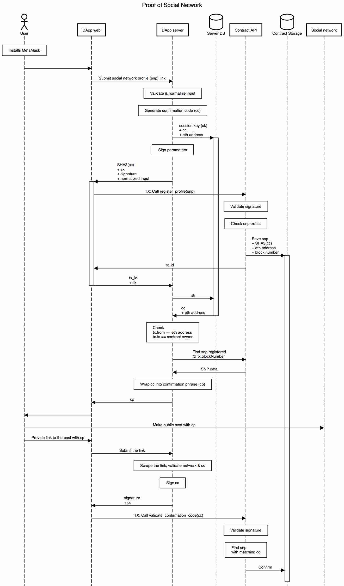

# 社交网络证明DApp



用户在DApp中填写表格，提供指向他/她的社交网络个人资料的链接，并将其提交给服务器。

服务器由一个Web应用程序和一个连接到区块链的奇偶校验节点组成。该节点在用于部署PoSN合约（合约的`所有者`）的以太坊帐户下运行。该帐户需要解锁。

服务器验证并规范化用户的配置文件链接：删除尾随空格，将协议转换为HTTPS（如果适用），将域名转换为小写，并删除其他URL参数。

然后，它生成一个随机的确认码（字母数字序列）并计算其SHA-3（严格来说是keccak256）哈希。此外，它还会生成一个随机会话代码（请参见下文），并将其与用户的eth地址和纯文本确认代码一起存储在内存/数据库中。然后，服务器将输入数据（即`str2sign =（用户的eth地址+用户的配置文件链接+确认代码的哈希）`）组合成一个字符串，该字符串经过哈希处理并用`所有者`的私钥签名（这就是为什么需要解锁`所有者`的帐户的原因）。

签名，确认代码的哈希，用户的规范化配置文件链接和会话代码被发送回客户端。然后，用户在MetaMask中确认交易并调用合约的方法。合约以与服务器相同的顺序组合输入数据，对其进行哈希处理，然后使用内置功能`ecrecover`来验证签名属于`所有者`。如果不是，则合约拒绝交易，否则它将添加一些元数据，最重要的是当前块的编号，并将其保存在区块链中。

当交易被挖掘时，`tx_id`返回到客户端，然后通过客户端与会话代码一起返回到服务器。服务器通过会话代码查询内存并验证用户的eth地址。然后，它通过`tx_id`从区块链中获取交易。它验证`tx.to`等于`所有者`，`tx.from`等于用户的eth地址。然后，服务器使用`tx.blockNumber`使用合约的方法来查找在该区块号处添加的配置文件链接。用户应被限制为每个eth块最多注册一个配置文件链接。

然后，服务器使用会话代码从内存中获取纯文本确认代码，并将其封装到预定义的有意义的文本中，例如：

```text
My POA identity confirmation code is <confirmation code>
```

（作为附带说明，如果确认代码是随机书中的随机报价，那将很有趣。）然后服务器将确认短语发送回客户端，并从内存中删除会话代码以防止重复使用。

用户必须创建一个公开可用的帖子，在该帖子中，确认短语将单独出现在单独的行上（此帖子中可能在其他行上还有其他文本）。

然后，用户返回到DApp，并将链接提交到他/她的帖子。服务器需要抓取此帖子，找到以预定义的文本开头的行，并从中提取确认代码。然后，服务器计算确认代码的SHA-3，并使用`所有者`的私钥对其进行签名。确认代码和签名的哈希值将返回给客户端。

然后，用户在MetaMask中确认交易，该交易将调用合同的方法。合同首先使用`ecrecover`来验证签名是否属于`所有者`。如果不是，则合同拒绝交易，否则合同将计算确认码的哈希值，并循环访问用户的个人资料链接以找到匹配的内容。服务器还必须仔细检查该帖子与合同数据中的配置文件链接位于同一网络中。

### 可能的作弊

1. _用户可以生成自己的确认代码_，计算所有哈希，然后将其提交给合同，然后进行确认。这无法完成，因为用户不知道`所有者`的私钥，因此无法计算有效的签名。
2. _用户可以从先前确认的个人资料链接之一重用他人的确认码或他/她自己的确认码_，这可以通过在签名之前将所有基本数据散列在一起（用户的eth地址，个人资料链接，确认码）并通过检查来避免合同副本中的个人资料链接。
3. _用户可以提交表单，但不对交易签名_。因此，在将配置文件链接添加到区块链并将`tx_id`呈现给服务器后，将确认短语发送给客户端。
4. _由于用户从一开始就知道确认代码（请参阅_[_PoPA DApp_](proof-of-physical-address-popa-dapp.md)_），因此他/她可以避免发布确认短语，而直接调用合同的方法_，应将链接发布到服务器，然后将其显示在服务器上，然后将其刮取并提取确认信息代码，然后使用`所有者`的私钥对其进行签名。
5. _用户可以在其他社交网络或网站上发布确认短语_，服务器应再次检查该帖子与合同数据中的个人资料链接位于同一网络上。 6.用户可以多次向服务器重新提交相同的tx\_id，这是通过在发送第一张明信片后从内存中删除会话代码来防止的。

