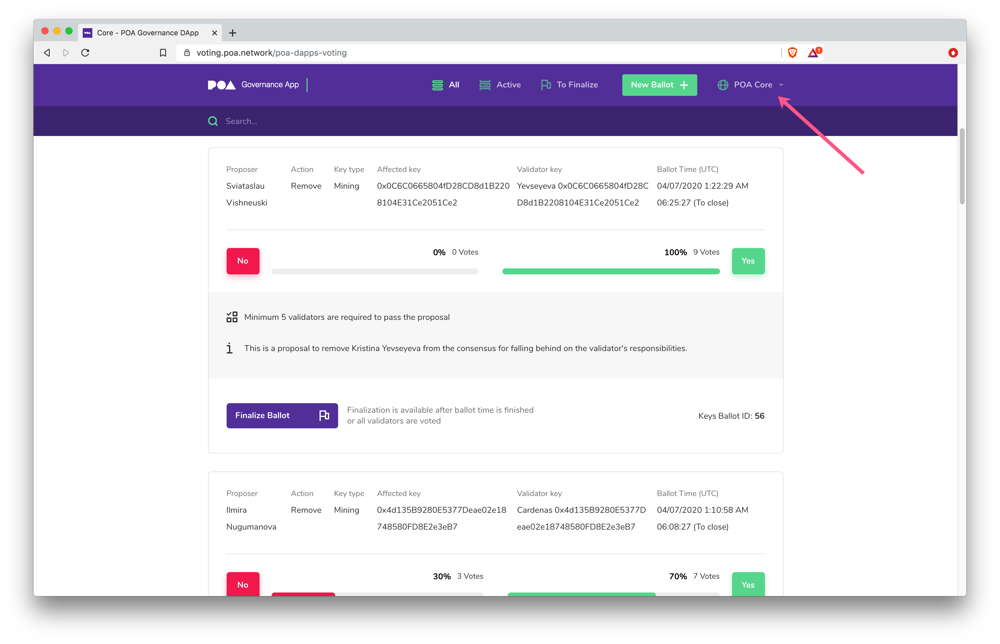
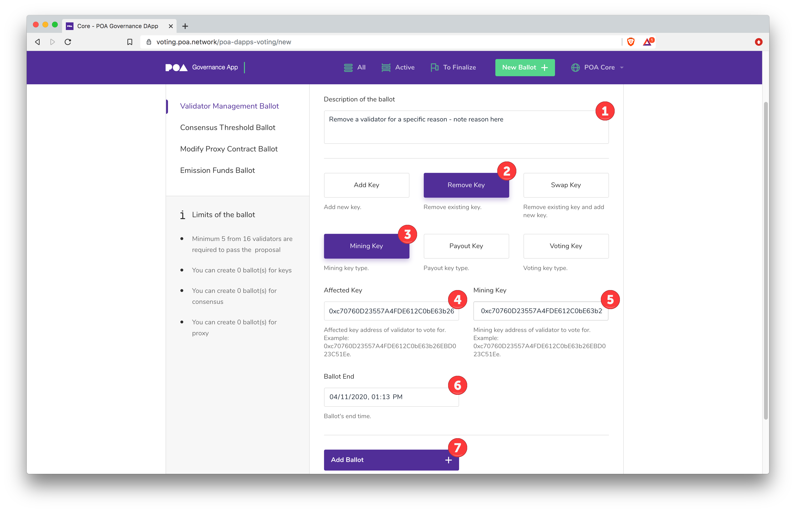
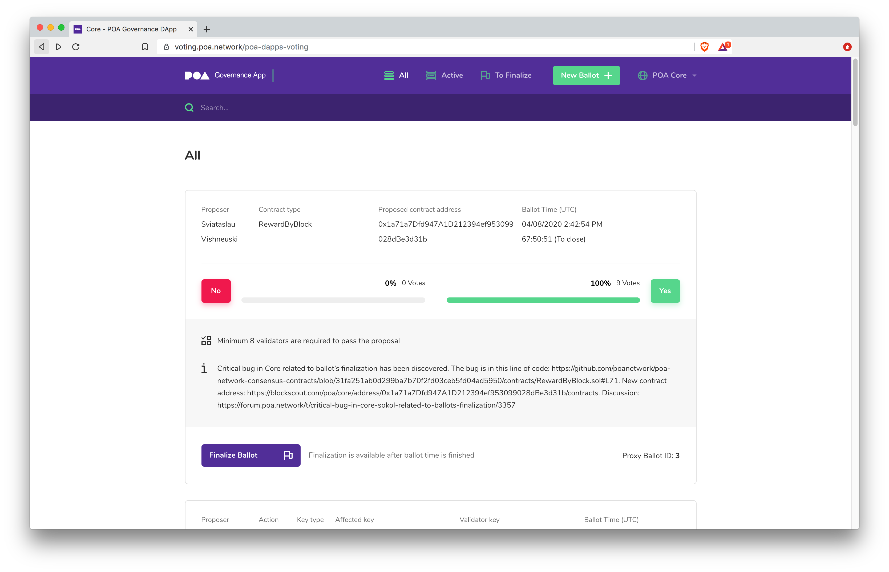

# Adding or Removing a Validator

## Adding a Validator

New validators can be added at any time. They will follow the [New Validator Process flow](https://github.com/poanetwork/wiki/wiki/Validator-Node-on-AWS) to start, and when a current validator is ready, they can propose a new ballot to add the validator.

## Removing a Validator

Validators may be removed through the voting process for various reasons, including failure to maintain or upgrade a node, malicious behavior, or self-removal. Any current validator can initiate the process to remove another validator.


A validator may remove themselves from the set by following the instructions below using their own mining key.


1\) Go to [https://voting.poa.network/poa-dapps-voting](https://voting.poa.network/poa-dapps-voting)  and select **POA Core (or Sokol) Chain** from the network dropdown. Check that your web3 wallet (Metamask or Nifty Wallet) is connected to your **Voting Key** on the POA Core Chain.

2\) Click on the **New Ballot **Button. The Validator Management ballot will appear by default. Fill in the required values.

1. **Description of the ballot**: Add **specific rationale** for removal along with links to any pertinent information (ie forum posts where this issue has been discussed).
2. **Remove Key**: Select this option.
3. **Mining Key**: Select this option. _Note: When the mining key is removed, associated payout and voting keys are also removed, so you only need to select the mining key here._
4. **Affected Key**: Enter the mining key of the validator to remove.
5. **Mining Key**:  Select the **same mining key **from the dropdown.
6. **Ballot End**: The date will pre-populate with the earliest available end time. You can increase the duration if desired.
7. **Add Ballot**: Press to confirm and sign the transaction in your Web3 Wallet.

3\) The Ballot will be displayed in the All and Active Ballots sections along with the required number of Yes votes needed to pass (and remove the validator) and the ballot end time.&#x20;

4\) Inform current validators about the new ballot (through Telegram or other means) so that they have a chance to vote before the ballot expires.&#x20;

5\) Once the ballot expires, any current validator can finalize it. Connect to the POA Core Chain with your Voting Key and click **Finalize **to complete the process. If enough votes were collected, the validator will be removed from the validator set.
