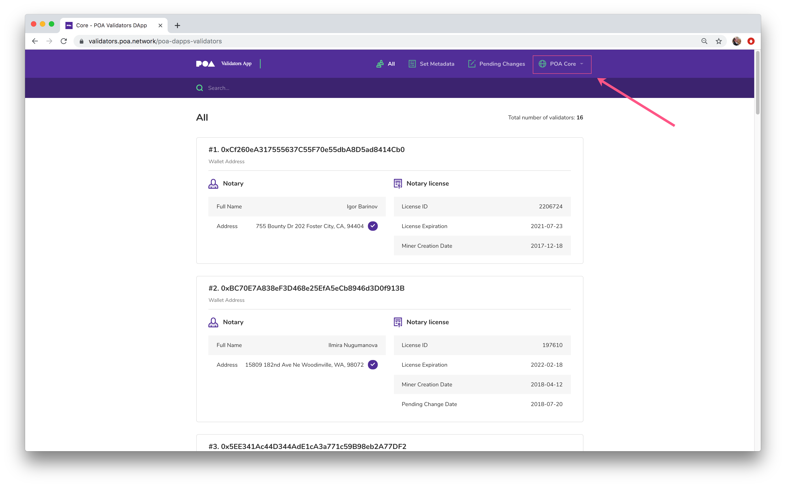
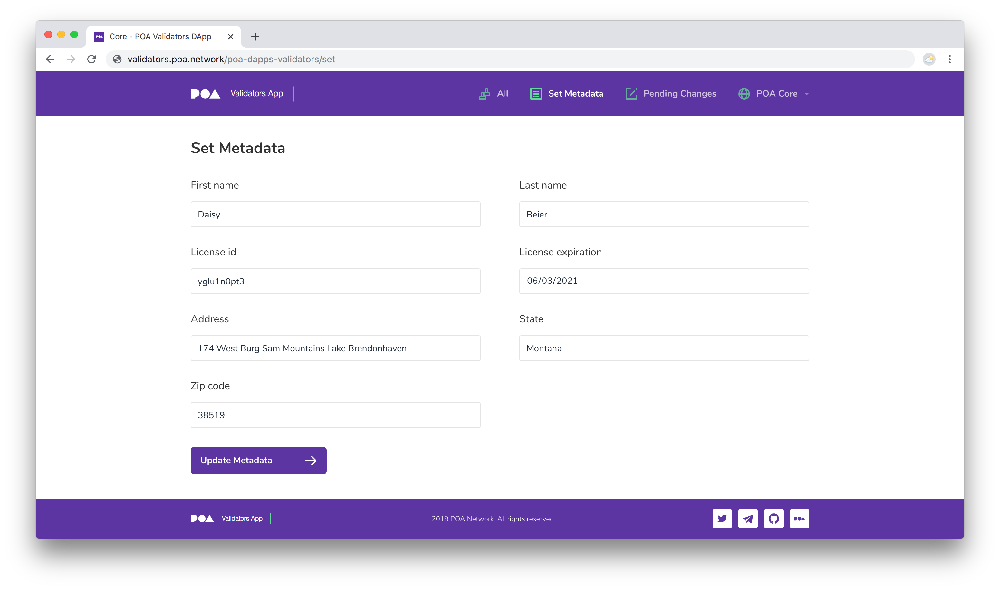
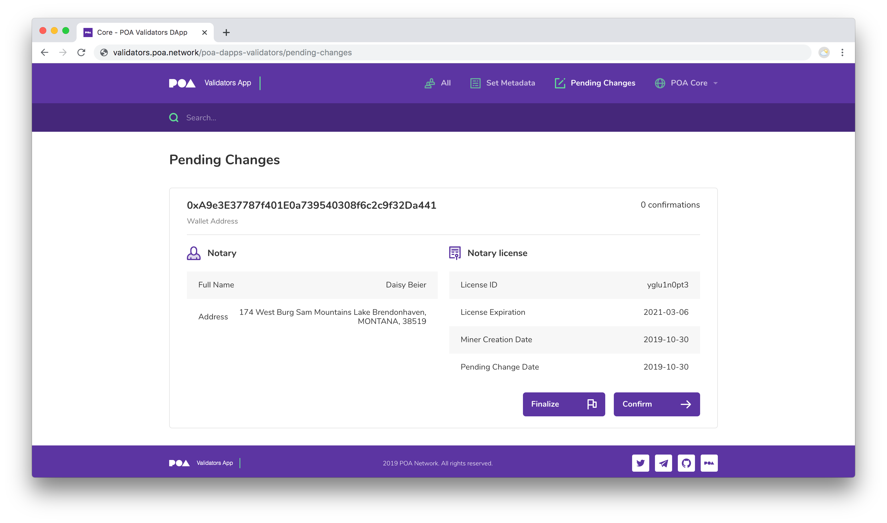

# Validators MetaData DApp

## View Current Network Validators

To see current validators along with their Notary information, visit [https://validators.poa.network/poa-dapps-validators](https://validators.poa.network/poa-dapps-validators).  In the Network Dropdown menu, select POA Core.

## For Validators: Update Metadata

1\) In MetaMask connect to the RPC endpoint of the required network:

* Mainnet `Core`: [https://core.poanetwork.dev](https://core.poanetwork.dev)
* Testnet `Sokol`: [https://sokol.poa.network](https://sokol.poa.network)

2\) Select your **Voting Key** in MetaMask.


You must have a small amount of POA on your Voting Key to submit a transaction. During the initial ceremony, you should  have received 0.1 POA on your Initial Key and can transfer it to Voting Key.


3\) Open URL [https://validators.poa.network/poa-dapps-validators](https://validators.poa.network/poa-dapps-validators)

4\) Go to the  `SET METADATA` page.

5\) Fill all the required fields with your contact details and license info

6\) Double-check the data you've provided.

7\) Double-check in MetaMask that you've selected your Voting Key and you're on the required network.

8\) Press `SET METADATA` button at the bottom of the page.

9\) Confirm transaction in MetaMask and wait until the transaction is mined.

10\) Open the `PENDING CHANGES` tab and verify your data in the list.

11\) Ask fellow validators to confirm and finalize your request. The metadata-change request needs at least **2 confirmations** by different validators and can then be finalized by any validator including yourself. Finalizing a request commits changes to the network.

